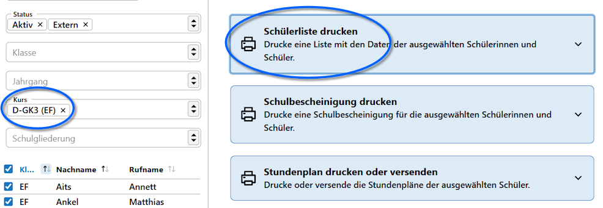
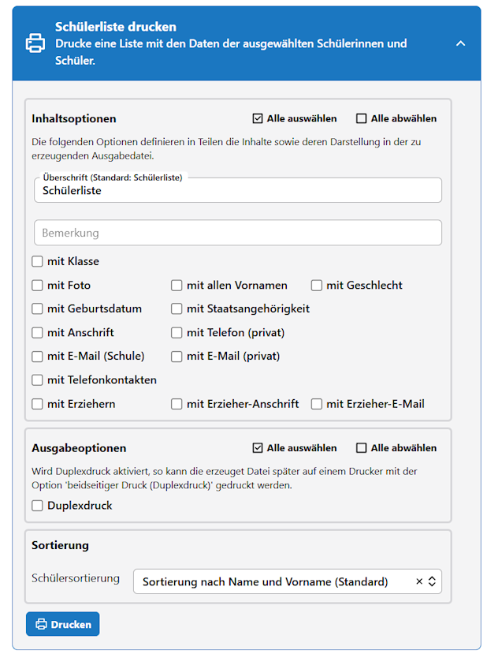
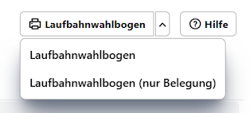
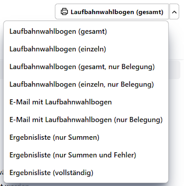
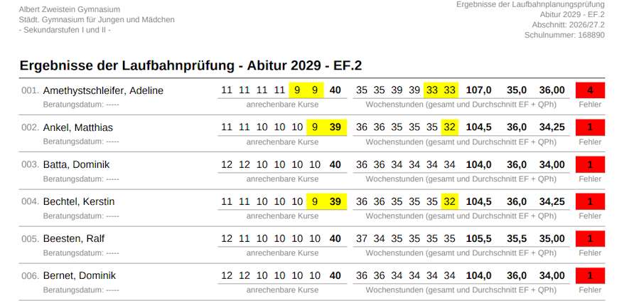
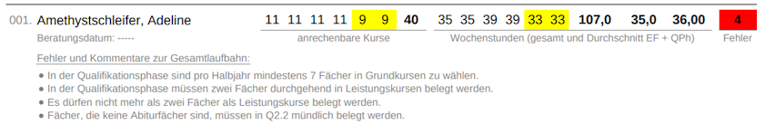
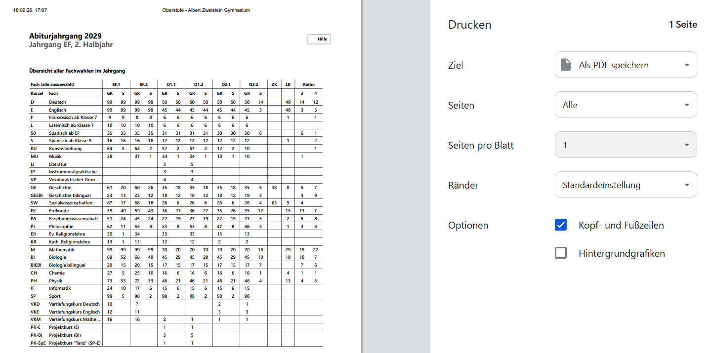

# VI. Listendruck und Reporting

In Laufe eines Abiturjahrgangs müssen viele Listen und andere Dokumente erzeugt werden. Dies beginnt bei Kurslisten, geht über Wahlbögen, die ersten Zeugnisse in der EF, Leistungsübersichten der Q-Phase, Drucke zum zentralen Abitur-Ausschuss und Abiturzeugnissen, wobei diese Aufstellung nicht erschöpfend ist.

Dieses Kapitel führt durch die unterschiedlichen Druckmöglichkeiten und bespricht das Reporting in SchILD-NRW 3.

Weiterführende Artikel zum Reporting von SchILD-NRW 3, etwa, wie Reports verändert und selbst erstellt werden können, finden Sie im Wiki zu SchILD-NRW 3. Ebenso finden Sie dort sehr ausführliche Anleitungen, wie Zeugnisreports zu verwenden und einzustellen sind. Dieses Handbuch wird aber auch hier einen Überblick verschaffen.

Dieser Artikel deckt nicht ab, dass auch externe Programme wie etwa Stundenplanungsprogramme verwendet werden können, um Kurslisten und vergleichbares zu drucken. Konsultieren Sie hierzu den Support und die Dokumentation von diesen Programmen.

## Listendruck über den SVWS-Client

:::tip Der SVWS-Client generiert PDF-Dateien
Wenn Sie die Druckoptionen des SVWS-Clients verwenden, werden immer erst PDF-Dateien erzeugt, die über den Internet-Browser gespeichert werden und dann gedruckt werden können.

Klicken Sie direkt auf **Öffnen**, um das Dokument direkt zu öffnen (als zipfile) oder direkt anzeigen zu lassen (als pdf), damit es zu einem physischen Drucker gesendet werden kann.
:::

Möchte man nur eine Kursliste generieren, geht ein schneller Weg über den SVWS-Client. Nutzen Sie die **App Schüler**, um Personen mit Haken zu markieren, um dann die im SVWS-Client hinterlegte allgemeine Schülerliste zu erzeugen.

Diese Schülerliste ist schnell erzeugt, für unsere GOSt-Arbeit ist sie aber nicht ganz geeignet, da die individuellen Kursarten nicht mit ausgegeben werden und damit Informationen zu mündlichen, schriftlichen Wahlen, LK oder den Abiturfächern fehlen.

Sollen jedoch weitere Informationen ausgeben werden, ist diese Liste sehr mächtig, denn...

... es stehen sehr viele weitere Informationen zur Verfügung.

Aus dem ersten Screenshot ist auch zu entnehmen, dass im SVWS-Client hinterlegte Stundenpläne ausgegeben beziehungsweise versendet werden können.

## Laufbahnwahlbogen über den SVWS-Client drucken

### Individuelle Bögen über die App Schüler

Sollen individuelle Laufbahnbögen (nach) gedruckt werden, gehen Sie wie im Kapitel **Laufbahnplanung** schon besprochen vor: navigieren Sie über die **App Schüler** zu deren **Laufbahnwahl**. Achten Sie darauf, dass Sie `Fächer anzeigen: nur gewählte` aktiviert haben, falls der resultierende Laufbahnwahlbogen kompakt bleiben soll. Sie können somit auch den vollständigen Bogen erzeugen, ohne das nicht belegte Fächer ausgeblendet werden.

Dann klicken Sie oben rechts auf `Laufbahnwahlbogen`.

Alternativ können Sie auch auf den kleinen `v`-Haken klicken, und direkt `Laufbahnwahlbogen (nur Belegung)` einen verkürzten Bogen erzeugen.

### Eine große Auswahl über die App Oberstufe

Über die **App Oberstufe** stehen im **Tab Laufbahnen** noch weitere praktische Druckoptionen zur Verfügung:

Klappen Sie oben rechts die Liste mit den Druckoptionen auf, können diese Optionen gewählt werden:

* **Laufbahnwahlbogen (gesamt)** erzeugt eine große pdf-Datei, in der alle Bögen der ausgewählten Schülerinnen hintereinander gehängt werden.
* **Laufbahnwahlbogen (einzeln)** erzeugt einzelne pdf-Dateien, die in einer zip-Datei heruntergeladen werden.

* Die folgenden beiden Optionen verfahren identisch, nur dass in den Bogen nur belegte Fächer erzeugt werden.

* Weiterhin steht die Möglichkeit zur Verfügung, die individuellen Laufbahnwahlbögen direkt per **E-Mail** zu verschicken. Wieder die kompletten Bögen und dann wieder nur mit den tatsächlich belegten Zeilen.

* **Ergbnisliste (nur Summen)** generiert die letzte Spalte der Laufbahnbögen, in denen die anrechenbaren Kurse und Summen sowie die Fehler jeweils über die Halbjahre aufgeführt werden. Bei dieser Optionen wie auch bei den folgenden werden die Daten für alle angehakten Schüler ausgegeben.

* Wählen Sie **Ergbnisliste (nur Summen und Fehler)** erzahlten Sie auch eine Ausgabe der vorhandenen Fehlertexte.

* Die Option **Ergebnisliste (vollständig)** gibt zusätzlich unter den Fehlern alle Informationen wie Sonstige Informationen und Bemerkungen aus.

### Kursplanung und Fachwahlen

Die großen **Tabs Kursplanung** und **Klausurplanung** bieten ebenfalls Druckausgaben, wie sie ahnand des **Tabs Laufbahnen** besprochen wurden.

Um in diesem Handbuch nicht eine parallele Dokumentation zu allen Details zu erstellen, nutzen Sie bitte die Dokumentationsartikel zu diesen Funktionen.

## Drucken von weiteren Informationen über den Drucker

Auch ohne vorbereite Druckausgabe ist der SVWS-Client sehr geeignet, Daten zu drucken. Nutzen Sie die **Druckoption ihres Internetbrowsers*, oft ist das ein Knopf oder auch STRG + P, um die aktuelle Seite auszugeben.

Zum Beispiel der **Tab Fachwahlen** lässt sich so sehr brauchbar ausgeben. Hier im Beispiel wird die Druckvorschau gezeigt, die Seite kann auch als PDF generiert werden, indem dies als Drucker gewählt wird.

---

Fahren Sie mit dem Artikel zum [Druck über SchILD-NRW 3](./s3_reporting.md) fort.