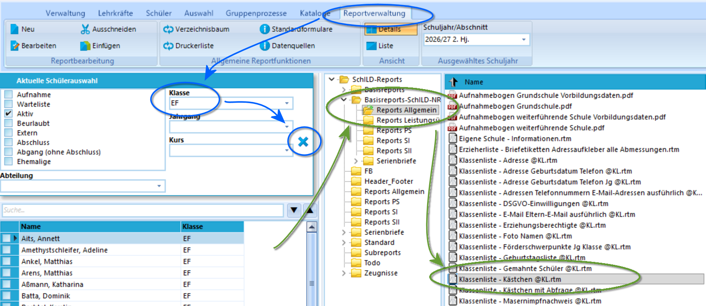
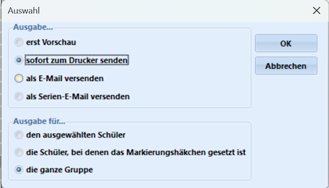
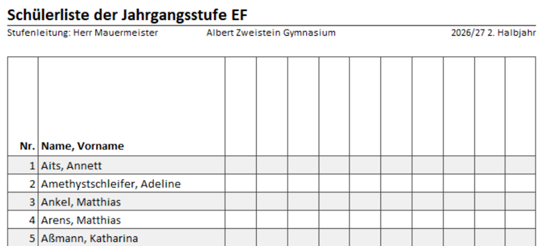

# VI. Reportdruck mit SchILD-NRW 3

SchILD-NRW 3 liefert mit dem Reportbaukasten ein mächtiges Werkzeug, mit dem sich viele unterschiedliche Reports erzeugen lassen. Dies reicht von einfachen Listen, Stammblättern und Formularen bis hin zu den Zeugnissen.

Reports sind Dateien mit der Endung .rtm, in denen definiert ist, wie etwa eine Liste auszusehen hat. Werden dann konkrete Daten an diesen Report gegeben, etwa "Schüler einer Klasse", wird die Liste generiert.

:::tip Nutzen Sie fertige Reports
Nutzen Sie fertige Reports, zum Beispiel die für SchILD-NRW 3 vollständig neu erstellte Basisreportsammlung oder die Zeugnisse, die Sie von der [Seite für Schulverwaltungssoftware](https://svws.nrw.de) herunterladen können.
:::

## Reports generieren

Starten Sie SchILD-NRW 3. Gegen Sie in den Reiter **Reportverwaltung**.

Sie können nun auf der linken Seite eine Schülergruppe auswählen, hier im Beispiel wurde die EF als *Klasse* angewählt, dann wurde der Filter mit dem Haken **✔** bestätigt - der Haken wurde daraufhin zum **X**, mit dem sich der Filter wieder aufheben lässt.

In der **Reportstruktur** rechts lässt sich über Ordner zur Reportdatei navigieren. Hier wurde eine "Klassenliste" gewählt: *Klassenliste - Kästchen @KL.rtm*.

Ein Doppelklick öffnet ein Menü:

Sie können sich über **Nur Vorschau** den Report einmal generieren lassen und anschauen. Hier über  **sofort zum Drucker senden** gewählt, dass die Liste tatsächlich zu drucken ist.

Da ein Report für mehr als die eine aktive Person erzeugt werden soll, wird **die ganze Gruppe** angewählt.

Die Liste wurde gedruckt.

Bei manchen anderen Reports wird statt der ausgewählten Schülerliste eine andere Datenquelle verarbeitet, wenn Sie zum Beispiel eine *Kursliste* erzeugen wollen, öffnet sich ein Auswahlfenster über alle Kurse, in dem die zu druckenden Kurse anzuhaken sind. In diesem Fenster würden auch Filtermöglichkeiten auf Jahrgänge zur Verfügung stehen.

## Reports hinzufügen

Die Ordner-Liste in der Reportverwaltung entspricht dem Ordner *Schild-Reports* in ihren *SVWS-Arbeitsverzeichnis*.

Alle Reports, die Sie herunterladen werden dort abgelegt. Richten Sie sich eine **Ordnerstruktur** für ihre Abteilung ein, in der Sie Ihre Reports organisieren.

:::tip Unterordner
Richten Sie einen Unterordner *Zeugnisse* ein, in dem Sie für alle Schuljahre die jeweiligen Zeugnisse - und alle damit verbundenen Anlagen - ablegen. So haben Sie für jedes Schuljahr die verwendeten Zeugnisformulare archiviert.

Richten Sie ebenso Ordner für die *EF*, *Q-Phase* und *Abitur* ein, in denen Sie alle für diese Phasen relevanten Reports ablegen.
:::

Beachten Sie, dass manche Reports als *gepackte .zip-Datei* heruntergeladen werden. Diese müssen Sie zuerst entpacken. Nehmen Sie zur Kenntnis, dass MS Windows per Standard Dateiendungen ausblendet, Sie sehen mitunter also nicht, ob Sie eine .zip oder schon die entpackte .rtm-Datei im Ordner liegen haben. In zip-Archieven können auch viele Dateien zusammen gepackt sein.

:::tip Nutzen Sie das exzellente Wiki!
Nutzen Sie hierzu bitte das Wiki von SchILD-NRW 3, in dem das Installieren von Reports ausführlich erläutert ist.
:::

## Bezugsquellen von Reports

Sie erhalten die offziellen Reports, das sind die Basisreportsammlung, die Zeugnisse und alle vom MSB bereitgestellten Anlagen zum Zeugnisverfahren über die [Webseite des MSB für Schulverwaltungssoftware](https://svws.nrw.de).

Auf der Webseite kann auch das **SVWS Forum** eine sinnvolle Quelle für Reports sein. Sucht man einen Report oder hat einen und möchte eine kleine Anpassung vornehmen, lohnt es sich, dort einfach zu fragen.

In der Praxis sind viele Ebenen der Schulverwaltung auf ihrer Ebene quervernetzt, etwa weil man sich auf **Oberstufenkoordinatorenveranstaltungen** der BRs oder des MSB getroffen hat und darüber werden viele Informationen und auch Reports ausgetauscht.

Reports können in der Schule selbst erstellt oder verändert werden. Eventuell gibt es bei Ihnen an der Schule jemanden, der motiviert und fähig ist?

## Erstellung von Reports zur Dokumentation und Archivierung

Nutzen Sie auch die Möglichkeit, Reports als pdf zu erstellen oder automatisch in die *Dokumentenablage von SchILD-NRW 3* legen zu lassen oder ein *Zeugnisverzeichnis* für die Ablage von Zeugnis-pfds zu definieren.

Weitere Informationen hierzu finden Sie im Wiki zu SchILD-NRW 3.