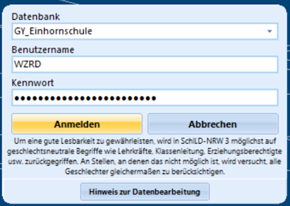
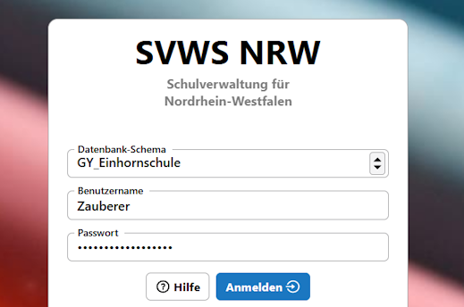
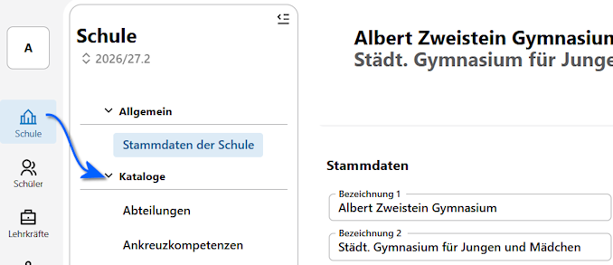
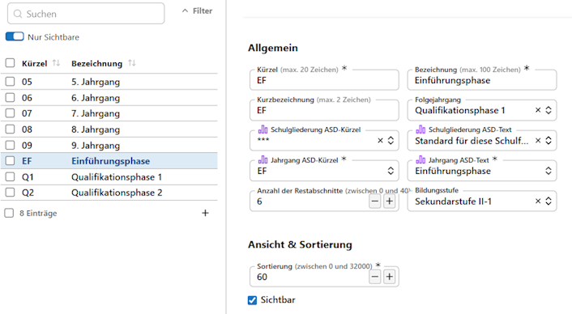
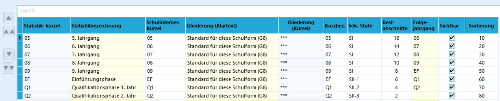
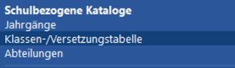
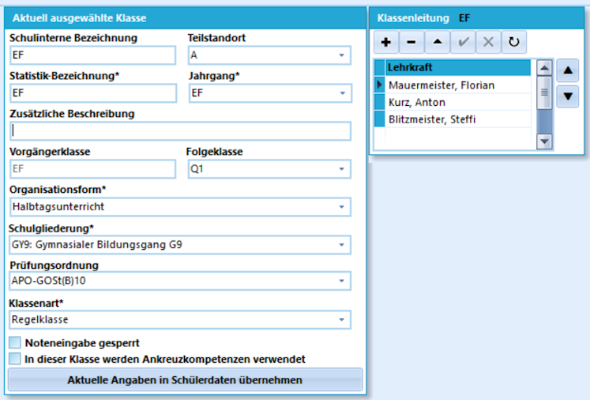

# I. Grundlegende Vorbereitungen der Datenbank

Diese Vorbereitungen sind in der Regel einmal vorzunehmen und auch nur dann, wenn die Daten noch nicht vollständig korrekt sind. Ist Ihre Datenbank gut eingerichtet: Herzlichen Glückwunsch - das haben Sie oder Ihre vorhergehenden Koordinationspersonen gut gemacht! 

Spätere Anpassungen sind mitunter nötig, wenn sich rechtliche oder pädagogische Rahmenbedingungen ändern.

:::tip Korrekte Einstellungen finden
Als Quelle für statistisch korrekte Einstellungen für Fächer oder welche Kursarten gelten, damit die Prüfungsalgorithmen für Laufbahnen, Zulassungen und Abschlüsse funktioernen sind die Schlüsseltabellen und Eintragungshilfen der Amtlichen Schuldaten (ASD) für die jährliche Statistik empfehlenswert. Auch wenn eine Oberstufenkoordination ansonsten mit der Statistik nicht betraut ist, lohnt sich also eine Lektüre.
:::

Starten Sie SchILD-NRW 3 und loggen Sie sich ein:

Für Prozesse, die Sie mit dem SVWS-Client durchführen möchten, loggen Sie sich in diesen ein.

Den SVWS-Client starten Sie über einen normalen Internetbrowser.

Für beide Programme sollte es ein Icon auf Ihrem Desktop geben. Sofern es keines gibt, wenden Sie sich an Ihre IT. Sie werden diese zwei Programme sehr oft starten.

:::tip Die Daten sind gleich!
Die Daten sind sowohl im SVWS-Client und in SchILD-NRW 3 identisch, beide greifen nur auf die vom SVWS-Server im Hintergrund verwaltete Datenbank zu.
:::

:::warning Statistikrelevante Felder
Einige Daten sind relevant für die jährliche Statistik der Amtlichen Schuldaten (ASD). Diese Felder sollten korrekt befüllt werden, da Sie teilweise für Ihre Arbeit besonders relevant sind - die automatischen Prüfungen oder Prozesse funktionieren nur bei korrekten Einträgen wie gewünscht - oder es der mit der Statistik beauftragten Person an Ihrer Schule die jährliche Arbeit sehr erleichtern.

In **SchILD-NRW 3** kennzeichnet ein * die **statistikrelevante Felder***. Unter **Verwaltung ➜ Einstellungen Individuelle ➜ Einstellungen** kann auch eine Farbe zum Hervorheben dieser Felder gesetzt werden. Im *SVWS-Client* werden statistikrelevante Felder durch ein lila Balkendiagramm gekennzeichnet.
:::

## Benutzer mit ausreichenden Rechten einrichten

Sie müssen einen Datenbankbenutzer haben, der mit ausreichenden Rechten ausgestattet ist. Mit diesem Benutzer melden Sie sich sowohl bei SchILD-NRW 3 und dem SVWS-Client an. Sprechen Sie bitte hierzu bei Bedarf Ihren SVWS-Administrator an (typischerweise ist am Gym/Ge das "jemand der SchILD macht" oder ein Schulleitungsmitglied).

:::tip Nehmen Sie Möglichkeit wahr, zu delegieren
Sie sind Abteilungsleitung/Koordination - an vielen Schulen gibt es Beauftragte für Schulverwaltungsaufgaben/SchILD-Administration/die Statistik und vergleichbar. Eventuell müssen Sie die  Versetzungstabelle gar nicht selbst konfigurieren?

Es empfiehlt sich jedoch, alle Einstellungen selbst auf Korrektheit zu prüfen. Dies gilt ganz besonders für die Fächer. Fehleinstellungen kosten am Ende schließlich Ihre Zeit und Nerven.
:::

Ihr Benutzer sollte Folgendes auf jeden Fall können:

+ Alle Daten (Schule, Schüler, Lehrer, Kataloge, ...) ansehen.
+ Leistungsdaten von Schülern ändern (allgemein oder funktionsbezogen)
+ Reports/Berichte drucken, ansehen, ändern, löschen.
+ Alles im- und exportieren.
+ Backups durchführen und einspielen.
+ Kataloge vollständig bearbeiten.
+ Stundenpläne bearbeiten.
+ Das Notenmodul im SVWS-Client verwenden.
+ Alles bezogen auf die Oberstufe.

Kontaktieren Sie hierzu Ihre schulinterne SchILD- und SVWS-Administration. Sind Sie ein Gymnasium oder eine Gesamtschule und haben diese Aufgabe nicht vergeben, kann darüber nachgedacht werden, jemanden zu beauftragen. Jede Schule in Bezug auf die Zusammenarbeit und Aufgabenverteilung in ihren Arbeitsprozessen individuell.

:::tip Funktionsbezogene Rechte
Ist ein Recht *"Funktionsbezogen"* bedeutet das, dass eigetragene Klassenlehrkräfte (also in der GOSt die Jahrgangsleitungen/Jahrgangsberatungslehrkräfte) oder **Abteilung**sleitungen, denen die Jahrgänge zugeordnet werden, für Ihre Klassen/Abteilungen diese *Rechte (funktionsbezogen)* besitzen.
:::

## Jahrgangstabelle, Klassen- und Versetzungstabelle

Damit Zuordnungen von Rechtsbedingungen der APO-GOSt für Versetzungen und andere Prüfungen funktionieren, müssen SuS korrekt definiertere Jahrgänge und Klassen zugeordnet sein.

### Jahrgänge

Richten Sie zuerst die Jahrgänge mit dem SVWS-Client beziehungsweise in SchILD-NRW 3 ein oder kontrollieren Sie die Einträge.

Sie finden die Apps, hier die **App Schule** entweder links oder oben in der Kopfleiste des SVWS-Clients. Dann klappen Sie die Kataloge auf.

Öffenen Sie im SVWS-Client die **App Schule ➜ Kataloge ➜ Jahrgänge**.

Alternativ, je nachdem, welches Programm Sie bevorzugen, verwenden Sie SchILD-NRW 3. Öffnen Sie zuerst **Kataloge ➜ Jahrgänge**.

In allen Einstellungen von SchILD-NRW 3 sind die *gelb hinterlegten Felder* unbedingt zu beachten: diese müssen ASD-konform *und* korrekt befüllt sein - sonst gibt es Probleme! Hier lassen sich oftmals auch nur ASD-konforme Einträge vornehmen.

Kontrollieren Sie Ihre Oberstufenjahrgänge. Achten Sie darauf, dass die Spalte **Sek.-Stufe** korrekt mit *SII-1* für die EF bis *SII-3* für die Q2 befüllt ist.

Ebenso beachten Sie, dass die Spalte **Folgejahrgang** jeweils den korrekten Eintrag hat, denn hierauf greift der Versetzungsalgorithmus zurück.

Hier im Screenshot ist zu sehen, dass die Beispielschule ein Gymnasium ist, da die **Restabschnitte** in der Q2 mit zwei Halbjahren befüllt sind und dann für jedes Schuljahr zwei Halbjahre bis zum Jahrgang 5 erhöhen. Mit den Restabschnitten wird berechnet, wie lange es für einen SoS noch dauert, zum Ende des vorgesehenen Bildungsganges zu kommen.

An einer Gesamtschule sehen die Restabschnitte anders aus: Zählen Sie von der Q2 von *2* über *4* und *6* zur EF hoch, dann setzen Sie bei *Jahrgang  10* wieder mit *2* ein und zählen von dort wieder jeweils zwei Abschnitte hoch. Der Hintergrund ist, dass an der Gesamtschule erst Jahrgang 05 bis 10 abgeschlossen werden und die GOSt dann für die dort angemeldeten SuS neu einsetzt.

Haben Sie noch alte Jahrgänge, die nicht mehr gebraucht werden - typischerweise "11", "12" und "13" - hier gelistet, stellen Sie diese einfach auf "nicht sichtbar", inde, Sie den Haken entfernen.

Ein BK kann hier alle Jahrgänge der unterschiedlichen Bildungsgänge einrichten, also eine GOSt bis zur 13 oder auch eine alternative Oberstufe bis Klasse 14.

### Klassen

Gehen Sie als nächstes über **SchILD-NRW 3** in die **Kataloge ➜ Klassen-/Versetzungstabelle** und generieren Sie Klassen für Ihre Oberstufenjahrgänge. Wie bei den Jahrgängen tragen Sie hier die Vorgänger- und Folgeklasse ein. Die Q2 hat keine Folgeklasse.

Wählen Sie ebenfalls die passende Schulgliederung und Prüfungsordnung aus. Die **Prüfungsordnung** ist die für jeweiligen Jahrgang gültige APO-GOSt. Als **Klassenleitung** können Sie Ihre Jahrgangs-Beratungslehrkräfte hinterlegen.

Die Details sind in den meisten Fällen unkompliziert: Die Gliderung ist vorgegeben, Ganztagsunterricht gibt es nicht, alles ist eine Regelklasse und die APO-GOSt ist ebenfalls normalerweise nicht differenziert. Hier im Beispiel wurde der EF die Vorgängerklasse EF gegeben, da eine individuelle Zuordnung zur 10.1, 10/B oder ähnlich ohnehin nicht in der Klassentabelle abzubilden ist.

Nehmen Sie zur Kenntnis, dass sich an dieser Stelle eine **Noteingabe sperren** lässt, so dass niemand - ohne die Berechtigung, Klassen zu bearbeiten - außerhalb der Notenzeiträume irgendwelche Änderungen vornehmen kann, obwohl der verwendete Benutzer dies eigentlich könnte. 

Fahren Sie mit der [Einstellung und Kontrolle der Fächer](voreinstellungen_faecher.md) fort.