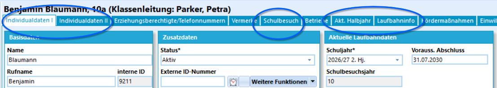
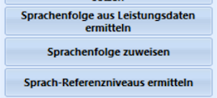

# III. Abiturjahrgang vorbereiten und planen

Aus Sicht der Fächer und der Jahrgangsleitung sind die Vorbereitungen getroffen.

Bevor aber Schüler-Laufbahnen gewählt werden - ob direkt im SVWS-Client oder über Laufbahnwahldateien, die mit WebLuPO verarbeitet werden - sollte die Schülermenge des Jahrgans überprüft werden.

## Schüler aufnehmen & Jahränge bereinigen

Nehmen Sie neue Schülerinnen auf und bereinigen Sie die existierenden Schüler. Sofern dies noch nicht geschehen ist, werden Abgänger entsprechend ausgeschult oder Wiederholer werden ihrem neuen Jahrgang zugeordnet.

Sie können viele Daten im SVWS-Client eintragen und ändern. Um aber alles bearbeiten zu können, ist derzeit noch SchILD-NRW 3 notwendig.

Neue Schüler werden in der Schule aufgenommen, wenn der Anmeldeprozess vollständig ist und die Oberstufenkoordination (Gy)/Abteilungsleitung (Ge) mit dem Sekretariat geklärt hat, dass die Person in der Datenbank angelegt wird und eine Schülerinnenakte angelegt wurde. Im Anschluss können alle notwendigen Daten in die Datenbank eingetragen werden.

Zuerst werden die **Individualdaten** eines Schülers erfasst. Dies sind Name, Adresse, Geburtsort und so weiter. In der Regel werden solche Daten über das Sekretariat bei der Anmeldung erfasst. In SchILDs **Individualdaten II** sollte man auch den Bereich **Sekundarstufe I** ausfüllen.

Auch die **Erziehungsberechtigten** anzulegen ist natürlich relevant, für die Laufbahnerfassung sind aber die eingekreisten Reiter von großem Interesse.

Schlagen Sie bitte den Reiter im Detail im Wiki von SchILD-NRW 3 nach. Dieses erreichen Sie über die [Webseite für Schulverwaltungssoftware des MSB](https://svws.nrw.de). Hier findet sich eine schnelle Übersicht:

* Im Reiter **Schüler ➜ Schulbesuch** erfassen Sie die **zuvor besuchte Schule** mit den bekannten Daten zur dortigen Entlassung.
* Sofern bekannt füllen Sie ebenfalls den Bereich **Alle zuvor besuchten Schulen** aus, hier werden die bekannten Schule in einer Liste aufgeführt. Bei Schulen aus anderen Bundesländern oder aus dem Ausland können Sie die hierzu vorgesehenen Schulnummern verwenden und die Schulen entweder konkret im **Katalog** anlegen oder es einfach zum Beispiel bei *Schule aus Bayern* belassen.

* Im Reiter **Schüler ➜ Akt. Halbjahr** können Sie Daten zum aktuellen, vorherigen oder zu vorherigen Lernabschnitten anlegen. Das Vorgehen unterscheidet sich etwas bezüglich darin, in welchen Lernabschnitt Sie jemanden aufnehmen: in den laufenden oder einen zukünftigen Lernabschnitt. Wählen Sie den passenden Lernabschnitt aus der Dropdown-Liste aus und geben Sie die Daten zu *Jahrgang, Klasse, Prüfungsordnung* und so weiter ein.

* **Wiederholer**, die üblicherweise erst zum Zeugnisdruck und anschließenden Schuljahreswechsel in ihren neuen Lernabschnitt verbucht werden, sollten nicht vergessen werden. Wenn ein Schüler einen Jahrgang wiederholt, denken Sie daran, die Versetzungsbemerkung korrekt zu setzen (EF ➜ Q-Phase "Nicht versetzt" oder vergleichbar). Nehmen Sie unbedingt die Haken bei **Gewerteter Abschnitt** und **2. Durchgang (oder höher)** wahr, denn viele Fehler aus der Praxis resultieren daher, dass hier Haken falsch gesetzt werden, also zum Beispiel eine Wiederholung der Q1 zusammen mit ersten Runde als *☑ gewertet* markiert sind oder der neue Abschnitt nicht gewertet ist.

:::tip **Leistungsdaten** vorheriger Lernabschnitte nachtragen
Bei Neuankömmlingen hat es sich in der Praxis als nützlich erwiesen, zumindest den vorherigen Lernabschnitt mit den Leistungsdaten des hinterlegten Zeugnisses auch in der eigenen Datenbank anzulegen. Dies hilft den Beratungslehrkräften im Jahrgang oder falls man noch einmal etwas zu den Fremdsprachen nachsehen möchte. Beispielsweise bei EF-Neulingen wäre das das letzte Halbjahr der 10. Hier muss keine Kurs-Belegung ausgedacht werden, es reicht, die Fächer in den **Leistungsdaten** (**SchILD-NRW 3: Schüler ➜ Akt. Halbjahr ➜ Leistungsdaten**) zu erzeugen und dann Noten/Punkte einzutragen.
:::

* Über **Schüler ➜ Laufbahninfo ➜ Sprachenfolge** sind die Fremdsprachen zu erfassen. Die **Sprachenfolge** muss unbedingt korrekt gesetzt werden, sonst kann die Laufbahnprüfung nicht korrekt durchgeführt werden. Geben Sie eine, welche Sprachen von welchem Lernabschnitt bis zu welchem belegt wurden. Geben Sie jeweils Jahrgang und Halbjahr an. Kommen Schüler von Schulen mit anderen Sprachbeginnen, unterscheiden Sie, als was die Sprache in der GOSt gelten soll. Beispiel: Haben alle Ihre Schülerinnen *"L7"*, aber ein neuer Schüler hat nun das Fach *"L6"*, das es bei Ihnen in NRW so gar nicht gibt, tragen Sie ruhig *"L7 mit Sprachbeginn in Jahrgang 6, 1. Halbjahr"* in der Sprachenfolge ein. 

* Wurden Sprachen über **Feststellungsprüfungen** oder **Herkunftssprachlichen Unterricht** nachgewiesen, werden diese ebenfalls unter **Laufbahninfo** erfasst.

* Aktualisieren Sie die Sprachenfolgen Ihrer eigenen Schüler, die eine vollständige Geschichte der Leistungsdaten in der Datenbank aufweisen über **Gruppenprozesse** nach. Wöhlen Sie in SchILD-NRW 3 zuerst die passende Schülermenge aus, entweder, indem Sie den kompletten Jahrgang wählen oder die passenden Schülerinnen anhaken und damit auswählen:
    * Der Gruppenprozess **Sprachenfolge aus Leistungsdaten ermitteln** trägt belegte Sprachen korrekt in die Sprachenfolge.
    * Mit dem Gruppenprozess **Sprachenfolge zuweisen** können Sie passende Werte für die Sprachenfolge auswählen und dann der gesamten Gruppe oder der aktuellen Auswahl zuweisen.

Nehmen Sie Schülerinnen in der Q-Phase auf, wird eventuell noch der Reiter **FHR** relevant, dieser wird aber später besprochen.

---

Fahren Sie nun mit der [Laufbahnplanung aller Schülerinnen und Schüler](../laufbahnplanung/index.md) fort.