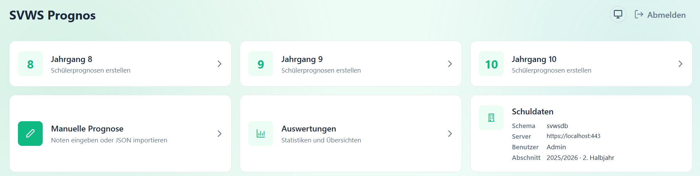
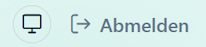
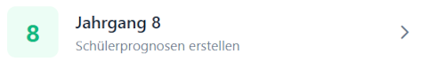
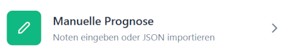
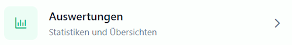
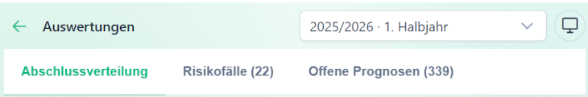
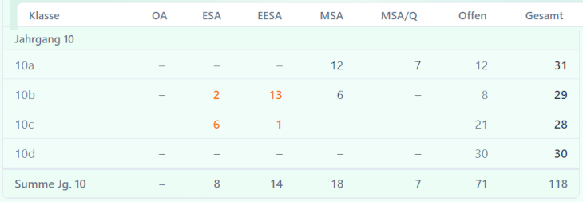
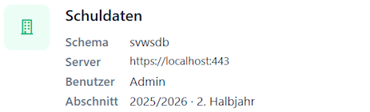

## SVWS-Prognos Übersicht

Nach dem Verbinden mit einem SVWS-Schema wird auf der Hauptseite von *SVWS-Prognos* eine Übersicht der Funktionen angezeigt.

In der Kopfzeile können Sie einen *hellen* oder *dunklen Modus* wählen oder die Systemeinstellung behalten.

Ebenso können Sie sich **Abmelden** und damit SVWS-Prognos verlassen. Es werden keine Daten gespeichert und alle aktuellen Daten im Browser werden gelöscht.

>[!TIP]Noten Speichern
>Veränderte Daten, zum Beispiel Noten, können aus den jeweiligen **Detailübersichten** der Schüler in den SVWS-Server zurückgespeichert werden.

Unter der Hauptseite sehen Sie die Kacheln mit den Funktionen von SVWS-Prognos.

## Prognosen

### Jahrgangsprognosen

Ein Klick auf die unterschiedlichen **Jahrgangs-Kacheln** darunter öffnet die Schüler-Übersicht für diesen Jahrgang.

An dieser Stelle findet die Hauptarbeit mit SVWS-Prognos statt.

Navigieren Sie über das Inhaltsverzeichnis zum Artikel der Jahrgangsprognosen.

### Manuelle Prognosen

Die Kachel **Manuelle Prognose** öffnet ein Eingabeformular, in das Sie Noten ohne Verbindung zu einem bestimmten Schüler eingeben können.
* Schnelle *"Was-wäre-wenn"-Szenarien* bei Beratungsgesprächen
* Überprüfung von Notenkombinationen
* Import von JSON-Notendateien als Testfälle

Sie finden mehr zur [Manuellen Prognose](prognose_manuell.md) im dazugehörigen Artikel, der links im Inhaltsverzeichnis erscheint.

## Abschluss-Auswertungen

Direkt daneben wird in der Kachel **Auswertungen** eine statistische Zusammenfassung angezeigt.

Über die Kopfzeile können Sie den gewünschten **Lernabschnitt** wählen.

In dieser Ansicht können Sie eine *Abschlussverteilung* aufrufen, ebenso werden Grenz- und *Risikofälle* angezeigt. Weiterhin haben Sie Zugriff auf noch *offenen Prognosen*.

Mit einem Klick auf `Risikofälle (x)` können Sie direkt in eine Liste springen, um sich die Datensätze anzeigen zu lassen. Gleichermaßen öffnet ein Klick auf `Offene Prognosen (y)` eine Liste mit den entsprechenden Schülerdatensätzen.

Es sind die jeweiligen Abschlüsse, Ohne Abschluss und die noch offenen Prognosen zu sehen. Im Fuß findet sich die Jahrgangs-Summen.

## Zusammenfassung der Schuldaten

In der letzten Kachel unten rechts werden Daten zur aktuell verwendeten Datenbank und dem verwendeten Lernabschnitt angezeigt.

