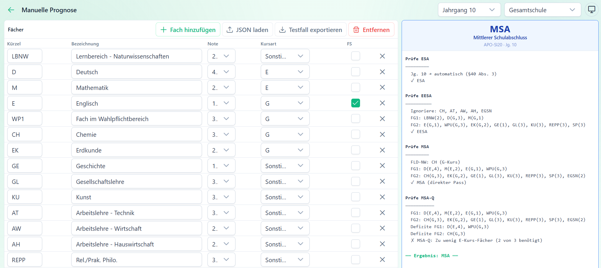
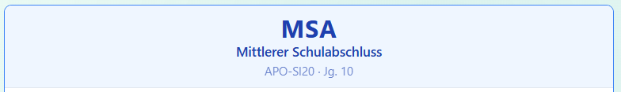

# Manuelle Prognose

Die Manuelle Prognose ist das zentrale Werkzeug für Beratungsgespräche oder für schnelle *"Was-wäre-wenn"*-Situationen.

Sie können in an dieser Stelle beliebige Notenkombinationen eingeben, die unabhängig von einem konkreten Schüler im SVWS-System sind und sofort das Prognoseergebnis sehen.

## Aufbau der Ansicht

Die Ansicht besteht aus zwei Bereichen, im linken Bereich sehen Sie die **Fächer**, im rechten Bereich ist der Block mit der Auswertung und der **Prognose**:



Stellen Sie für eine korrekte Prognose zuerst sicher, dass in der Kopfzeile **Jahrgang** und **Schulform** wie gewünscht gewählt sind.

Zulässige Werte für das Feld **Jahrgang** sind: 
* *Jahrgang 8* — Frühprognose; EESA und MSA/MSA-Q werden geprüft
* *Jahrgang 9* — Prüfung auf EESA und MSA/MSA-Q
* *Jahrgang 10* — ESA wird automatisch gewährt; MSA/MSA-Q werden geprüft
* *Kein Jahrgang* — Nur Prüfung auf MSA/MSA-Q ohne Jahrgangsbeschränkung

Wählen Sie die **Schulform**
* *Gesamtschule*
* *Sekundarschule*
* *Primusschule*

Stellen Sie anschließend links die Fächer ein. Achten Sie hier darauf, die Kürzel ASD-Kürzel der Statistik zu verwenden, damit der Prognose-Algorithmus die Fächer erkennt. 

Auf der rechten Seite finden Sie die Zusammenfassung der Prognoseberechnung und auf welche Abschlüsse mit welchen Kriterien und Ergebnissen geprüft wurde. 

Bei den **Fächern** können Sie die Kürzel umbenennen und über `+ Fach hinzufügen` eine weitere Fach-Zeile erzeugen.

* *Kürzel* das Fachkürzel laut der ASD-Bezeichnungen, verwenden Sie hier unbedingt *Großbuchstaben*, also zum Beispiel Werte wie	D, M, E, BI, WP1 (weiter unten ist eine vvollständige Liste)
* Die *Bezeichnung* ist ein optionaler Klartextname wie *Deutsch*, *Mathematik*
* Bei der *Note* sind die Schulnoten 1 bis 6 einzutragen
* *Kursart*	Kurstyp des Faches	E-Kurs, G-Kurs oder Sonstige
* *FS*	Fremdsprache (Häkchen)	Für Zusatzfremdsprachen wie Französisch, Spanisch

Beim **Fachkürzel** erkennt SVWS-Prognos erkennt die Standard-ASD-Fachkürzel aus dem SVWS-System:

* Hauptfächer: D, M, E
* Naturwissenschaften: BI, CH, PH, IF
* Geisteswissenschaften: GE, EK
* Religion/Ethik: RE, ER, KR, PP, REPP
* Sport: SP
* MU, KU, TE
* WP1, WP2	Wahlpflichtunterricht (wird intern zu WPU normiert)

Fächer mit den Kürzeln LBAL, AT, AH, AW oder PK werden von der Prognoseberechnung ignoriert.

Wählen Sie **Kursarten**
* *E-Kurs* Erweiterungskurs
* *G-Kurs* Grundkurs
* *Sonstige* Alle anderen Fächer (Sport, Musik, Religion …)

Aktivieren Sie die **Fremdsprachen-Checkbox FS** für Fächer, die eine Fremdsprache sind und als Zusatzfremdsprache gelten sollen, also alle Fremdsprachen außer Englisch. Beispiele: Französisch (F), Spanisch (S) oder Latein (L).

>[!TIP] Zusatzfremdsprachen
> Englisch (E) ist grundsätzlich keine Zusatzfremdsprache, auch wenn die FS-Checkbox aktiv sein sollte.
>
> Zusatzfremdsprachen werden bei der ESA- und EESA-Berechnung ignoriert, fließen jedoch in die MSA-Berechnung ein.

Der Button ``🗑 Entfernen`` setzt die Fächertabelle auf die Standardfächer zurück.

Einzelne Fächerzeilen entfernen Sie über das `✕`-Symbol am Ende jeder Zeile.

**Standardfächer**

Beim Öffnen der Manuellen Prognose sind typische Fächer einer Gesamtschule bereits vorausgefüllt (Deutsch, Mathematik, Englisch und so weiter). Sie können diese Standardauswahl überschreiben oder weitere Fächer hinzufügen.

## Das Prognoseergebnis lesen

Sobald alle Fächer eingetragen sind, berechnet die App automatisch das Ergebnis im rechten Panel.

Das Ergebnis wird mit jedem Noteneintrag oder Notenänderung aktualisiert.

Oben rechts wird der **Abschluss** angezeigt und wie folgt eingefärbt:



Folgende Farben werden verwendet:

* 🔴 Rot: Ohne Abschluss (OA)
* 🟠 Orange: Erweiterter Erster Schulabschluss (EESA) 
* 🟡 Gelb: Erster Schulabschluss (ESA)
* 🔵 Blau: Mittlerer Schulabschluss (MSA)
* 🟢 Grün: Mittlerer Schulabschluss mit Qualifikationsvermerk zum Besuch der Gymnasialen Oberstufe (MSA-Q) 

Unterhalb des Abschlusses sehen Sie das **Berechnungsprotokoll**. Dies ist schrittweise Erläuterung im Detail, wie SVWS-Prognos das Ergebnis berechnet hat. 

Hierbei werden die folgenden Symbole verwendet:
* **✓**: die getestete Bedingung ist erfüllt
* **✗**: die getestete Bedingung *nicht* erfüllt
* **⚠**: es wird ein *Hinweis* oder eine *Warnung* angezeigt

Aus dem Protokoll kann gelesen werden,
* welche Fächergruppen gebildet wurden.
* Ob Defizite vorhanden sind und ob sie ausgeglichen werden
* Warum ein bestimmter Abschluss erreicht oder verfehlt wird.

Eine Beispielberechnung, nach der ein *EESA* erreicht wird, könnte so aussehen:

```
Prüfe ESA
─────────
  Jg. 10 → automatisch (§40 Abs. 3)
  ✓ ESA
 
Prüfe EESA
──────────
  Ignoriere: CH, AT, AW, AH, EGSN
  FG1: LBNW(2), D(G,3), M(G,2)
  FG2: E(G,1), WPU(G,3), EK(G,2), GE(1), GL(3), KU(3), PP(3), SP(3)
  ✓ EESA
 
Prüfe MSA
─────────
  FLD-NW: CH (G-Kurs)
  FG1: D(E,4), M(G,2), E(G,1), WPU(G,3)
  FG2: CH(G,3), EK(G,2), GE(1), GL(3), KU(3), PP(3), SP(3), EGSN(2)
  ✗ MSA: Defizite zu hoch
 
══ Ergebnis: EESA ══
```

### Daten importieren und exportieren

Sie können eine vorbereitete Notenliste im **JSON-Format importieren**. Klicken Sie auf `⤒ JSON laden` und wählen Sie eine .json-Datei aus.

Das unterstützte Format:

``` json
{
  "input": {
    "jahrgang": "10",
    "faecher": [
      { "kuerzel": "D",  "note": 2, "kursart": "E" },
      { "kuerzel": "M",  "note": 3, "kursart": "E" },
      { "kuerzel": "E",  "note": 2, "kursart": "E" },
      { "kuerzel": "BI", "note": 4, "kursart": "G" }
    ]
  }
}
``` 

Jahrgang und Schulform aus der JSON-Datei werden automatisch übernommen, sofern vorhanden.

Haben Sie ein Ergebnis berechnet, können Sie die aktuelle Eingabe über `⤓ Testfall exportieren` als **JSON-Datei speichern**.

Diese Datei enthält die eingestellten Fächer, Jahrgang, Schulform und Noten und kann später erneut importiert werden.