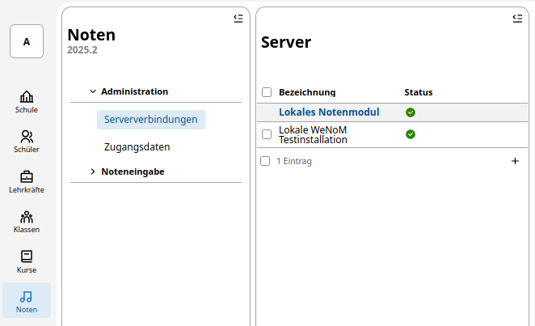
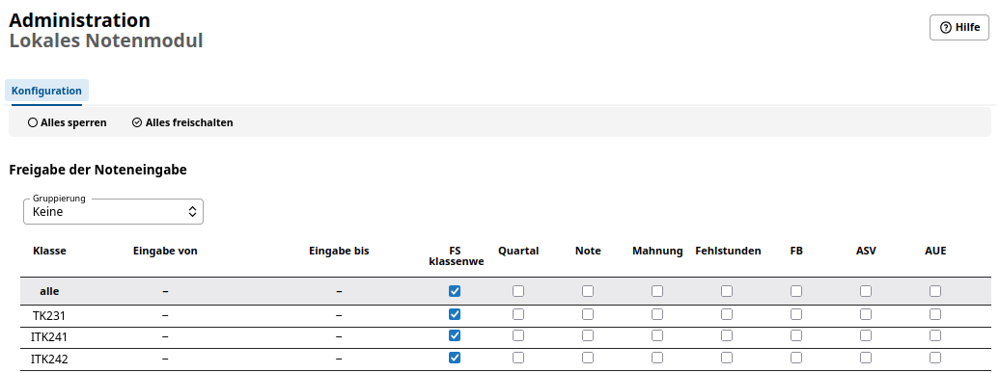
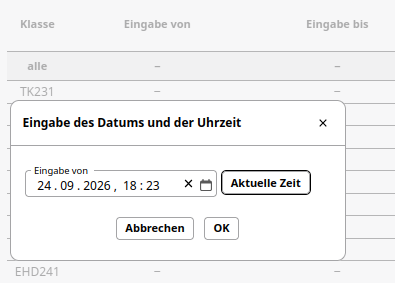

# Notenmodul konfigurieren

In der App Noten des SVWS-WeNoM-Servers finden Sie die Einstellungen zu den Serververbindungen. Hier sehen Sie nun auch die zuvor eingerichtete Verbindung zu Ihrem WeNoM-Server.

Im Fenster **Server** sehen Sie als Verbindungen immer das *Lokale Notenmodul* als Verbindung. Dieses ist das Notenemodul auf dem internen SVWS-Server, das im internen Netz direkt über den SVWS-WebClient erreicht werden kann.
Darunter finden Sie die von Ihnen eingerichtete Verbindung zu Ihrem WeNoM-Server. 

Grundsätzlich ist es sinnvoll, zunächst das *Lokale Notenmodul* zu konfigurieren und diese Konfiguration dann bei der WeNom-Verbindung zu übernehmen bzw. dann ggf. spezifisch abzuwandeln.

## Lokales Notenmodul konfigurieren

Haben Sie als Serververbindung das *Lokale Notenmodul* ausgewählt, sehen Sie rechts im Fenster die *Administration Lokales Notenmodul*. Unterhalb der Überschrift **Konfiguration** sehen Sie die Möglichkeiten, zur Festlegung der freizuschaltenden Klassen, der Terminvorgaben zur Noteneingabe sowie der angebotenen bzw.vorausgewählten Eingabespalten.

Klicken Sie in der Spalte *Eingabe von* in das Datenfeld im Spaltenkopf, können Sie den Datums- und Zeitwert eintragen, ab dem alle Noteneintragungen für alle Klassen möglich sind. Klicken Sie in der Spalte *Eingabe bis* in das Datenfeld im Spaltenkopf, können Sie den Datums- und Zeitwert eintragen, bis zu dem alle Noteneintragungen für alle Klassen erledigt sein müssen.

Die Eintragungen im Spaltenkopf werden dann immer für alle Klassen angewendet. Sollten Sie für einzelnen Klassen Abweichungen eintragen müsssen, so können Sie diese direkt in der jeweiligen Zeile der Klasse im betreffenden Datenfeld vornehmen.

