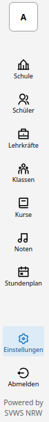
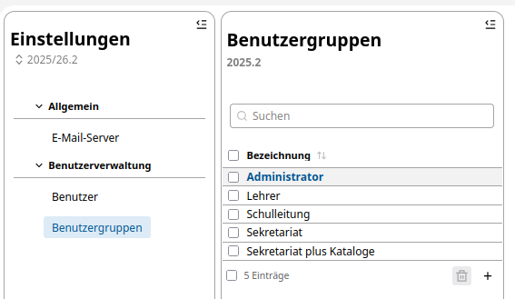
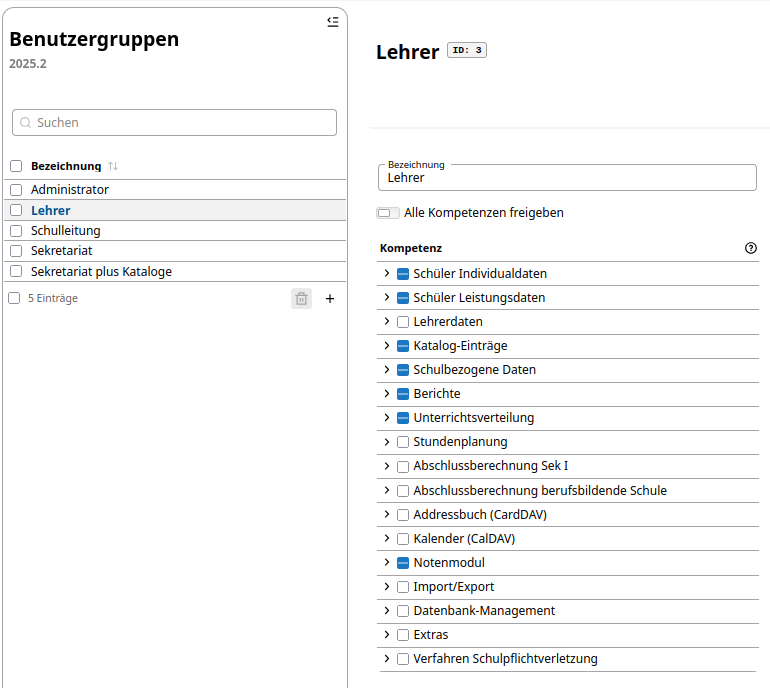
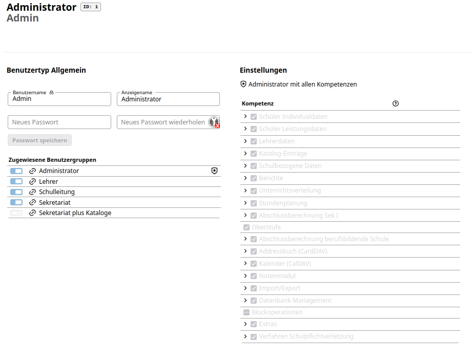
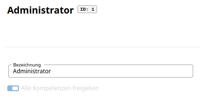
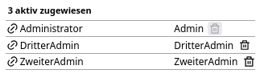
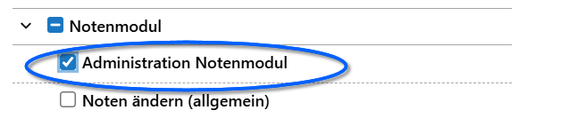
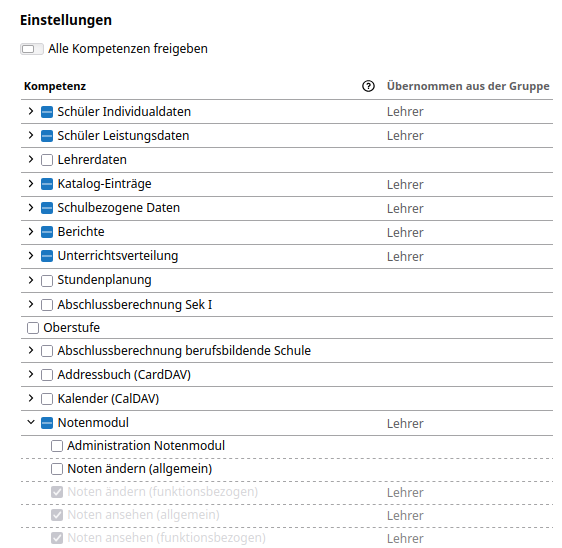

# Benutzerrechte anpassen

Im Menü des SVWS-Client wählen Sie als Administrator ganz unten links das Zahnradsymbol, um die Einstellungen für die Benutzergruppen und die Berechtigungsstufen der benutzer anzupassen.

Haben Sie den Menüpunt **Einstellungen** ausgewählt, erscheint rechts daneben eine Spalte mit den angelegten Benutzergruppen.

## Berechtigungsstufe der Benutzergruppe anpassen

Hier werden alle Benutzergruppen dargestellt, die Sie bereits im System angelegt haben. Benötigen Sie weitere Benutzergruppen, könen Sie diese über das **+** - Zeichen umsetzen.

Wählen Sie eine Benutzergruppe aus - dies erkennen Sie ab der Hintergrundschraffur bei der Bezeichnung der Benutzergruppe - sehen Sie rechts daneben ein weiteres Fenster, in dem die für diese Benutzergruppe ausgewählten Kompetenzen dargestellt werden. Sollten Sie für bestimmte Benutzergruppe weniger oder weitergehende Benutzerberechtigungen benötigen, so passen Sie diese Auswahl mithilfe der Checkboxen auf die gewünschten Kompetenzen/Berechtigungen an.

## Benutzern, eine Berechtigungsgruppe zuordnen

Damit Lehrer Noten eintragen und bestimmte Lehrer zusätzlich als Administratoren für das Notenmodul arbeiten können, müssen Sie diesen Benutzern die gewünschte Berechtigungsstufe zuordnen. Dies erfolgt, indem Sie pro Benutzer diesen einer entsprechenden Benutzergruppe zuordnen bzw. mehrere Benutzergruppen einem Bebnutzer zuordnen. 

Wählen Sie hierzu unter **Einstellungen - Benutzerverwaltung** den Punkt **Benutzer** aus. Rechts daneben erscheint der ausgewählte Benutzer mit den darunter zugewiesenen Bneutzergruppen. Rechts daneben sehen Sie die für diesen Benutzer ausgewählten einzelnen Berechtigungen.

## Prüfen, wer einer Benutzergruppe zugeordnet ist

Klicken Sie auf **Einstellungen - Benutzergruppen** und wählen Sie in der Spalte **Benutzergruppe** eine Benutzergruppe aus. Sie sehen dann rechts die ausgewählte Benutzergruppe.

Danach sehen Sie ganz rechts in der Spalte **aktiv zugewiesene Benutzer**, diejenigen Benutzer, die dieser Benutzergruppe derzeit aktiv zugeordnet sind.

Sollen aktive Benutzer nicht mehr dieser Benutzergruppe angehören, so können Sie diese direkt mithilfe des Papierkorbsymbols hinter dem Benutzernamen löschen. Es wird nur die Zuordnung des Benutzers gelöscht.

## Benutzerrechte für SVWS-WeNoM administrierende Lehrkräfte

Soll ein Datenbank-Nutzer auch die oben erklärte Konfiguration vornehmen können, ist dieser Nutzer mit den passenden Rechten auszustatten. Ansonsten sieht ein Nutzer - auch ein *Administrator*, der zusätzlich auch *Lehrer* ist - nur die selbst unterrichteten Klassen.

Sie können zur Konfiugration der Klassen/Jahrgänge/Abteilungen einen *Administrator, der kein Lehrer ist* verwenden.

Sie können aber auch einem Lehrer (ob Administrator oder nicht) auch die Nutzerrechte des Notenmoduls freischalten.

Gehen Sie über die **App Einstellungen ⚙** in **Benutzerverwaltung ➜ Benutzergruppen**. Erzeugen Sie eine neue Benutzergruppe oder wählen Sie eine existiernde, die die SVWS-WeNoM-Konfiguration übernehmen soll.

Navigieren Sie zum Bereich **Notenmodul** und aktiveren Sie den Bereich **Administration Notenmodul**.

Sie können auch einem individuellen **Benutzer** diese Rechte gezielt zuweisen, ohne über Benutzergruppen zu gehen.

Haben Sie einen Benutzer ausgewählt, wird ganz rechts dargestellt, welche Berechtigungsstufen diesem Benutzer zugeordnet sind. Ein Bereich hierbei sind die Berechtigungen für das **Notenmodul**.

In obiger Abbildung kann der ausgewählte Nutzer aufgrund seiner Zuordnung zur Benutzergruppe *Lehrer* Noten ändern und ansehen. Sie können diesem Lehrer nun zusätzlich die Berechtigung erteilen, das Notenmodul zu administrieren. Dadurch kann dieser Lehrer auch im Notenmodul bei den Serververbindungen die Synchronisation zum externen WeNoM-Server durchführen und die Konfiguration der Klassen/Jahrgänge/Abteilungen vornehmen.
