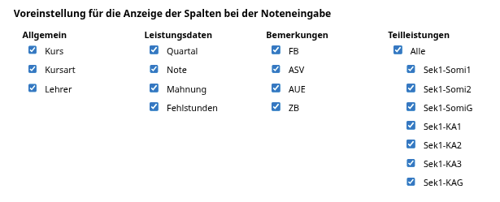
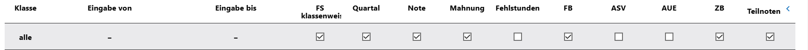
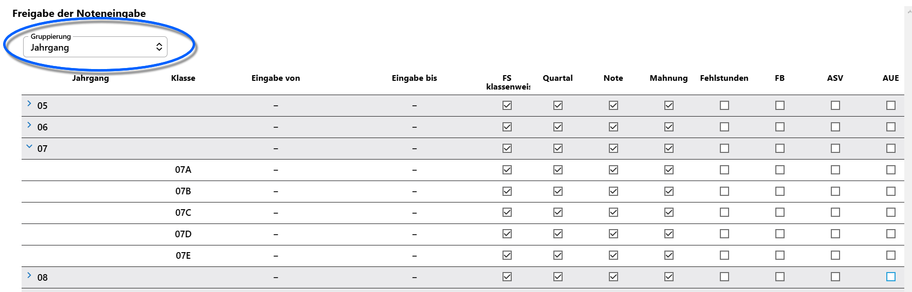
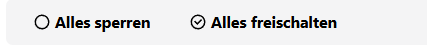

# Anzeige anpassen

Im Tab **Konfiguration** eines SVWS-WeNoM-Servers lässt sich einstellen, welche Spalten bei der Noten- und Leistungsdateneingabe und im Klassenleitungsbereich jeweils klassenweise befüllt und geändert werden können.

Setzen Sie bei einer Klasse die Checkboxen wie beabsichtigt, um die jeweiligen Einträge für Benutzer schreibbar zu machen.

Wenn Fehlstunden erfasst werden sollen - die Einträge in der Spalte **FS** sind angehakt - kann weiterhin über die Spalte **FS klassenweise** gesteuert werden, ob die Eingabe von Fehlstunden auf Fachebene möglich ist oder Fehlstunden eines Lernenden nur über die Klassenleitungen aufsummiert eingegeben werden. Für diesen Fall ist die Checkbox bei **FS klassenweise** anzuhaken. Sollen FS über die Fächer erfasst werden, ist die Spalte **FS klassenweise** ohne Haken zu konfigurieren.

Unterhalb der Checkbox-Matrix lassen sich *Spalten* vollständig ein- oder ausblenden.

Hier können Sie auch steuern, welche **Teilleistungen** zur Noteneingabe angezeigt werden.

Über die Kopfzeile lassen sich die Einträge auch für alle Klassen auf einmal umändern.

Über das Dropdown-Menü "Gruppierung" können Sie Klassen nach *Jahrgängen* oder *Abteilungen* zusammenfassen und so übersichtlich mit wenigen Checkboxen im Gruppenkopf steuern. Heben Sie eine Gruppierung auf, indem Sie den Eintrag wieder auf *keine* stellen.

Eine Gruppe lässt sich auch aufklappen, so dass für eine Klasse abweichende  Einstellungen vorgenommen werden können.

Oben links können Sie über die beiden Schalter `Alles sperren` und `Alles freischalten` alle Checkboxen auf einmal setzen.

::: tip Denken Sie ans Synchronisieren
Zum Abschluss Ihrer Arbeiten synchronisieren Sie die Daten mit ihrem SVWS-WeNoM.
:::
