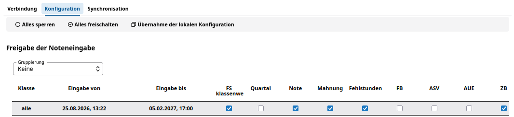

# Übernahme für WeNoM

Haben Sie über den SVWS-Client in der **App Noten** des SVWS-Servers alle Einstellungen für die Benutzerberechtigungen sowie für die lokale Noteneingabe auf dem SVWS-Server konfiguriert, gilt es nun festzulegen, welche dieser Einstellungen Sie für den externen WeNoM-Server verwenden möchten. 

Klicken Sie dazu auf die **App Noten** links in der Menüleiste, wählen Sie dann die Server-Verbindung aus, die Sie bereits für Ihren externen WeNoM-Server eingerichtet haben. 

 

Wenn Sie nun oben in der Menüleiste den Punkt **Übernahme der lokalen Konfiguration** auswählen, werden alle Einstellungen, die Sie bereits für die lokale Noteneingabe über den SVWS-Server konfiguriert haben 1:1 übernommen. Die einzelnen Einstellungen pro Klasse werden unterhalb der dargestellten Spaltenköpfe angezeigt.

Hier können Sie weitere Anpassungen vornehmen, die Besonderheiten von Klassen abbilden. 

Sollten z.B. bestimmte Abteilungen oder Jahrgänge abweichende Termine zur Noteneingabe benötigen, können Sie zuerst die Gruppierung auswählen und dann in der jeweiligen Abteilungen oder dem jeweiligen Jahrgang für die gewünschten Klassen, die gesamte Abteilung oder den gesamten Jahrgang Anpassungen vornehmen. Bei sehr vielen Klassen erleichtert es Ihnen die Zuordnung.
