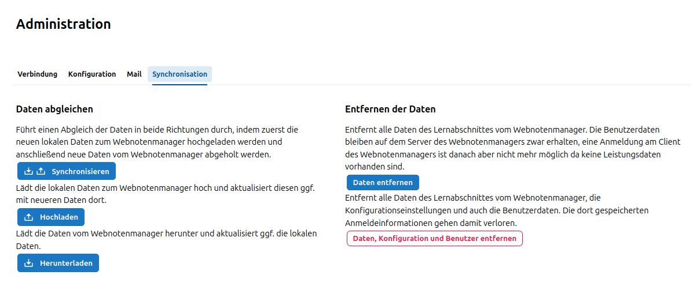

# Daten abgleichen

Nachdem die Installation und Ersteinrichtung und damit die erfolgreiche Verbindung zum SVWS-WeNoM-Server im SVWS-Server eingerichtet wurde, kann die schulfachliche Administration auf der Konfigurationsoberfläche des SVWS-Servers die Daten zwischen beiden Datenbeständen abgleichen. Dies erfolgt über den Menüpunkt **Synchronisation**.

Für den Datenabgleich finden Sie dort drei Möglichkeiten:

 - **Hochladen**: Muss der WeNoM-Server erstmalig mit Belegungsdaten etc. gefüllt werden, so erfolgt dies über den Menüpunkt **Hochladen**. Dabei werden die Daten vom SVWS-Server auf den SVWS-WeNoM-Server übertragen.
 - **Herunterladen**: Sollten die Daten auf dem SVWS-WeNoM-Server bereits vorhanden sein, können diese über den Menüpunkt **Herunterladen** auf den SVWS-Server übertragen werden. Dabei werden die Daten vom SVWS-WeNoM-Server auf den SVWS-Server übertragen.
 - **Synchronisieren**: Sollten die Daten auf beiden Servern bereits vorhanden sein, können diese über den Menüpunkt **Synchronisieren** abgeglichen werden. Dabei werden die Daten vom SVWS-Server auf den SVWS-WeNoM-Server übertragen und anschließend die Daten vom SVWS-WeNoM-Server auf den SVWS-Server übertragen. Dabei wird anhand eines Zeitstempels in beiden Datenbeständen entschieden, welcher Eintrag der Neuere ist und der Eintrag mit dem neuesten Datum wird für den SVWS-Server erhalten beziehungsweise vom SVWS-WeNoM übernommen.

In der Regel werden die Datenbestände *synchronisiert*, was einem Hochladen mit anschließendem Herunterladen entspricht.

Dabei wird anhand eines *Zeitstempels* in beiden Datenbeständen entschieden, welcher Eintrag der Neuere ist und der Eintrag mit dem neuesten Datum wird für den SVWS-Server erhalten beziehungsweise vom SVWS-WeNoM übernommen.

Beim Synchronisieren werden ebenfalls die Benutzer abgeglichen, so dass es für den SVWS-WeNoM ausschließlich Benutzer gibt, die im SVWS-Server vorhanden sind.

In besonderen Fällen kann nur hoch- beziehungsweise heruntergeladen werden, so dass kein beidseitiger Abgleich über die Datumsstempel stattfindet.

