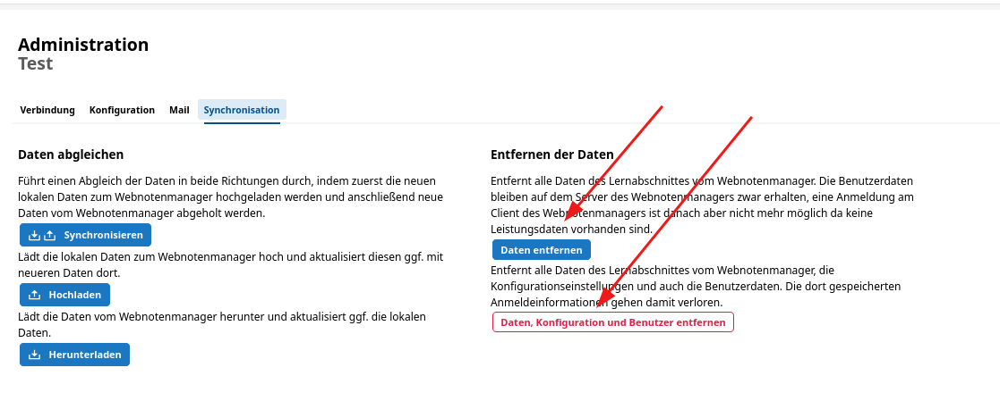
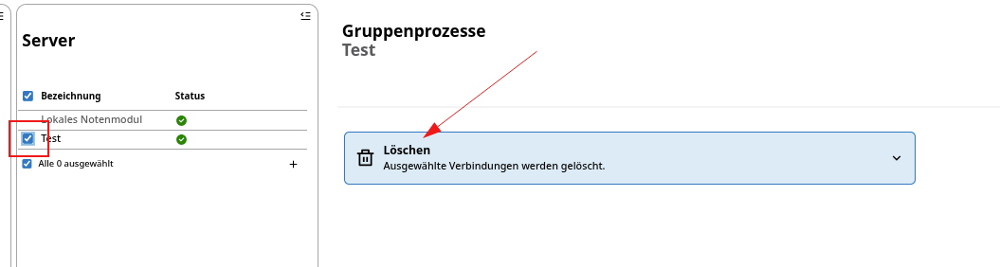

# Daten entfernen

Haben Sie in der App Noten die Verbindungsdaten zum externen WeNoM-Server aufgerufen, können Sie über den Menüpunkt **Synchronisation** als schulfachliche Administration Daten löschen.

Im normalen, halbjährlichen Schulabschnittswechsel können mit dem Punkt **Daten entfernen** alte Zeugnisdaten zur Sicherheit aus dem, über das Internet erreichbaren System genommen werden. Zum einen sind diese Daten dann nicht mehr im externen WeNoM-Server abrufbar und zum anderen kann ein neuer Lernabschnitt auf dem SVWS-WeNoM begonnen werden.

Falls ein installierter SVWS-WebNotenManager vollständig aufgegeben oder vollständig neu initialisiert werden soll und der schulfachliche Administrator somit die Löschung aller Daten auf dem SVWS-WeNoM-Server durchführen muss, kann dies über den Schalter `Daten, Konfiguration und Benutzer entfernen` erreicht werden.

### Verbindungsdaten löschen oder erneuern

Wenn ein neues Secret benötigt wird oder ein SVWS-WeNoM-Server gelöscht werden soll, können die noch eingetragenen Zugangsdaten unter `Verbindungsdaten einrichten` gelöscht, beziehungsweise erneuert werden.

::: danger Achtung: Daten auf dem WeNoM-Server werden dadurch nich gelöscht!
Die *Daten*, die sich auf dem externen WeNoM-Server befinden, werden dabei nicht gelöscht. Es wird lediglich die *Verbindungsmöglichkeit* entfernt.

Die Möglichkeit zur Verbindung kann gegebenenfalls wiederhergestellt werden, falls das *Secret* des SVWS-WeNoM-Servers noch gültig ist.
:::