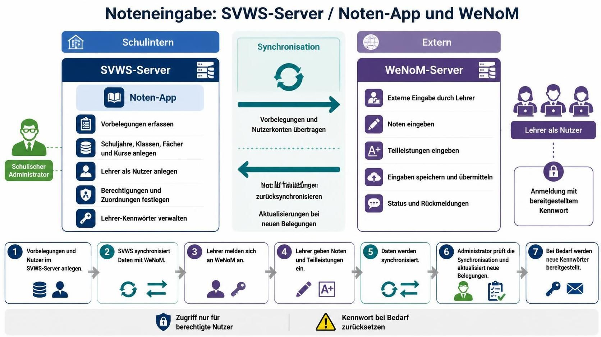

# Überblick zur schulischen Administration

Zur Verwaltung der Online-Noteneingabe mit WeNoM ist das Zusammenspiel zwischen dem SVWS-Server mit seinem Notenmodul (App) sowie der extern eingerichteten Instanz des WeNoM-Dienstes zu konfigurieren und im laufenden Betrieb regelmäßig zu pflegen.

Welche Schritte zu Beginn relevant sind, welche laufenden Aufgaben zu erledigen sind und welche Besonderheiten adressiert werden können, wird hier für die schulische Administration beschrieben.

Das Funktionsprinzip des Notenmanagements mit dem internen SVWS-Server und dem externen WeNoM-Server kann vereinfacht, wie nachstehend abgebildet, dargestellt werden:

*Abb. mit KI-Unterstützung erstellt.*

## Ablauf des Notenmanagements

**Voraussetzung**

Es ist ein SVWS-Server korrekt installiert und konfiguriert. Entsprechend der Version des verwendeten SVWS-Servers ist ein externer WeNoM-Server installiert und konfiguriert.

Wie der externe WeNoM-Server installiert und konfiguriert werden sollte, ist im eigenständigen Kapitel Installation nachzulesen: **[Installation](../installation/installation.md)**

**Auf dem SVWS-Server:**

1. Es werden alle Belegungen (Klassen, Schüler, Lehrkräfte, Fächer, Kurse, Notenarten) durchgeführt.
2. Es werden alle Lehrkräfte als Nutzer hinterlegt.
3. Es sind allen Lehrkräften die erforderlichen Berechtigungen zur Noteneintragung zuzuweisen.
4. Es werden allen schulischen Administratoren die erforderlichen Berechtigungen zugewiesen, um das Notenmanagement durchführen zu können.
5. Es wird die Verbindung zum WeNoM-Server eingerichtet und getestet.
6. Es wird festgelegt, welche Klassen zur Noteneingabe freigegeben werden und welche Daten für die anstehende Synchronisation genutzt werden sollen.
7. Es wird der initiale Upload der Daten auf den WeNoM-Server durchgeführt.
8. Alle weiteren Änderungen werden über die regelmäßige Synchronisation durchgeführt.

**Auf dem WeNoM-Server:**

1. Lehrkräfte melden sich mit ihren Zugangsdaten an.
2. Lehrkräfte prüfen, ob sie alle Klassen, Fächer, Kurse und Teilleistungen sehen bzw. eintragen können, die sie benötigen.
3. Lehrkräfte tragen Noten, Teilleistungen, Mahnungen und Zeugnisbemerkungen ein.
4. Sollten Lehrkräfte ihr Zugangskennwort nicht mehr kennen, wenden diese sich an die schulische Administration, die das Kennwort zurücksetzen kann.

## Aufgaben der schulischen Administration

1. Verwaltung der Benutzerkonten und Berechtigungen.
2. Überwachung und Pflege der Datenintegration zwischen SVWS-Server und WeNoM-Server.
3. Unterstützung der Lehrkräfte bei der Nutzung des Notenmanagements.
4. Regelmäßige Durchführung der Synchronisation der Daten.