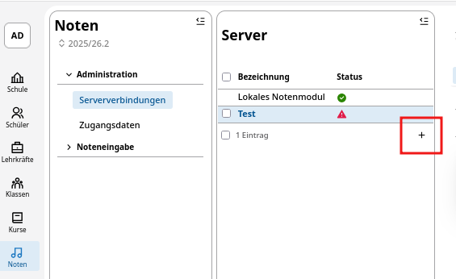
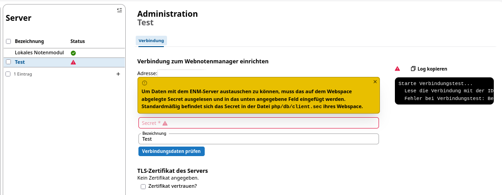

# Verbindung einrichten

Die Einrichtung der Verbindung zur Synchronisation zwischen dem SVWS-Server und dem externen WeNoM-Server obliegt der für die Schule zuständigen **schulfachlichen Administration**, gegebenfalls also der Schulleitung, Stellvertretung oder Beauftragte/technische Koordinatoren/Schuladmins. Es werden somit höhere Rechte beim Benutzer des SVWS-Servers benötigt.

Zur Einrichtung eines neuen WebNotenManagers im SVWS-Server drücken Sie das Pluszeichen unter **Noten -> Administration -> Serververbindungen -> Server**.

Es können mit einer Datenbank mehrer SVWS-WebNotenManager verknüpft werden, um z.B. in größeren Berufskollegs die Abteilungen autark voneinander arbeiten zu lassen.

## Verbindungsdaten festlegen

Zur Festlegung der Verbindung erscheint folgendes Fenster:

In der Zeile Adresse ist eine gültige URL des WeNoM-Servers einzutragen. Diese URL muss mit `https://` beginnen und darf nicht mit einem Backslash enden. Die URL muss von dem SVWS-Server aus erreichbar sein.

In der rot markierten Zeile *Secret* ist das zuvor generierte Secret des externen WeNoM-Servers einzutragen. Dieses Secret finden Sie im Webspace des SVWS-WeNoM unter `./db/client.sec` abgespeichert. Das Secret aus dieser Datei müssen Sie unter *Secret* einfügen.

In der Zeile Bezeichnnung legen Sie noch einen internen Namen für die festgelegte Verbindung fest, die für Sie eindeutig ist. Dieser Name wird in der Liste der Verbindungen angezeigt.

:::info 

Damit der SVWS-Server und SVWS-WeNoM gesichert kommunizieren können, wird ein *Secret* benötigt. Dies wird im OAuth2-Verfahren verwendet, um die sendende Gegenstelle zu identifizieren. Das Secret wird bei der erstmaligen Eingabe der Verbindungsdaten im SVWS-Client automatisch generiert und im Webspace des SVWS-WeNoM unter `./db/client.sec` abgespeichert. 

:::

Ist das Secret erfolgreich eingetragen, kann jederzeit die Verbindung zum SVWS-WeNoM geprüft werden.
