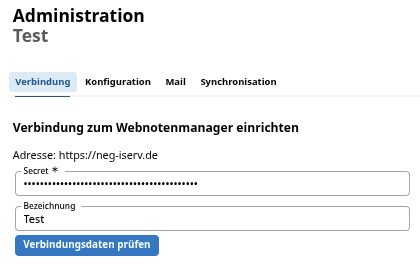

# Verbindung prüfen

Bei der Ersteinrichtung der Verbindung zu Ihrem externen WeNoM-Server sollte die Verbindung geprüft werden, um sicherzustellen, dass die Kommunikation zwischen dem SVWS-Server und dem WeNoM-Server korrekt eingerichtet ist.




Den Verlauf der Überprüfung sehen Sie rechts in dem schwarzen Fernster. Bei einer erfolgreichen Verbindung wird die Meldung *Verbindungstest erfolgreich abgeschlossen.* angezeigt. Bei einer fehlerhaften Verbindung wird eine Fehlermeldung  angezeigt, die der zuständigen schulischen Administration Hinweise zur Korrekturr der Verbindungsdaten liefert.

Erst nachdem die Verbindung erfolgreich geprüft wurde, kann die Synchronisation der Daten zwischen dem SVWS-Server und dem WeNoM-Server durchgeführt werden.

Nach der Ersteinrichtung befinden sich noch keine Daten, also explizit auch keine Logindaten auf dem WeNoM-Server. Dazu ist eine Synchronisation beziehungsweise ein Hochladen der Daten erforderlich. Dies kann im Benutzerhandbuch zur Administration unter [Synchronisation SVWS - WeNoM](../benutzerhandbuch_administration/synchronisation_svws_wenom.md) nachgelesen werden.

## Hinweise und Fehlersuche zur Einrichtung

### Fehlerhafte Eingabe der URL

Achten Sie auf die vollständig korrekte Syntax. Bei der URL ist das die Eingabe von beispielsweise `meinWeNoM.de`, ohne `https`://` und Backslash. Die verschlüsselte Verbindung zu einem HTTPS-gesicherten Server ist notwendig. Eine Verbindung zu einem HTTP-Server - ohne das S - ist nicht zulässig.

+ Prüfen Sie also, ob Sie das `https://` als Präfix korrekt gesetzt haben.
+ Prüfen Sie, ob gegebenfalls Dopplungen vorliegen: `https://https://meinWeNoM.de`.
+ Prüfen Sie auf Sonderzeichen, die fälschlicherweise verwendet wurden: `https://mein%WeNoM.de`.
+ Prüfen Sie, ob ein Backslash zu viel am Ende vorhanden ist: `https://meinWeNoM.de/`.

### Abweichungen des internen Names

Möglicherweise ist die URL vom SVWS-Server aus nicht auffindbar. Dies könnte an den Einstellungen eines Proxyservers liegen.

Hier könnte eine direkte Angabe der IP-Adresse statt des DNS-Namens erfolgen.

### Benutzung eines internen Zertifikats

In manchen netzinternen Umgebungen kann die Frage auftreten, ob dem eigenen, selbst ausgestellten Zertifikat vertraut werden soll. Dies kann in Absprache mit dem technischen Admin durch Setzen des Hakens bestätigt werden.

## Alternativ: Generation des Secrets per API

Wenn Sie ohne einen SVWS-Server das Secret generieren möchten und dieses dann an die schulische Administration übergeben wollen, können Sie dies per API-Aufruf auslösen.

>[!TIP] Prüfung der Serverantwort in der Debug-Konsole des Browsers
>Über die Konsole des Browsers (üblicherweise F12) kann die Serverantwort überprüft werden. Darüber hinaus gibt es kein sichtbares Feedback.

Zur Initialisierung wird folgende URL */api/setup* auf ihrer Domain aufrufen, ein Beispiel wäre etwa:

```bash
https://meinnotenmanager.de/api/setup
```

Dies kann von jedem gängigen Browser aus ausgeführt werden.

Gültige Responsecodes sind:

```bash
204 Setup erfolgreich
409 Server ist schon initialisiert
```

Der Aufruf des oben genannten API-Befehls erzeugt im Ordner */db* eine *app.sqlite*-Datenbank und eine Datei `client.sec`.

In dieser Datei steht das generierte *Secret*.