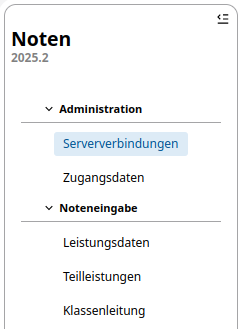

# Zugänge für Lehrkräfte

Die Lehrkräfte erhalten von der schulfachlichen Administration ein *Initialkennwort*. 

In Kombination mit der *Dienstlichen Email-Adresse* als Benutzername ist dieses Kennwort der individuelle Erstzugang zum externen WebNotenManager.

Die Lehrkräfte müssen nach dem ersten Login das Initialkennwort ändern. Sie erhalten ein neues persönliches Passwort. Dieses Passwort ist dann für die weitere Nutzung des externen WeNoM-Servers zu verwenden.

Sollten Lehrkräfte ihr Passwort vergessen haben, kann die schulfachliche Administration das Passwort auf das Initialkennwort zurücksetzen. Die Lehrkraft kann dann mit dem Initialkennwort sich erneut anmelden. Es wird für die Lehrkraft während des Anmeldeprozesses ein neues Passwort zugeordnet und angezeigt.

Alle administrativen Tätigkeiten rund um die Zugänge für Lehrkräfte werden über die App **Noten** im SVWS-Client durchgeführt. Unter dem Menüpunkt **Administration** finden Sie den Unterpunkt **Zugangsdaten**. Dort werden die Lehrkräfte mit den hinterlegten Zugangsdaten angezeigt.

