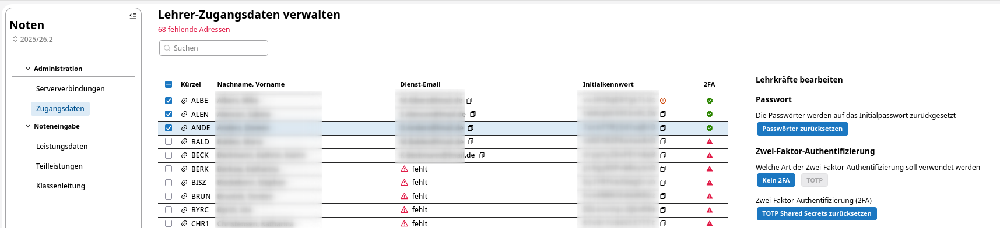

# Zugänge einrichten

Um Anpassungen an den Zugängen der Lehrkräfte vorzunehmen, müssen Sie in der App **Noten** im SVWS-Client unter dem Menüpunkt **Administration** den Unterpunkt **Zugangsdaten** auswählen. Dort werden die Lehrkräfte mit den hinterlegten Zugangsdaten angezeigt.

Sie haben die Möglichkeit, einzelne, mehrere oder alle Lehrkräfte auszuwählen und über den Button *Passwort zurücksetzen* das Passwort auf das Initialkennwort zurückzusetzen. Die Lehrkraft kann dann mit dem Initialkennwort sich erneut anmelden. Es wird für die Lehrkraft während des Anmeldeprozesses ein neues Passwort zugeordnet und angezeigt.

Dies setzt voraus, dass die Lehrkräfte ihr bisheriges Initialkennwort noch zur Verfügung haben.

Sollte dies nicht mehr der Fall sein, können Sie über den Button *Initialkennwort zurücksetzen* ein neues Initialkennwort generieren. Dieses wird dann in der Spalte *Initialkennwort* angezeigt und kann der Lehrkraft mitgeteilt werden.

Ungültige oder nicht eindeutige Email-Einträge in der Spalte *Dienst-Email* werden als Fehler markiert. Diese Daten werden nicht zum WeNoM-Server übertragen.

Ebenso werden ausschließlich dienstliche Email-Adressen und keine privaten Email-Adressen des Lehrerdatensatzes als Zugangsdaten verwendet. Liegt im Lehrerdatensatz kein gültiger Eintrag im Datenfeld *dienstliche Email* vor, so erhält diese Lehrkraft kein Login für den SVWS-WebNotenManager.

::: warning SVWS-Benutzer vs SVWS-WeNoM-Benutzer
Die Personengruppe der SVWS-Benutzer ist nicht identisch mit den WeNoM-Benutzern: Die unter **Noten -> Administration -> Zugangsdaten** aufgeführte Personengruppe sind Unterrichtende oder mit Koordination und Klassenleitung Beauftragte.
:::

