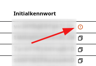
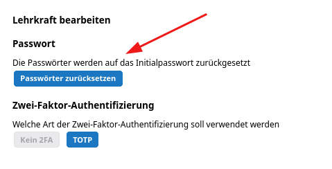
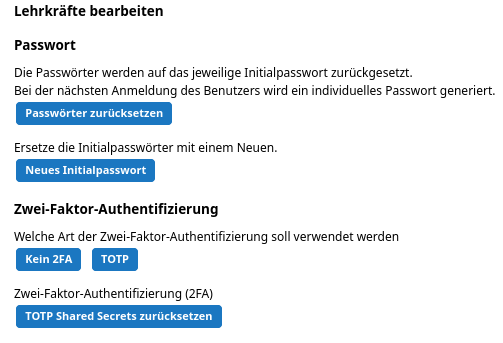
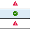
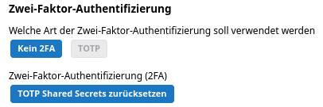

# Zugänge zurücksetzen

Die Lehrkräfte erhalten bei der Erstanmeldung mit dem Initialkennwort beim erstmaligen Anmeldevorgang ein neu generiertes und der schulischen Administration unbekanntes Passwort angezeigt. Nach erfolgreicher Erstanmeldung können diese sich dann nur noch mit dem neuen Passwort am WeNoM-Server anmelden.

Ist diese Intitialisierung abgeschlossen und wurde mit dem SVWS-Server eine erneute Synchronisierung durchgeführt, wird dies in der App Noten bei den Zugangsdaten mit einer roten Markierung neben dem Initialkennwort gekennzeichnet.

Die schulische Administration kann mit dem Button *Passwort zurücksetzen* individuell für ausgesuchte Lehrkräfte oder auch für alle Lehrkräfte das Passwort auf das Initialkennwort zurücksetzen.

Dies setzt voraus, dass die Lehrkräfte ihr bisheriges Initialkennwort noch zur Verfügung haben.

Sollte dies nicht mehr der Fall sein, können Sie über den Button *Initialkennwort zurücksetzen* ein neues Initialkennwort generieren. Dieses wird dann in der Spalte *Initialkennwort* angezeigt und kann der Lehrkraft mitgeteilt werden.

Die schulfachliche Administration kann ebenso für ausgewählte oder alle Lehrkräfte eine Zwei-Faktor-Authentifizierung (2FA) aktivieren, bei Bedarf zurücksetzen oder auch deaktivieren.

Haben sie als schulfachliche Administration einzelne oder alle Lehrkräfte markiert, wählen Sie dann die gewünschte Option für die Zwei-Faktor-Auithentifizierung aus. Soll diese vorübergehend deaktiviert werden, wählen Sie den Punkt **keine 2FA** aus. 

Soll diese hingegen aktiviert werden, wählen Sie den Punkt **TOTP** aus.

Sollten Lehrkräfte mit ihrer 2FA-Authentifizierungs-App sich nicht mehr anmelden können, haben Sie als schulfachliche Administration die Möglichkeit, die 2FA für diese Lehrkraft zurückzusetzen. Hierzu wählen Sie den Punkt **TOTP Shared Secrets zurücksetzen**.

In der Liste der Lehrkräfte wird in der Spalte **2FA** mithilfe eines grünen Häkchens gekennzeichnet, bei welchen Lehrkräften die Zwei-Faktor-Authentifizierung aktiviert ist.

Dies wird zudem bei Auswahl der betreffenden Lehrkraft rechts im Menü **Lehrkraft bearbeiten** unter **Zwei-Faktor-Authentifizierung** mithilfe des ausgegrauten Buttons **TOTP** dargestellt.

::: warning Nach Anpassungen immer Synchronisation durchführen
Sollten Sie als schulfachliche Administration Änderungen an den Zugangsdaten der Lehrkräfte vorgenommen haben, so ist es zwingend erforderlich, dass Sie anschließend eine Synchronisation zwischen dem SVWS-Server und dem WeNoM-Server durchführen. Nur so werden die Änderungen auf den WeNoM-Server übertragen.
:::
