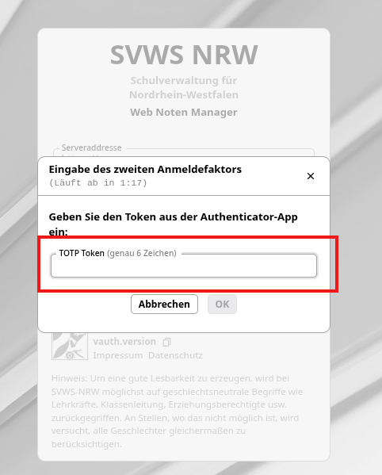
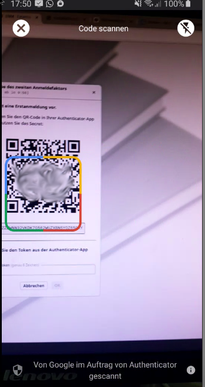
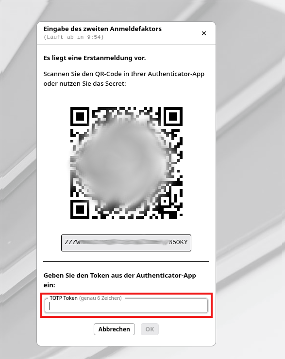

# Zwei-Faktor-Authentifizierung (2FA)

Hat Ihre Schule bereits im SVWS-Server für die Lehrkräfte die Zwei-Faktor-Authentifizierung aktiviert, dann müssen alle oder die betreffenden Lehrkräfte neben der Erstanmeldung
zusätzlich den zweiten Faktor zur erfolgreichen Anmeldung am WeNoM-Server einrichten.

## Login mit aktivierter Zwei-Faktor-Authentifizierung

Ist seitens der schulfachlichen Administration der zweite Faktor verpflichtend eingeschaltet, so erscheint nach der ersten Anmeldemaske zusätzlich die Eingabemaske für den 6-stelligen, zeitlich begrenzt gültigen zweiten Faktor.

Sollten Sie die Zwei-Faktor-Authentifizierung erstmalig nutzen, dan folgen Sie bitte nachstehend dargestellten Einrichtungsschritten.

# Einrichtung der Zwei-Faktor-Authentifizierung 

Damit der Umgang mit sensiblen Daten über das Internet zusätzlich gesichert wird, ist es möglich, eine Zwei-Faktor-Authentifizierung für jeden Benutzer einzurichten. Diese Entscheidung wird **seitens der Schule** getroffen.
Diese weitere Sicherheitsebene muss durch die schulfachliche Administration im SVWS-Server eingeschaltet worden.

Ist diese eingeschaltet worden, so erhält ein Benutzer beim nächsten Login nach erfolgreicher Eingabe des Kennworts die zusätzliche Aufforderung den *Zweiten Faktor* einzugeben.

Vor der Nutzung müssen Sie zunächst z.B. auf Ihrem Smartphone eine Zwei-Faktor App installieren.

## Einmalig: Zwei-Faktor App installieren

Sie benötigen eine Authentikator-App als diesen zweiten Faktor.
Eine solche App kann in Varianten auf lokalen Desktop-Systemen, Tablets oder auch Samrtphones verwendet werden.
Diese müssen Sie vorab einmal installieren und mithilfe des QR-Code initialisieren.

Hier ein Beispiel einer Smartphone-App:

+ Richten Sie eine neue Verbindung ein (oft ein Plus-Zeichen).
+ Scannen Sie den QRCode mit der Kamera des Smartphones

In der App wird dann für WeNoM Ihrer Schule ein Eintrag hinterlegt. Zu diesem WeNoM-Eintrag werden dann *zeitbasierte Einmalkennworte*  angezeigt als Zifferncode.

+ Übertragen Sie den 6-stelligen Code, der auf dem Endgerät angezeigt wird, in die Eingabe unter TOTP Token.

Im Screenshot wird dieser durch den roten Kasten hervorgehoben. Bei diesen Verfahren werden *zeitbasierte Einmalkennworte* verwendet, die vom Nutzer in der
Authentikator-App abzulesen und händisch bei einer Anmeldung einzugeben sind.

Damit ist die Authentifizierung über einen zweiten Faktor eingerichtet und kann beim nächsten Login verwendet werden.
