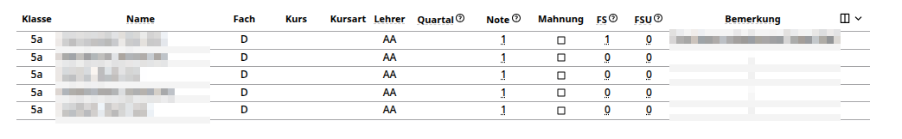
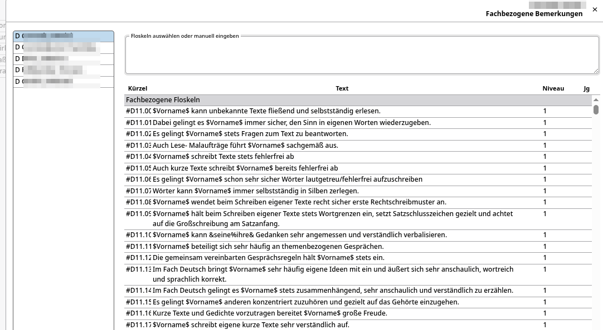
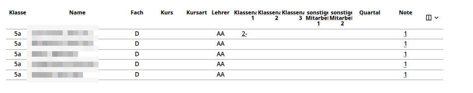
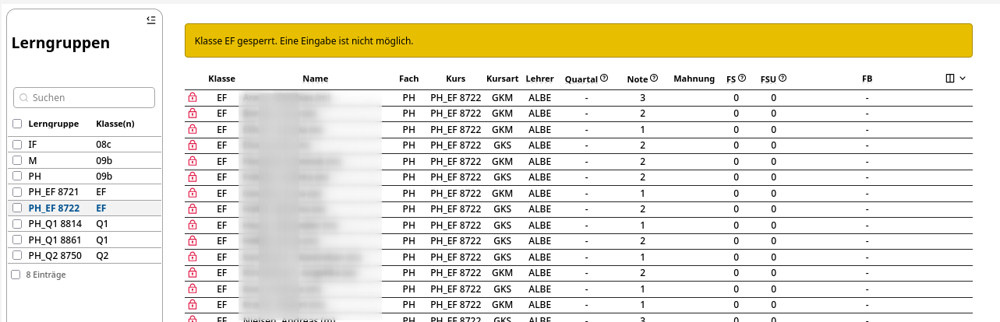

# Eintragungen der Fachlehrkräfte

## Leistungsdaten

### Noten eintragen

Die **Fachlehrkraft** kann die Noten für ihren eigenen Unterricht in den Leistungsdaten eingeben. Hierbei ist die **Note** die Zeugnisnote. Es kann ebenfalls eine **Quartalsnote** vergeben werden.

Es lassen sich ganze Noten (1, 2, 3, …) und Noten mit Tendenzen eingeben (3+, 3, 3-, …). Weiterhin können je nach Bedarf Leistungsstufen E1, E2, E3 oder Codes wie NB für "Nicht beurteilbar" oder NE für "Nicht erteilt" usw. eingetragen werden. Wichtig für die korrekte Eingabe sind die jeweiligigen Vereinbarungen Ihrer Schule.

::: tip Pfeiltasten verwenden
Nutzen Sie bei Verwendung einer Tastatur die Cursortasten, um zwischen den Feldern und Spalten zu wechseln. Noten lassen sich gut mit dem Ziffernblock eintippen.
:::

## Mahnungen setzen

Bei den Leistungsdaten können **Mahnungen** neu gesetzt oder bereits ausgesprochene Mahnungen von der Lehrkraft nachgesehen werden. Mahnungen werden über den Haken in der Checkbox vergeben.

Ist das Feld *mit einem Haken versehen* und *inaktiv* - wird also ohne Checkbox angezeigt und ist nicht mehr veränderbar - dann handelt es sich um eine *ältere Mahnung*, die dem Schüler zum Beispiel im letzten Halbjahr durch die Vergabe eines Defizits ausgesprochen wurde.

Bei Schülern neu gesetzte Mahnungen sind am gesetzten Haken und der *roten Färbung* erkennbar. Diese Mahnungen können weiterhin bearbeitet werden.

::: info Update des Mahnungs-Status
Werden die Noten und Mahnungen aus SVWS-WeNoM in den SVWS-Client übertragen und dort verarbeitet, wird der Zustand der Mahnung auf *ausgesprochen* beziehungsweise *versendet* geändert. Dies bedeutet nach einer weiteren Synchronisation mit SVWS-WeNoM, dass der Status hier auf *angehakt* und *inaktiv* wechselt.
:::

### Fachbezogene Fehlstunden eintragen

Im Bereich **Fehlstunden** können *fachbezogene Fehlstunden* (FS) als ganze Zahl eingegeben werden. Die Anzahl der *unentschuldigten Fehlstunden* (FSU) wird in der benachbarten Spalte eingetragen und darf die Anzahl der gesamten Fehlstunden nicht übertreffen. Fehlstunden für die gesamte Klasse können nur von der Klassenleitung über das entsprechende Menü eingetragen werden.

Sollten Sie mit dem Maus in das jeweilige Feld klicken und es zeigt sich kein Eingabecursor, dann wurde die Option zur Eingabe von fachbezogenen Fehlstunden und/oder fachbezogenen Bemerkungen zentral dekativiert.

### Eintragungen fachbezogene Bemerkungen (FB)

Durch Klicken auf **Fachbezogene Bemerkungen** öffnet sich ein Eingabefenster. Es ist nun der zuvor ausgewählte Schüler ausgewählt und Sie können Bemerkungen erzeugen.

Im unteren Bereich dieses Fensters können durch die Schule **vorformulierte Floskeln** entweder durch Eingabe des Kürzels oder durch Anklicken übernommen und beim Schüler eingetragen werden. Hierbei werden Platzhalter wie *$Vorname$* automatisch ausgefüllt.

Sie können im Anschluss Schüler der entsprechenden Lerngruppe auf der linken Seite durchklicken und für diese ebenfalls Bemerkungen erzeugen.

## Teilleistungen

Als **Teilleistungen** werden Unternoten eines Faches bezeichnet. Dies sind zum Beispiel Noten für *Sonstige Mitarbeit*, *Klausuren und Klassenarbeiten* oder *ZP10-Prüfungsleistungen*.

::: info Teilleistungen variieren je nach Schule
Die Schule kann Teilleistungen nach eigener Maßgabe definieren, daher können die Teilleistungen nach Schulform und Schule in ihrer Anzahl und in ihrer Bezeichnung variieren. Schulen verwenden eventuell keine Teilleistungen.
:::

Im Tab Teilleistungen findet man eine Übersicht über alle in dieser Lerngruppe durch den zentralen SVWS-Server vorgegebenen Teilleistungsarten.

Alternativ zum Leistungsdatenreiter können hier auch die Quartals- und Endnoten eingetragen werden.

## Gesperrte Lerngruppen

Seitens der schulischen Administration können einzelne Lerngruppe für die Eingaben ganz oder auch nur teilweise gesperrt werden.

## Eintragungen der Klassenleitung

### Klassenleitung: FS und FSU

Der **Tab Klassenleitung** ist nur für Klassenlehrkräfte sichtbar. Hier werden fachübergreifende Fehlstunden, also die Gesamtfehlstunden, verwaltet. *FS* steht für die *Summe der Fehlstunden* und *FSU* für die *Summe der Unentschuldigten Fehlstunden*.

Die Erfassung von Gesamtfehlstunden gilt für den Fall, dass sich die Schule nicht für die Erfassung der fachbezogenen Fehlstunden entschieden hat.

### ASV, AUE und ZB

Unter den Spalten

+ **ASV** - Arbeits- und Sozialverhalten,
+ **AUE** - Außerunterrichtliches Engagement und
+ **ZB** - Zeugnisbemerkung

können jeweils in diesen unterschiedlichen Kontexten Bemerkungen eingetragen werden.

Ebenso wie bei den fachbezogenen Bemerkungen kann hier auf vorformulierte Floskeln zurückgegriffen werden. Zum Bearbeiten des Textes öffnet sich ein Fenster, in dem Floskeln ausgewählt oder manuell eingetragen werden können.
