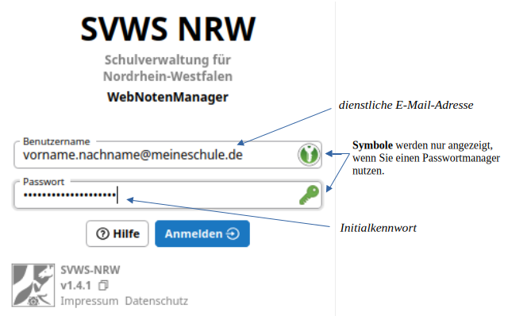
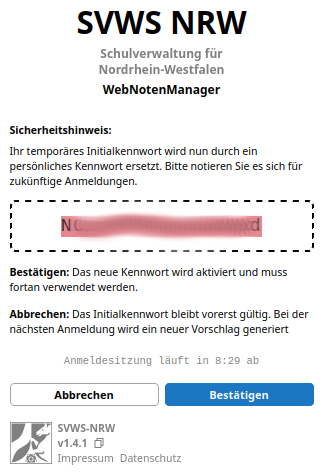

# Erste Anmeldung

+ Öffnen Sie die Webadresse (URL) des SVWS-WeNoM-Servers, die Sie von Ihrer Schule erhalten haben.
+ Zum Anmelden gilt die **dienstliche E-Mail-Adresse** als **Benutzername**.
+ Als Kennwort ist das **Initialkennwort** zu verwenden, welches Ihnen von der schulischen Administration mitgeteilt wurde.

Nach der ersten Anmeldung am System verliert das Initialkennwort die Güligkeit und es wird **einmalig** das neue Passwort angezeigt.
Notieren Sie sich das Passwort - zum Beispiel in Ihrem Passwortmanager.

Bitte speichern Sie nie die Passwörter im Browser!

Sollte Ihre schulische Administration die Zwei-Faktor-Authentifizierung aktiviert haben, müssten Sie nun noch den zweiten Faktor zur Anmeldung einrichten.
Wie dies funktioniert und was dabei zu beachtenm ist, können Sie im Abschnitt 2FA nachlesen: [Einrichtung 2FA](2fa/index.md)
