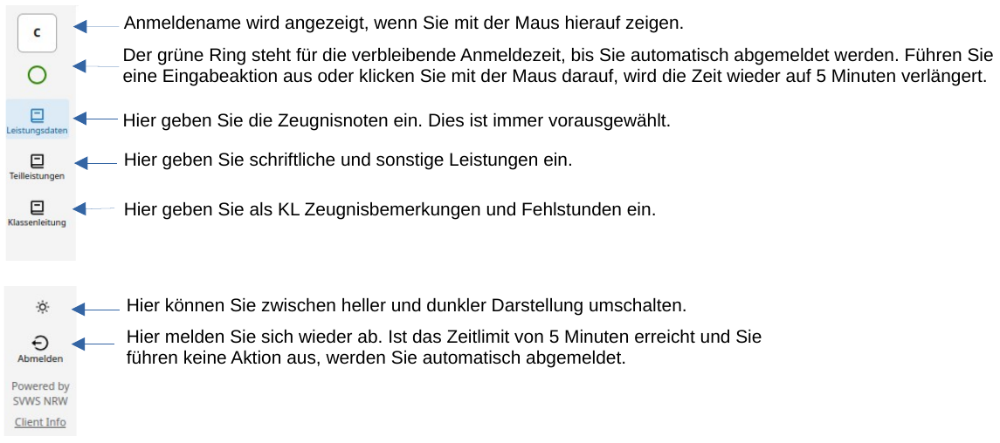

# Menü nach der Erstanmeldung

Nachdem Sie sich erfolgreich beim WebNotenManager Ihrer Schule angemeldet haben, sehen Sie ein Fenster das inhaltlich dreigeteilt ist.
Ganz links im Fenster sehen Sie eine dauerhafte Menüleiste.

Die links dargestellten Symbole haben folgende Funktionen:

Über die links angezeigten Symbole können Lerngruppen, für die Eintragungen vorgenommen werden sollen, ausgewählt werden.

+ **Leistungsdaten** - dies sind die Zeugnisnoten, Fehlstunden und Mahnungen bei Schülern. Diese sind nach der Anmeldung immer vorausgewählt.
+ **Teilleistungen** - werden an Ihrer Schule Teilleistungen zu Fächern erfasst, sind diese hier aufgeführt. Teilleistungen könnten u.a. Noten für Klausuren, Sonstige Mitarbeit oder ZP10-Noten sein.
+ **Klassenleitung** - als Klassenleitung können hier aufsummierte Fehlstunden oder die diversen Arten von Zeugnisbemerkungen eingegeben werden.
