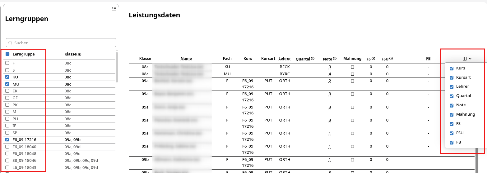

# Ansicht nach der Erstanmeldung

Haben Sie sich erfolgreich angemeldet, dann sind die Leistungsdaten vorausgewählt. Sie sehen dann in dem dreigeteilten Fenster ganz links die Menüleiste, gefolgt von den Lerngruppen, die Ihnen zugeordnet sind. Ganz rechts finden Sie die Leistungsdaten für die ausgewählte Lerngruppe für Ihr Fach / Ihren Kurs.

## Leistungsdaten - hier: Tabelleneinstellungen

Nachstehende Darstellung zeigt die beiden Inhaltsfenster des vorausgewählten Menüpunkts **Leistungsdaten**:

In dem links rot umrandeten Bereich der Lerngruppen können Sie die rechts daneben darzustellenden Lerngruppen auswählen.
Klicken Sie hierzu in das Kästchen links vor der jeweiligen Lerngruppe. Diese wird dann rechts in dem Fenster zur Noteneingabe mit allen Schülern für Ihr Fach dargestellt.

Möchten Sie direkt mehrere Lerngruppen untereinander rechts im Fenster angezeigt bekommen, so klicken Sie links auf die jeweiligen Kästchen der darzustellenden Fächer und Klassen.
In obiger Abbildung wurden drei Lernrguppen/Fächer ausgewählt. Alle Schüler dieser drei Lerngruppen werden dann rechts in dem Fenster dargestellt.
Sie können also selbst steuern, wie viele Gruppen auf einmal dargestellt werden sollen.

In der obigen Abbildung ist ganz rechts ein roter Kasten als Markierung gesetzt. Hierin wird dargestellt, welche Elemente in dem Fenster für die ausgewählte Lerngruppe dargestellt werden.
In dem Beispiel wurden alle Felder ausgewählt. Es werden in der Tabellendarstellung die entsprechenden Tabellenspalten eingeblendet.
Möchten Sie gerne weniger Elemente dargestellt bekommen, so deaktivieren Sie die entsprechenden Elemente. Sie können dies selbst steuern.
