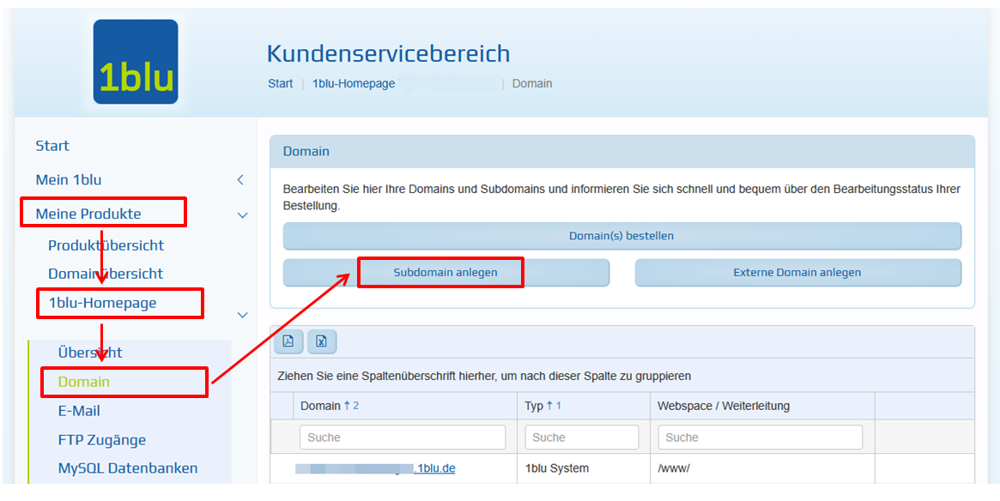
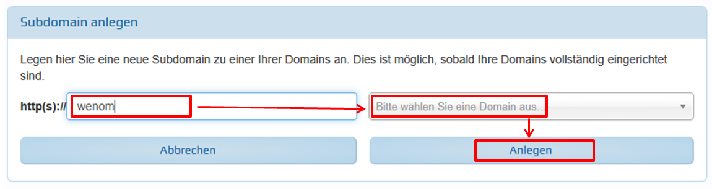
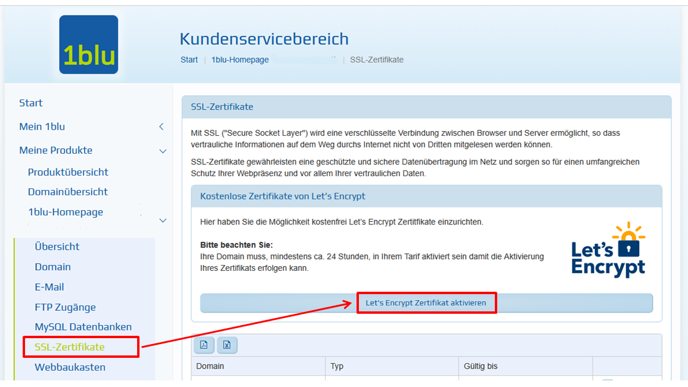
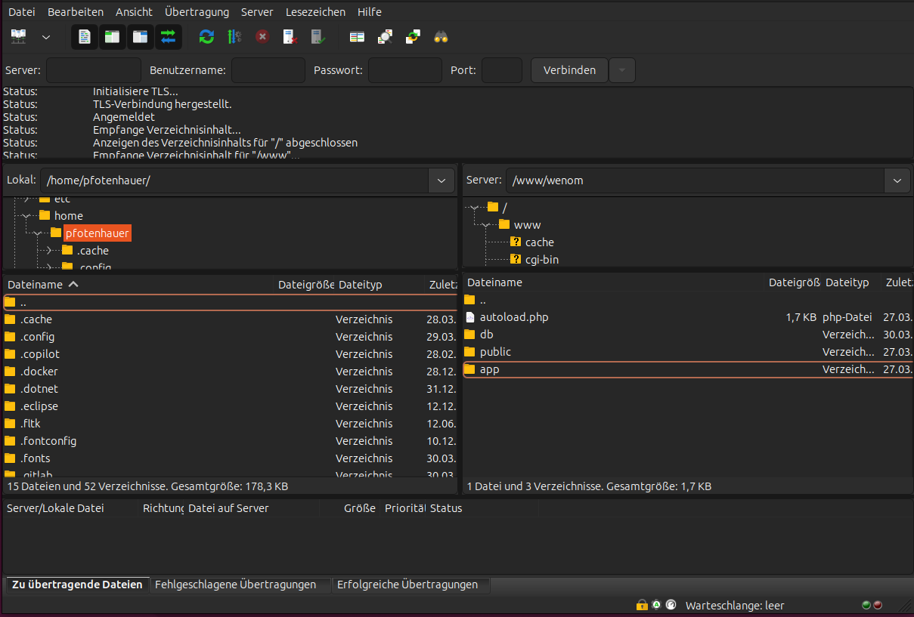
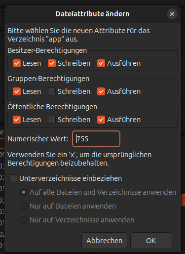
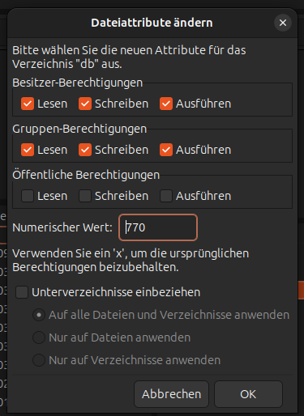

# Webspace 1blu

## Voraussetzungen

+ Sie haben einen Webspace bei 1blu.
+ Sie haben einen sFTP-Zugang zum Dateisystem des Webhostings.

## Subdomain anlegen (optinal)

Loggen Sie sich in den Kundenbereich von 1blu ein.
Legen Sie zu Ihrem Produkt unter "Domain" eine Subdomain an.





## Zielverzeichnis setzen

Achten Sie bitte darauf, dass das Zielverzeichnis des Webhostings auf den Unterordner `public` ueigen muss.

## Zertifikat zuweisen

Aktivieren Sie für diese Subdomain ein SSL-Zertifikat für die sichere Verbindung.



## Dateien hochladen

Laden Sie sich die aktuelle [wenom-x.x.x.zip](https://github.com/SVWS-NRW/SVWS-Server/releases) herunter.

Verbinden Sie sich mit Ihrem sFTP-Benutzer und erstellen Sie im Verzeichnis "www" ein Unterverzeichnis, z. B. "wenom", in das die WeNoM-Dateien abgelegt werdenb sollen. Laden Sie die Dateien aus der ZIP-Datei in das neu erstellte Verzeichnis Verzeichnis hoch.



Sie haben nun folgende Verzeichnisse:

```bash
- www
  -- wenom
     --- app
     --- db
     --- public
```

## Berechtigungen setzen

Setzen Sie für die Verzeichnisse "app" und "public" die Rechte auf 755. Beziehen Sie dabei alle Unterverzeichnisse  und Dateien mit ein:



Setzen Sie für das Verzeichnisse "db" die Rechte auf 770. Beziehen Sie dabei alle Unterverzeichnisse  und Dateien mit ein:



## Einrichtung

Weiter geht es mit der [Ersteinrichtung](../installation/ersteinrichtung.md) des WebNotenManagers.
