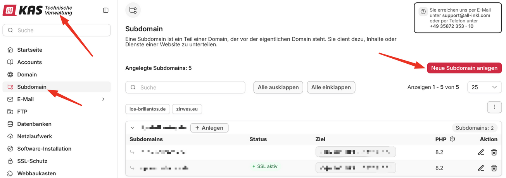
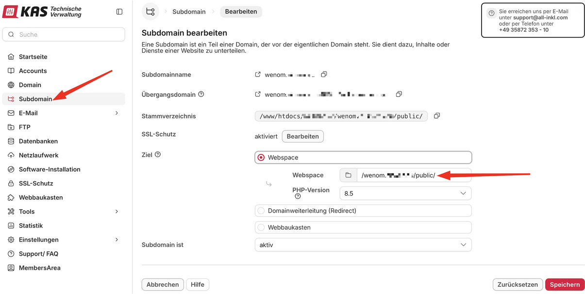
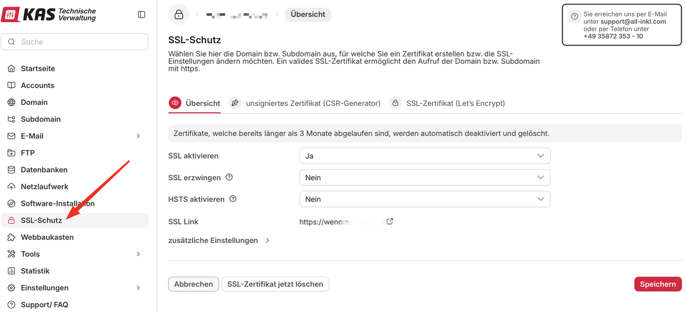
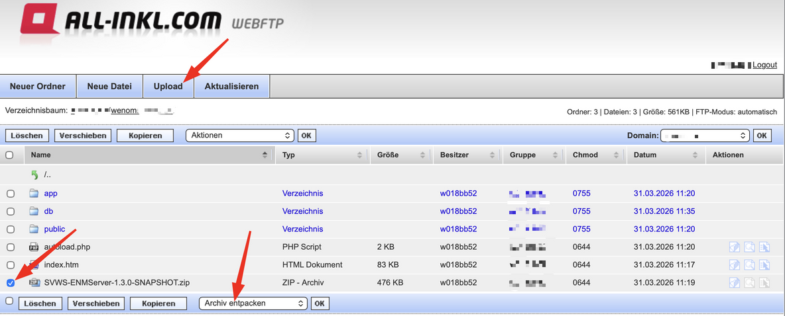
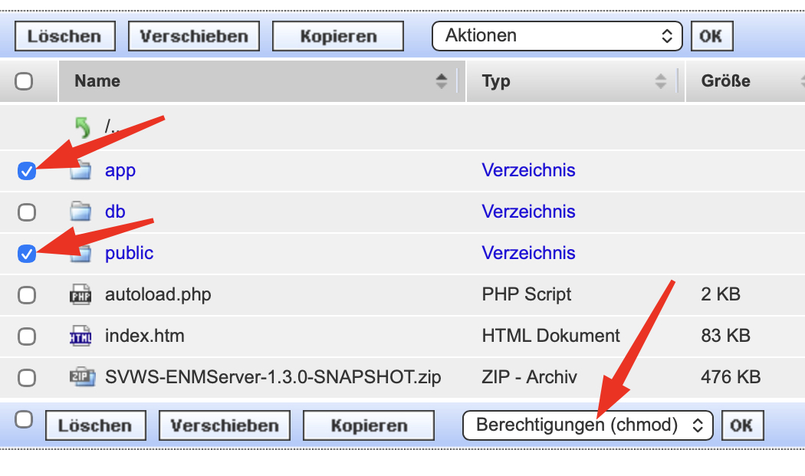
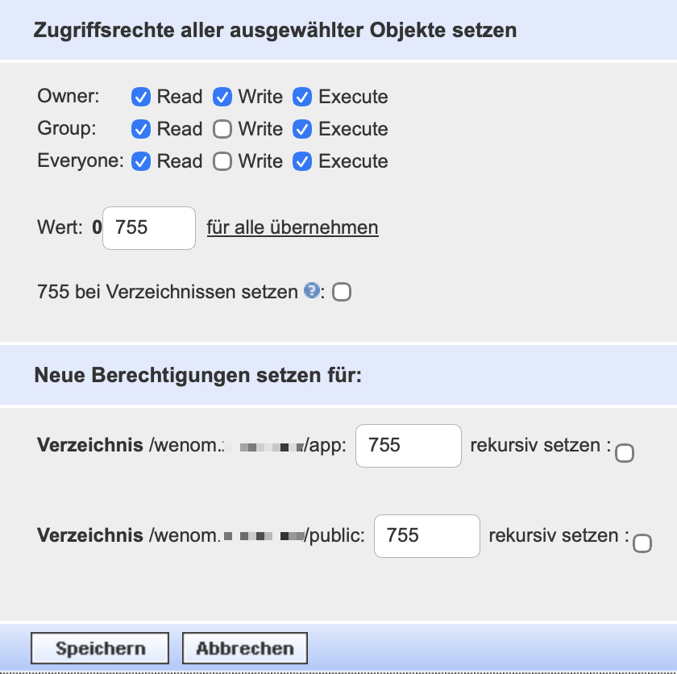
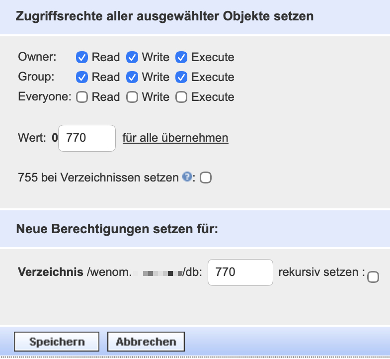

# Webspace All-Inkl

## Voraussetzung

+ Sie haben einen Webspace bei All-Inkl
+ Sie haben einen sFTP-Zugang zum Dateisystem des Webhostings

## Subdomain anlegen (optinal)

Loggen Sie sich in den Kundenbereich - Technische Verwaltung (KAS) von All-Inkl ein.
Legen Sie unter "Domains" eine Subdomain an.

## Zielverzeichnis setzen

Das Zielverzeichnis des Webhostings muss der Unterordner `public` sein.

## Zertifikat zuweisen

Falls es noch nicht eingerichtet ist, verknüpfen Sie diese (Sub-)Domain mit einem SSL-Zertifikat für die sichere Verbindung.

## Dateien hochladen

Laden Sie sich die aktuelle [wenom-x.x.x.zip](https://github.com/SVWS-NRW/SVWS-Server/releases) herunter.

Verbinden Sie sich mit Ihrem FTP-Benutzer und laden Sie die ZIP-Datei in das Verzeichnis, das mit der gewünschten Subdomain verknüpft wurde. Entpacken Sie die ZIP-Datei

## Berechtigungen setzen

Setzen Sie die Rechte (auf alle Unterordner und Dateien) auf die Ordner `Public` und `App`:

Setzen Sie die Rechte  (auf alle Unterordner und Dateien) auf den Ordner `db`:

## Einrichtung

Weiter geht es mit der [Ersteinrichtung](../installation/ersteinrichtung.md) des WebNotenManagers.
