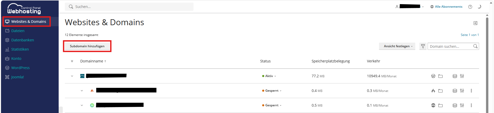
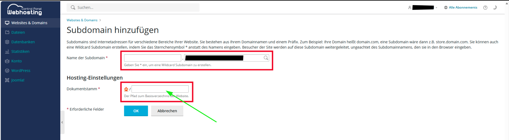
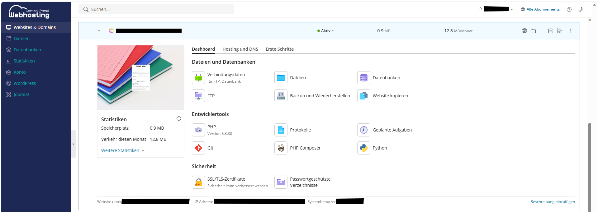
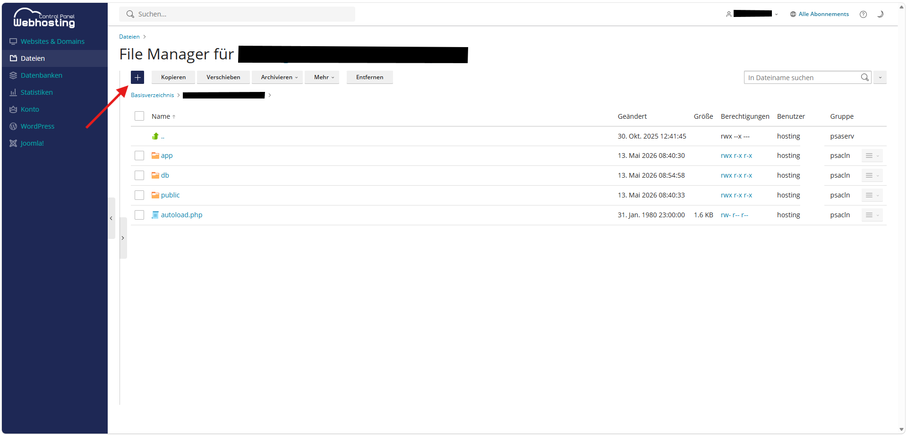
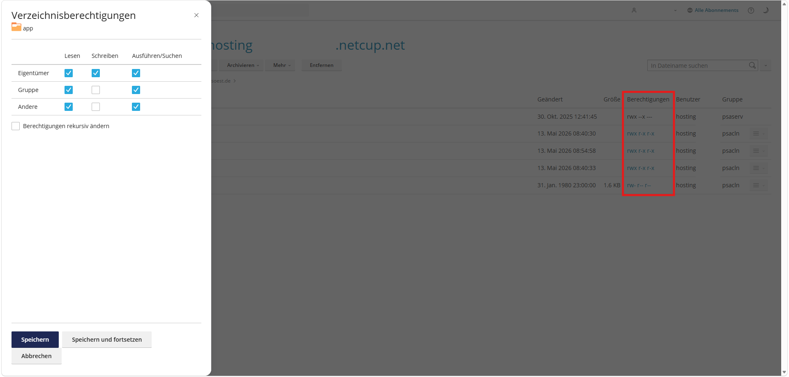
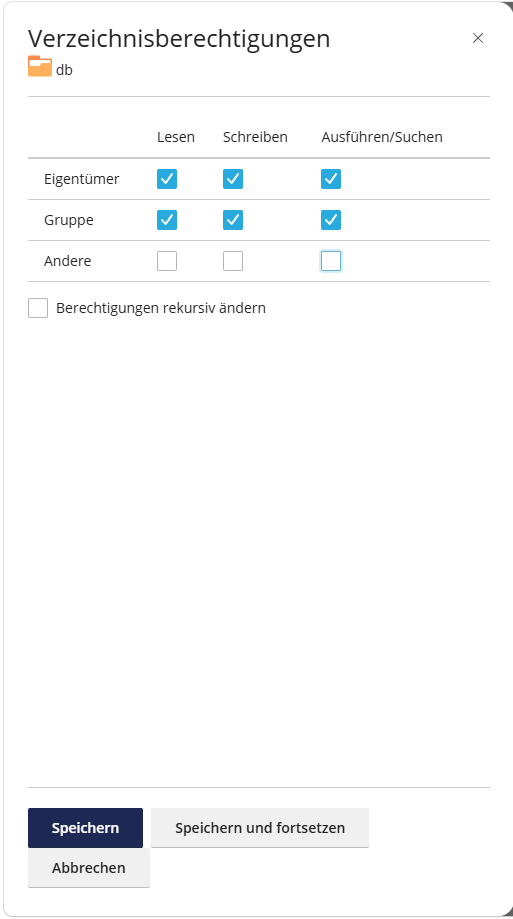

# Webspace Netcup

## Voraussetzung

+ Sie haben einen Webspace bei netcup
+ Sie haben einen sFTP-Zugang zum Dateisystem des Webhostings

## Subdomain anlegen (optional)

Falls Sie ihren WeNoM Server unter einer Subdomain betreiben wollen, wie zum Beispiel wenom.IhreWebseite.de, muss diese noch angelegt weden. Loggen Sie sich dazu in den Kundenbereich bei Netcup ein.
Legen Sie unter "Domains" eine Subdomain an.

## Zielverzeichnis setzen

Das Zielverzeichnis des Webhostings muss der Unterordner `public` sein.

## Zertifikat zuweisen

Die (Sub-)Domain muss über ein gültiges Zertifikat verfügen. Die kann unter dem Dashboard -> Sicherheit gefunden bzw. gesetzt werden.

## Dateien hochladen

Laden Sie sich die aktuelle [wenom-x.x.x.zip](https://github.com/SVWS-NRW/SVWS-Server/releases) herunter.

Anschließend per sFTP die Dateien in das Webverzeichnis hochladen.

## Berechtigungen setzen

## Einrichtung

Weiter geht es mit der [Ersteinrichtung](../installation/ersteinrichtung.md) des WebNotenManagers.
