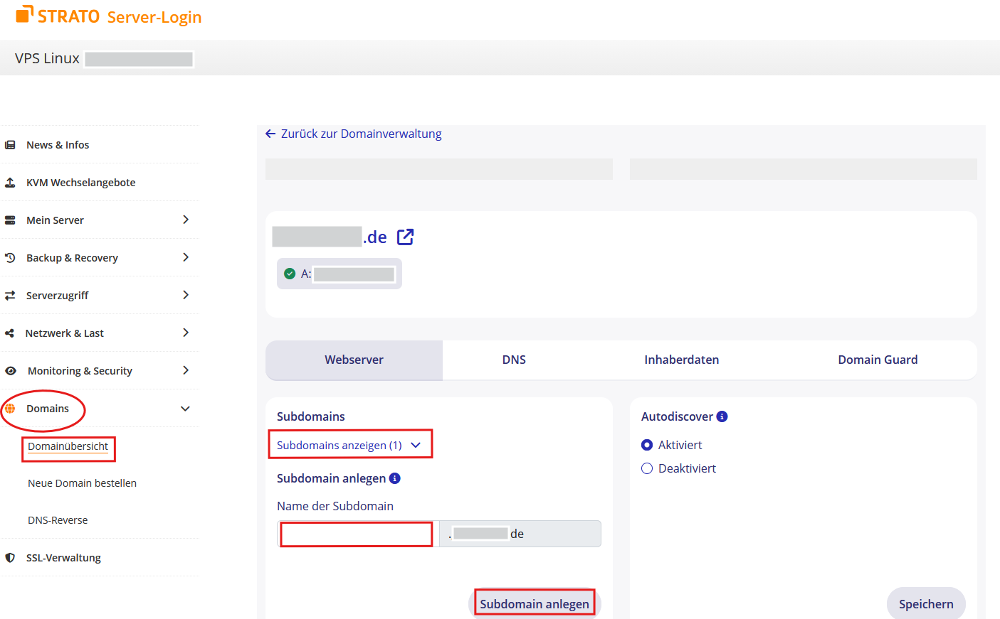
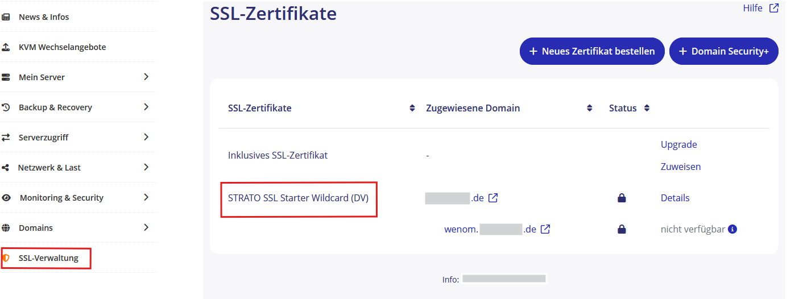
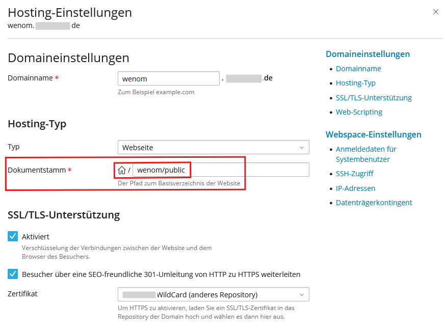
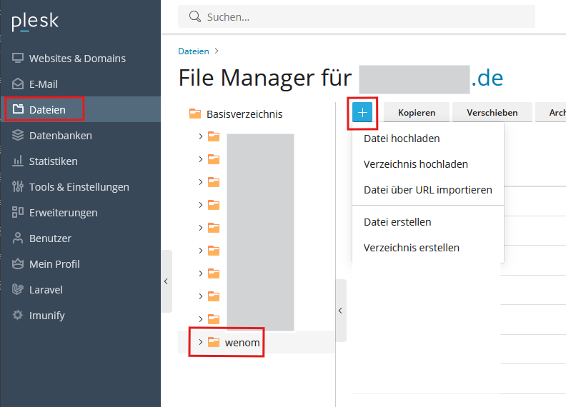
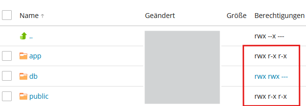

# Webspace Strato

## Voraussetzung

+ Sie haben einen Webspace bei Strato
+ Sie haben einen sFTP-Zugang zum Dateisystem des Webhostings

## Subdomain anlegen (optional)

Falls Sie ihren Wenom Server unter einer Subdomain betreiben wollen, wie zum Beispiel wenom.IhreWebseite.de, muss diese noch angelegt weden. Loggen Sie sich dazu in den Kundenbereich bei Strato ein.

Legen Sie unter "Domains" eine Subdomain an.

Verknüpfen Sie diese Subdomain mit einem SSL-Zertifikat für die sichere Verbindung.  

## Zielverzeichnis setzen

Das Zielverzeichnis des Webhostings muss der Unterordner `public` sein.

## Dateien hochladen

Laden Sie sich die aktuelle [wenom-x.x.x.zip](https://github.com/SVWS-NRW/SVWS-Server/releases) herunter.

Verbinden Sie sich mit Ihrem FTP-Benutzer und laden Sie die ZIP-Datei in das Verzeichnis, das mit der gewünschten Subdomain verknüpft wurde. Entpacken Sie die ZIP-Datei

>Bemerkung: Diese Prozesse können auch mit Anwendungen wie z.B. **FileZilla** erledigt werden.

  

## Berechtigungen von Ordnern ändern

Setzen Sie die Rechte (auf alle Unterordner und Dateien) auf die Ordner `Public` und `App`:

## Einrichtung

Weiter geht es mit der [Ersteinrichtung](../installation/ersteinrichtung.md) des WebNotenManagers.
