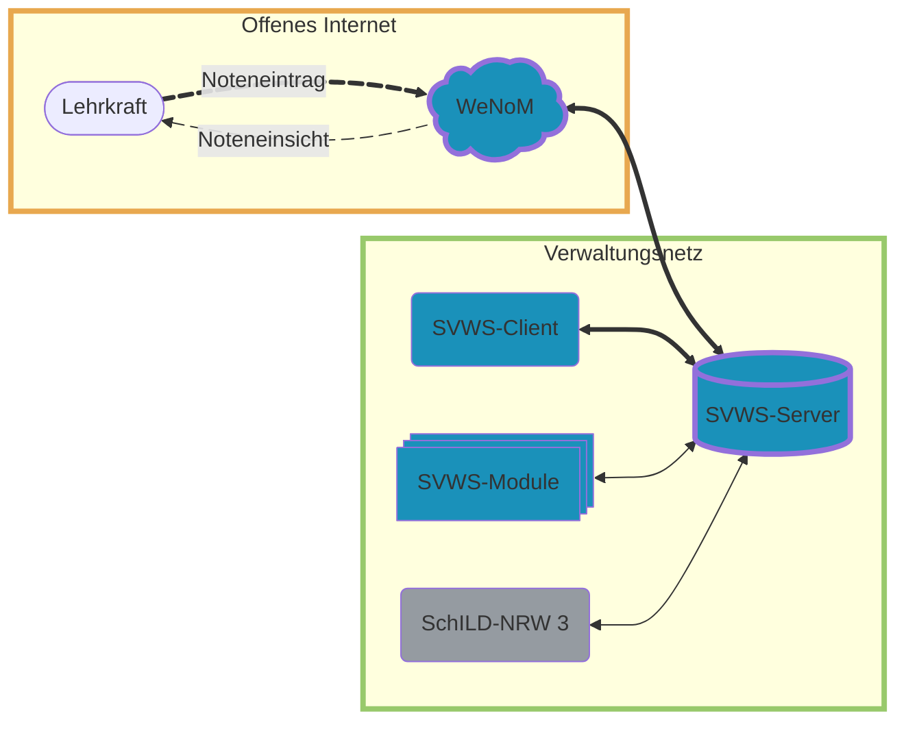

# SVWS-WeNoM - Installationsanleitung

## Technische Übersicht

Der SVWS-WeNoM wird auf PHP-Basis mit TypeScript und vue entwickelt und stellt eine benutzerfreundliche und intuitive Benutzeroberfläche bereit, um die Dateneingabe so einfach wie möglich zu gestalten.

Die Arbeit mit dem SVWS-WebNotenManager ist unten schematisch dargestellt:



Die Software synchronisiert die eingegebenen Daten teilautomatisch mit dem SVWS-Server, um sicherzustellen, dass die Daten stets auf dem neuesten Stand sind und für interne Schulzwecke zur Verfügung stehen.

## Voraussetzungen

Es wird ein Webspace mit mindestens php8.2 oder höher, inkl. sqlite3 Modul benötigt. Der Webspace muss über ein Zertifikat verfügen (http**s**\://...).

Dies alles liegt in der Regel bei den gängigen [Webhostern](../hoster_installation/index.md) fertig eingerichtet vor.

Alternativ können Sie die Einrichtung des Webservers unter der Artikel "[eigener  Webserver](./installation_webserver.md)" nachlesen.

Der SVWS-WeNoM ist über eine **eigene (Sub-)Domain** aufzurufen. Richten Sie sich hierfür zum Beispiel *wenom.MeineDomain.de*, *noten.MeineSchule.de* ein.

## Download der SVWS-WeNoM Programmdateien

Unter [github.com/SVWS-NRW/SVWS-Server/releases](https://github.com/SVWS-NRW/SVWS-Server/releases) können neben dem SVWS-Server auch die Programmdateien des zugehörigen SVWS-WeNoM heruntergeladen werden: Dazu klicken Sie auf **WeNoM-x.x.x.zip**. Die "x.x.x" geben die aktuelle Versionsnummer wieder.


Bei den anderen Dateien handelt es sich hier im die Windows- beziehungsweise Linuxinstaller für den SVWS-Server/-Client und die SVWS-Laufbahnplanung (WebLuPO für die Gymnasiale Oberstufe).

## Kopieren der SVWS-WeNoM Programmdateien

+ Entpacken aller Dateien aus der gepackten .zip-Datei in das Verzeichnis des Webservers. Sie können das root-Verzeichnis wählen, oft ist das `\html\` oder `\wwww\`. Sie können aber auch ein Unterverzeichnis für den SVWS-WeNoM erstellen.
+ Freigabe der Ordner `app`, `db` und `public` mit entsprechenden Rechten.
+ Stellen Sie die `(Sub-)Domain` so ein, dass sie auf das Verzeichnis `./public` zeigt. Nutzen Sie hierzu gebenfalls die Anleitung Ihres Hosters oder die Anleitung für einen eigenen Webserver.


Die Ordnerstruktur in `/var/www/html/wenom` sollte nun folgendermaßen aussehen:

```bash
/app
/db
/public
```

::: warning Wichtig!
`DocumentRoot` in der Apache-Konfiguration muss auf den Ordner `./public` zeigen!
:::

Die Änderung des `DocumentRoot` kann unter den hosterspezifischen Installationen oder der Installation für den eignenen Webserver bei Bedarf nachgelesen werden. Bei Webhostern ist dies häufig weder nötig noch möglich. Wenn Sie einen eigenen Webserver aufsetzen, kontaktieren Sie hierzu Ihre IT.

### Ordner-, Unterordner- und Dateiberechtigungen

1. Setzen Sie die korrekten Ordner-Berechtigungen (und Unterordner und Dateien) für `public` und `app`zum Lesen und Schreiben:
    - **Besitzer**: `Lesen, Schreiben, Ausführen`
    - **Gruppe**:  `Lesen, x, Ausführen`
    - **Öffentlich**: *NICHTS erlaubt*
    - Numerisch: `750`

2. Setzen Sie die Ordner-Berechtigungen für den Ordner `db` (und Unterordner und Dateien) auf
    - **Besitzer**: `Lesen, Schreiben, Ausführen`
    - **Gruppe**: `Lesen, Schreiben, Ausführen`
    - **Öffentlich**: *NICHTS erlaubt*
    - Numerisch: `770`

::: warning Kontrollieren Sie die Ordnerberechtigungen
Kontrollieren Sie bitte diese Berechtigungen gewissenhaft!
:::

### Test

Rufen Sie nun den Netzwerkpfad mit dem passenden Ordner für SVWS-WeNoM auf und testen Sie, ob der Notenserver erreichbar ist.


## Impressum und Datenschutzhinweis

Für SVWS-WeNoM-Instanzen, die über das freie Internet erreichbar sind, ist ein Impressum zu setzen.

Erzeugen Sie im Pfad der Datenbank `/db/` eine Datei *Impressum.md*, in die Sie Ihre Daten eintragen. 

Sie können den Standard-Datenschutzhinweis in SVWS-WeNoM ändern, indem Sie auch eine *Datenschutz.md* erzeugen und eigene Eintragungen vornehmen.

Wenn an den Pfaden nichts verändert wurde, ist der Standardpfad `wenom_verzeichnis/db/` für die beiden Dateien. Nutzen Sie andere Pfade, etwa für mehrere SVWS-WeNoM-Instanzen, müssen diese verwendet werden.

```
$impressumPath = $dbPath.'/Impressum.md';
$datenschutzPath = $dbPath.'/Datenschutz.md';
```

>[!TIP]Großschreibung
>Beachten Sie bitte die großen "I" für die *Impressum.md* beziehungsweise "D" *für Datenschutz.md*.

Liegt eine der beiden Dateien nicht vor, wird für die Nutzer bei `Impressum` der Link inaktiv und bei `Datenschutz` der Standardtext angezeigt.

## Übersicht Informationsverbund

.

## Update & Backup

### Backup

Ein einfaches Backup kann durch das Kopieren der Datei `./db/app.sqlite` erstellt werden.

In dieser Datei werden sämtliche personenbezogenen Daten, Zugangsdaten sowie Anwendungseinstellungen gespeichert. Der Synchronisationsschlüssel ist nicht Bestandteil dieser Datei.

Der Synchronisationsschlüssel befindet sich separat in der Datei `./db/client.sec.` Eine Sicherung dieser Datei ist optional, da der Synchronisationsschlüssel bei Bedarf neu generiert werden kann.

### Update

### Update

Vor der Durchführung eines Updates wird dringend empfohlen, ein **Backup der bestehenden Installation** zu erstellen oder zumindest mit einer Synchronisation zum SVWS-Server einen aktuellen Datentransfer zu haben.

Für das Update laden Sie, wie bereits bei der Installation beschrieben, die zugehörigen ZIP-Dateien von unserer [GitHub-Seite](https://github.com/SVWS-NRW/SVWS-Server/releases) herunter. Entpacken Sie anschließend die Dateien direkt über die bereits vorhandene Installation.

In der Regel werden die Dateien im Verzeichnis `./db`, insbesondere `app.sqlite` und `client.sec`, bei einem Update nicht überschrieben. Dadurch bleiben die bestehenden Daten sowie der bisherige Zugang in der Regel erhalten.

Bei größeren Versionssprüngen kann es jedoch zu Änderungen am Datenbankschema kommen, wodurch die bestehende Datenbank möglicherweise nicht mehr kompatibel ist. In diesem Fall kann es erforderlich sein, den WeNoM-Zugang vollständig neu einzurichten.

#### php-fpm 

Fall Ihr Server php-fpm einsetzt muss dieses nach einem update nochmal neu gestartet werden. Hier ein Beispiel für PHP 8.4: 

```bash
systemctl restart php8.4-fpm
```
