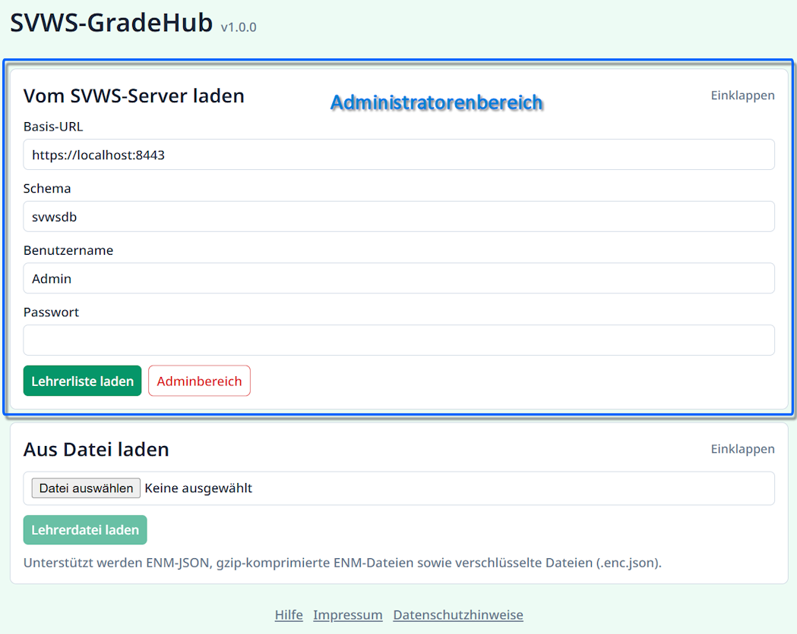
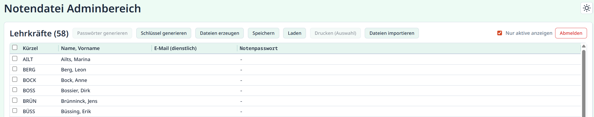
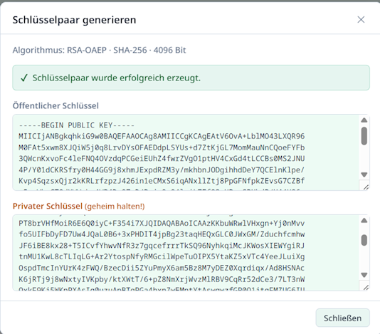
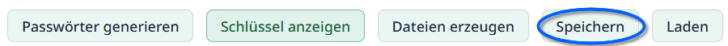
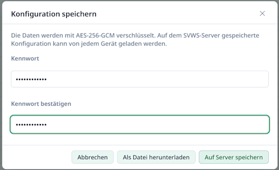
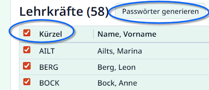
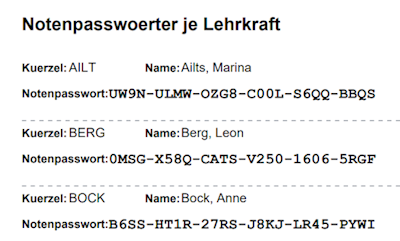

# Administration im externen SVWS Notenmodul GradeHub

Diese Anleitung beschreibt
* die Einrichtung von GradeHub,
* die Erstellung der Notendateien für Lehrkräfte sowie
* die Vorbereitung des späteren Notenimports.

GradeHub dient als Übergangslösung zur Noteneingabe, bis WeNoM flächendeckend verfügbar ist.

## Starten im Administratormodus



Startet GradeHub im Modus für Administratoren, finden Sie diesen oberhalb dem normalen Bereich für Lehrkräfte. 

Die ausführbare Datei für MS Windows startet immer im Administratorenmodus.

Um das Externe SVWS Notenmodul GradeHub in der Webserver-Variante im Modus für Adminstratoren zu starten, ist dieser in der Datei `config.js` auf `true`zu stellen und eventuelle Kommentarzeichen vor der Zeile `//` sind zu entfernen.

```
window.GRADEHUB_CONFIG = {
  admintoolVisible: true,
}
```

Entsprechend können Sie GradeHub wieder in den Lehrkraft-Modus versetzen, indem Sie die Zeile `admintoolVisible: true` wieder auskommentieren oder auf `false`setzen.

## Notendateien mit GradeHub erzeugen

>[!TIP]Verschlüsselung von Lehrkraft-Notendateien
>Notendateien, die Sie mit GradeHub erzeugen, sind verschlüsselt und über individuelle Passwörter gesichert.
>Notendateien, die Sie mit dem SVWS-Client erzeugen, sind nicht verschlüsselt.

Die GradeHub-Instanz, mit der Sie die Notendateien erzeugen, muss im Verwaltungsnetz gestartet werden.

Geben Sie im Bereich **Vom SVWS-Server laden** die Daten Ihres SVWS-Servers ein. Die *Basis-URL* und der *Port* (der Teil mit Doppelpunkt und den Zahlen hinter der URL *":xxxx"*) sind im Zweifel bei Ihrer zuständigen IT zu erfragen. Standardmäßig könnte man 443 probieren.

**Benutzername** und **Passwort** sind ein Datenbanknutzer mit ausreichenden Rechten. Hier im Beispiel wird ein *Admin*zugang verwendet.

### Lehrerliste laden und einzelne Datensätze direkt bearbeiten

Wenn Sie auf `Lehrerliste laden` klicken, holt sich GradeHub die Liste der Lehrkräfte vom SVWS-Server.

Sie können anschließend im Dropdown-Menü eine Lehrkraft auswählen und über `Vom Server laden` direkt in die Ansicht für diese Lehrkraft springen und normale Eintragungen vornehmen.

Konsultieren Sie hierfür bitte das **Benutzerhandbuch für die Bedienung von GradeHub**.

Wenn Sie in diesem Modus `Speichern` wählen, bekommen Sie die Option, eventuelle Änderungen über `Zum Server speichern` direkt in den SVWS-Server zu schreiben, ohne dass Notendateien verwendet werden.

### Verschlüsselung einrichten

Sofern Sie Notendateien für alle oder ausgewählte Lehrkräfte erzeugen wollen, klicken Sie auf den roten Button `Adminbereich`.



Der Admin-Bereich von GradeHub startet mit der Lehrkraftliste. Hier im Screenshot ist zu sehen, dass der Bereich **Passwörter generieren** ausgegraut ist und nicht zur Verfügung steht und auch keine **Notenpasswörter** erzeugt wurden.

In dieser Beispieldatenbank sind auch keine dienstlichen Emailadressen hinterlegt und werden daher nicht nach GradeHub exportiert. Wurde GradeHub für den Emailversand durch die Administration eingerichtet, werden die dienstlichen Emailadressen zum Notenversand verwendet.

Klicken Sie auf `Schlüssel generieren`. Im Anschluss sehen Sie eine Zusammenfassung wie diese hier:



Es wurde ein Schlüsselpaar für ein asynchrones Verschlüsselungsverfahren erzeugt. Nutzer müssen mit Schlüsseln nichts tun, nehmen Sie diese hier zur Kenntnis.

Sie müssen nun ihre **Konfiguration** ``Speichern``.





Sie müssen die Schlüssel und die Konfiguration von GradeHub speichern. Es stehen die Optionen zur Verfügung, die Konfiguration an den Server zu senden. Klicken Sie hierzu auf `Auf Server Speichern`. Das Passwort, das Sie hier vergeben, müssen Sie für die Schule sichern und an einem geeigneten Ort digital oder physisch aufbewahren.

Wenn Sie GradeHub unabhängig vom SVWS-Server im Admin-Modus betreiben möchten, können Sie die Konfigurationsdatei auch `Als Datei herunterladen`. Hierbei wird eine Datei namens `gradehub-config.ghd` erzeugt, für die Sie einen sicheren Speicherort wählen. Auch hier ist ein Passwort zu vergeben.

>[!WARNING] Bewahren Sie die Konfigurationsdatei auf
>Die Konfigurationsdatei (gradehub-config.ghd) muss sorgfältig aufbewahrt werden. Sie wird für den Import der von den Lehrkräften zurückgegebenen Notendateien benötigt.

Um GradeHub wieder mit existierenden Schlüsseln zu versehen, klicken Sie auf `Laden`, geben Sie das **Kennwort** ein klicken Sie bei aktiver Server-Verbindung auf `Vom Server laden` oder bei Verwendung der Datei auf `Aus Datei laden`und wählen Sie dann die gradehub-config.ghd aus.

### Passwörter generieren

Nachdem ein Schlüsselpaar generiert wurde, können Sie einzelne Lehrkräfte anwählen oder aktivieren Sie alle, indem Sie oben auf die Checkbox links neben **Kürzel** klicken.



Klicken Sie anschließend auf `Passwörter generieren`, um für diese Lehrkräfte eben dies zu tun.

>[!TIP]Neue Passwörter überschreiben alte Passwörter
>Beachten Sie bitte, dass eventuell schon exportierte Notendateien ein altes Passwort gespeichert haben und damit nicht mehr zu importieren sind.

>[!WARNING]Speichern Sie die Passwörter!
>Sie müssen die Passwortliste nun auch wie oben erwähnt zum Server oder in die `gradehub-config.ghd` speichern. Diese Daten müssen später geladen werden, um die Notendateien wieder einlesen zu können!

Nachdem Passwörter generiert wurden, können diese über `Drucken (Auswahl)` in ein pdf gespeichert werden, das auch gut druckbar ist:



### Lehrkraft-Notendateien erzeugen

Nachdem Sie die Verschlüsselung eingerichtet haben und Notenpasswörter generiert wurden, können Lehrkraft-Notendateien erzeugt werden.

Wählen Sie bestimmte Lehrkräfte oder alle an und klicken Sie dann auf `Daten erzeugen`. 

Wählen Sie einen Speicherort für die Dateien.

Die Lehrkräfte können nun Ihre Lehrkraft-Notendateien ausfüllen.

>[!TIP]SVWS Client
>Sie können mit dem SVWS-Client ebenfalls Lehrkraft-Notendateien erzeugen. Nutzen Sie hierfür den **Datenaustausch** in der **App Schule**. Diese Dateien sind jedoch nicht verschlüsselt.
> Entsprechend können Sie im SVWS-Client auch keine Lehrkraft-Notendateien einlesen, die verschlüsselt mit GradeHub erzeugt wurden.

## Dateien zurückspielen

Um die Dateien schließlich wieder einzusammeln, klicken Sie auf `Dateien importieren`. 

Nun können Sie einen ganzen `Ordner auswählen`, in dem alle Dateien eingelesen werden oder individuelle `Dateien auswählen...`.