# Bedienung des Externen SVWS Notenmoduls

Nach der Anmeldung mit der Lehrkraft-Notendatei ist eine Übersicht über das **Externe SVWS Notenmoduls GradeHub** zu sehen:

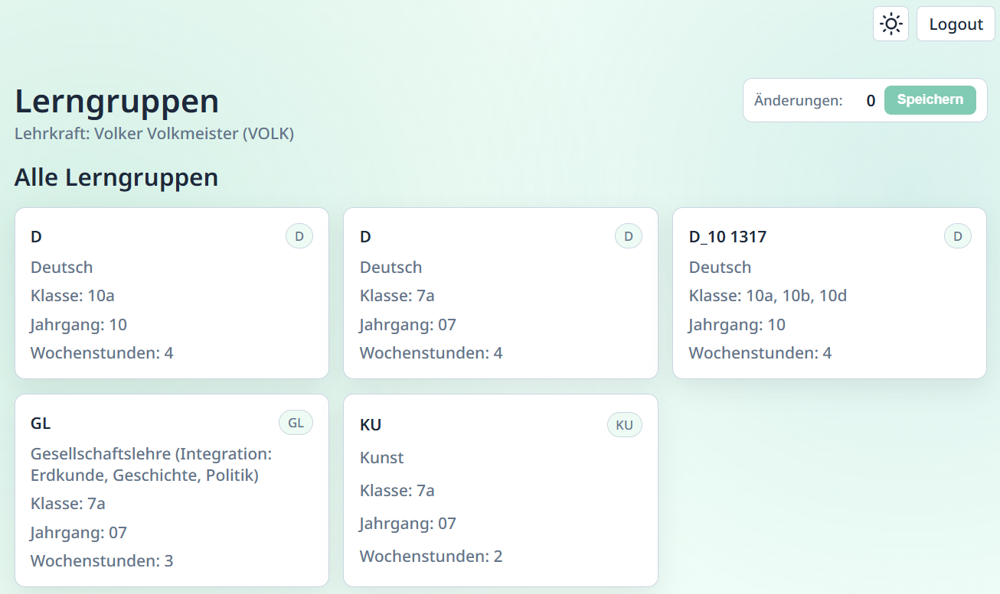

Oben rechts können Sie in einen *hellen Modus* oder *dunklen Modus* umschalten beziehungsweise die *Systemeinstellung* übernehmen.

Weiterhin findet sich hier der Knopf, mit dem Sie sich ausloggen können und GradeHub damit beenden.

Auf dieser Hauptseite werden die in der Lehrkraftdatei vorhandenen *Lerngruppen* angezeigt. Lerngruppen sind die von der Lehrkraft unterrichteten Klassen oder Kurse. Mit einem Klick auf diese Lerngruppen öffnet sich die Übersicht, in der die Daten für diese Lerngruppe eingegeben werden können.

`Klicken` Sie auf den Eintrag in der Liste der Lerngruppen, den Sie bearbeiten möchten.

## Noten eintragen

Die Ansicht wechselt zur Noteneingabe für diese Gruppe.

Tragen Sie nun die Leistungsdaten ein, hier im Screenshot sind Eintragungen für die *Quartalsnote* schon vorhanden und es werden neu die *Noten* eingetragen.

Hier im Beispiel werden auch Tendenznoten der Sekundarstufe I verwendet.

Es können noch weitere Eintragungen in Notenfelder gemacht werden, eine Zusammenfassung hierzu finden Sie in der Fußzeile unterhalb der Schülermenge:

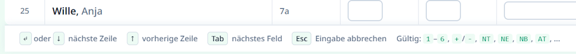

Zum einen finden sich hier Hinweise zur Bedienung:
* Sie können mit der **Pfeil-nach-unten-Taste `↓`**  oder mit der **Enter-Taste `↵`** eine Zeile nach unten wechseln.
* Die **Pfeil-nach-oben-Taste `↑`** wechselt eine Zeile nach oben.
* Mit der **Tabulator-Taste `⭾`** springen Sie eine Spalte nach rechts.
* Entsprechend springt **Shift `⇧` + Tab `⭾`** eine Spalte nach links.
* Eine Eingabe können Sie mit Escape `Esc`abbrechen.

Daneben finden Sie die **Gültigen Einträge für Notenfelder**:
* Die **Noten 1 bis 6** mit den **Tendenznoten** von jeweils **+** und **-**.
* **NT** für *"Nicht teilgenommen"*, * **NE** für *"Nicht erteilt"*, * **NB** für *"Nicht bewertet"*, * **AT** für *Ärtliches Attest*.

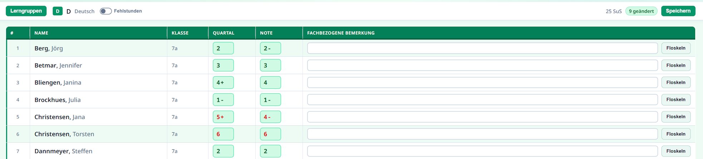

Beachten Sie bitte den Bereich oben rechts, in dem angezeigt wird, wie viele Änderungen bezüglich dem Urspungszustand der Lehrkraft-Notendatei gemacht wurden:

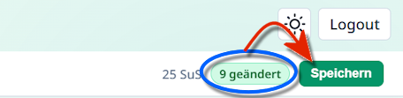

Im blauen Oval sind die Änderungen zusammengefasst.

Hier ist unbedingt der Speichern-Knopf zu beachten: erst wenn Sie `Speichern`, werden Ihre Eintragungen zurück in die Lehrkraft-Notendatei geschrieben!

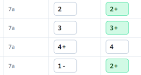

In den Daten selbst sehen Sie Änderungen in Grün hervorgehoben.

>[!CAUTION]Ohne Speichern gehen Änderungen verloren
>Schließen Sie GradeHub nun oder loggen Sie sich aus, werden die Eintragungen verworfen.
>Bei einem Klick auf Logout werden Sie gewarnt, dass es noch ungespeicherte Änderungen gibt.

## Eingabe weiterer Daten

### Fachbezogene Fehlstunden

Sollen **Fehlstunden fachbezogen** erfasst werden, verwenden Sie den Schalter oben links, um die Spalten für Fehlstunden Fachbezogen **FSF** und die hiervon Unentschuldigten Fehlstunden **FSU** zu aktivieren.

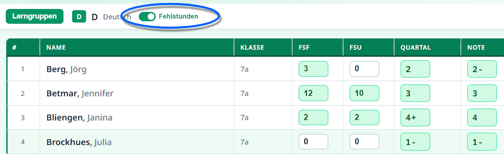

### Fachbezogene Bemerkungen

Tragen Sie fachbezogene Bemerkungen bei Wunsch direkt in das Freitextfeld **Fachbezogene Bemerkung** ein oder klicken Sie rechts auf den Schalter `Floskeln`, um den Floskeleditor aufzurufen.

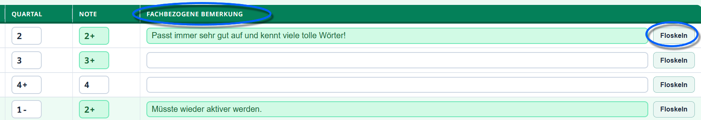

Beachten Sie auch hier, dass geänderte Felder in Grün markiert werden.

Soll der Floskeleditor verwendet werden, stehen alle über den SVWS-Client im Katalog Floskeln definierten Floskeln zur Verfügung. Diese werden mit in die Lehrkraft-Notendatei exportiert und können dann in GradeHub verwendet werden.

Im Floskeleditor lassen sich im **Filter** links Floskeln auf (Teil-)Worte einschränken und ganz rechts gibt es einen Filter für einen **Jahrgang**. Es stehen alle Jahrgänge zur Verfügung, die in der gesamten Lehrkraft-Notendatei enthalten sind.

Unten rechts finden Sie die Schaltflächen, ob die gemachten Änderungen mit `Abbrechen` verworfen werden soll oder ob Sie diese `Übernehmen`. Mit `Schließen` verlassen Sie den Floskeleditor wieder.

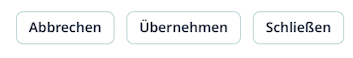

Unten links können Sie zu einem vorherigen oder nächsten Schülereintrag wechseln.

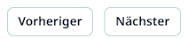

## Eintragungen für Klassenleitungen

Für Lehrkräfte, die als eine Klassenleitung eingetragen sind, stehen unterhalb der Kacheln für die Leistungsdaten weiterhin eine Kachel für die **Klassenleitung** zur Verfügung.

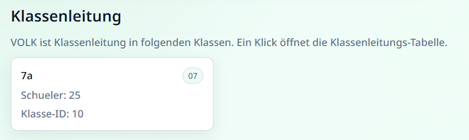

Es öffnet sich die Klassenleitungs-Übersicht:

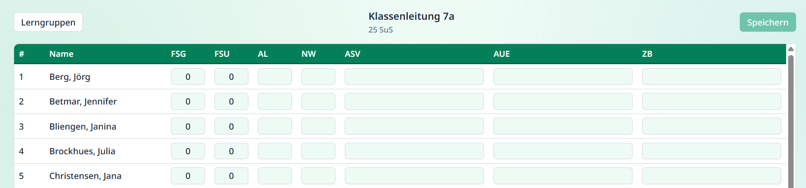

In dieser Maske finden sich Felder für die Gesamten Fehlstunden **FSG** und die davon unentschuldigen Fehlstunden **FSU**.

Ebenso können je nach Schulform die **Lernbereichsnoten** für Arbeitslehre **AL** und Naturwissenschaften **NW** eingetragen werden.

In den Felder für die Bemerkungen
* Arbeits und Sozialverhalten **ASV**
* Außerunterrichtliches Engagement **AUE**
* Zeugnisbemerkungen **ZB**
wird nach einem `Doppelklick` das jeweilige Floskelfenster geöffnet.

Wie oben bei den Fachbezogenen Floskeln beschriben, können hier Freitexte eingegeben werden oder es kann auf die in der jeweiligen Floskelgruppe in der SVWS-Datenbank definierten und mit in GradeHub exportierten Floskeln zurückgegriffen werden.

>[!CAUTION] Speichern
>Achten Sie auch hier auch hier darauf, gemachte Änderungen zu speichern.

Über den Schalter `Lerngruppen` oben links kehren Sie zur Hauptseite von GradeHub zurück.

## Speichern und Logout

>[!TIP]Zwischensicherungen
>Es kann jederzeit eine Zwischensicherung gemacht werden und Sie können dann mit Ihrer Lehrkraft-Notendatei weiterarbeiten.

Am Ende Ihrer Arbeiten `Speichern` Sie Ihre Änderungen und nutzen Sie den Schalter `Logout`. Es werden keine Daten außerhalb der Lehrkraft-Notendatei an einen anderen Server übertragen oder gespeichert.

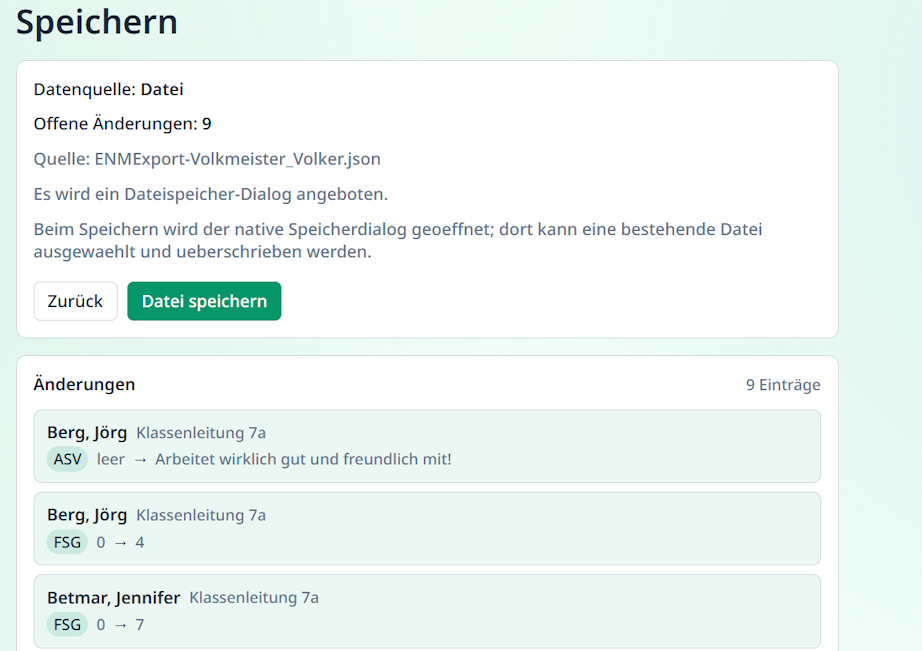

Im folgenden Dialog zum Speichern erhalten Sie noch einmal eine Übersicht. Sie können `Zurück` klicken, um ungespeichert weiter zu arbeiten.

Klicken Sie auf `Datei Speichern`, um Ihre Änderungen wieder in eine Lehrkraft-Notendatei zu speichern.

Je nach Browser kann es vorkommen, dass sich eine Browser-Meldung öffnet.

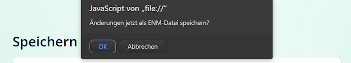

In einem solchen Fall bestätigen Sie diese Nachfrage. IN diesem Fall Klicken wir auf `OK`. 

Ob diese Nachfrage erscheint oder nicht, nun ist ein Speicherort für die Lehrkraft-Notendatei zu wählen.

Hier wird die originale Lehrkraft-Notendatei wieder mit der neuen Version überschrieben. So wird verhindert, dass mehrere Versionen mit unterschiedlichen Arbeitsständen entstehen.

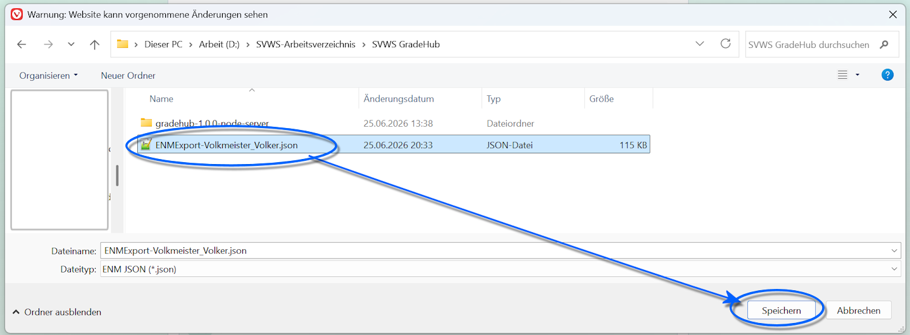

Nun müssen Sie Ihre **gespeicherte Lehrkraft-Notendatei** wieder der Schule zur Verfügung stellen.

>[!CAUTION] Die richtige Datgei wieder abgeben
>Haben Sie nicht nur die Datei im Verwaltungsnetz verwendet & überschrieben, sondern die Arbeit an einem anderen Ort erledigt, achten Sie bitte darauf, die wirklich korrekte Lehrkraft-Notendatei wieder abzugeben.