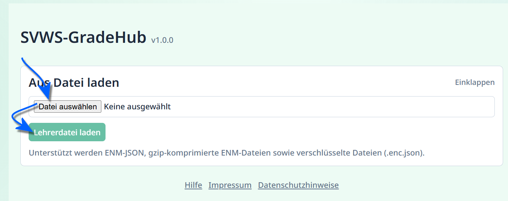
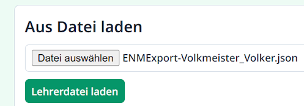

# Benutzerhandbuch SVWS-GradeHub

## GradeHub installieren und starten

Um das Externe SVWS Notenmodul GradeHub zu starten, müssen Sie es aufrufen.

Liegt das Modul schon vor, etwa weil die Schule Ihnen einen Link oder eine Internetadresse hat zukommen lassen oder weil das Modul schon auf den Lehrerzimmer-Rechnern liegt, brauchen Sie keinen Download und Sie können die Datei direkt starten. Eventuell hat die IT einen Link auf dem Desktop der Computer abgelegt.

>[!TIP] Tipp für die IT
>Wenn Sie die IT der Schule sind, legen Sie einen Link auf den Desktops an.

Ansonsten laden Sie das Modul herunter und installieren Sie es. Ihr Schule wird Ihnen hierfür einen Link zur Verfügung stellen.

* Entpacken Sie die Datei. Unter MS-Windows ist mit der `rechten Maustaste` auf die Datei zu klicken, dann wählen Sie `Alle extrahieren...`.
* Wählen Sie einen Speicherort für die Dateien.
* Navigieren Sie zu diesem Speicherort und starten Sie die Datei `index.html`.

>[!TIP] MS Windows blendet Dateiendungen aus
>MS Windows blendet per Standard die Dateiendungen aus. Damit wäre die die startende Datei nur die `index`.

## Lehrernoten-Datei laden & Login

Sie haben eine Lehrkraft-Notendatei erhalten oder diese liegt auf einem der für die Noteneingabe vorgesehen Computer.

Klicken Sie `Datei auswählen` an und navigieren Sie zu Ihrer Lehrkraft-Datei. Wählen Sie diese aus.

Klicken Sie dann auf `Lehrerdatei laden`.

>[!TIP]Administrationsmenü
>Unter Umständen kann es sein, dass Sie den Administrations-Bereich oberhalb des Logins sehen. Dies ist auch der Fall, wenn Sie die Windows-Exe gestartet haben. Ignorieren Sie diesen Teil und nutzen Sie den normalen Login über die Lehrkraft-Notendatei darunter.

Geben Sie bei Bedarf Ihr *Initialkennwort* ein, das Sie von der Schule erhalten haben oder Ihr *Kennwort* ein, dass Sie nach einem vorherigen Login selbst erzeugt hatten.

Unter Umständen ist kein Kennwort notwendig.

Im Anschluss öffnet sich die Maske zur Eingabe von Noten, Fehlstunden und weiterer Daten.

Nutzen Sie hierzu das [Benutzerhandbuch des Externen SVWS Notenmoduls GradeHub](/svws_module/svws_gradehub/bh_gradehub_verwenden.md), das links im Inhaltsverzeichnis aufgeführt ist oder folgen Sie dem Link.