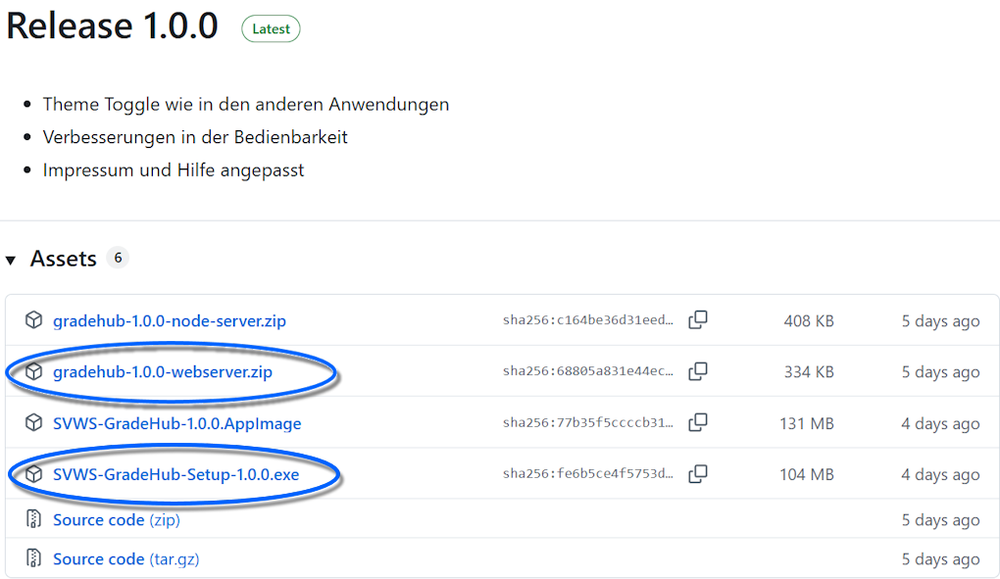
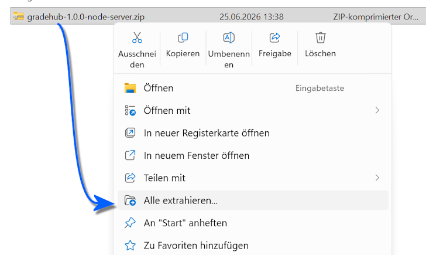

# Installation des SVWS-GradeHub

Laden Sie den **SVWS Externen Notenmanager für Lehrkräfte GradeHub** auf der [Seite des MSB für Schulverwaltungssoftware](https://www.svws.nrw.de/) im Bereich für [Tools und Module](https://www.svws.nrw.de/svws-server-schild-nrw-3/svws-server-tools-module) herunter.

Die Dateien stehen als mehrere Optionen zur Verfügung:

* Als MS-Windows-exe
* Als gepackte .zip, hier wird eine index.html entpackt und in einem Browser gestartet.
* Weitere Varianten für IT-Kundige

In allen Varianten findet die Verarbeitung von Daten ausschließlich auf dem Client-Rechner statt. Es findet nach dem Programmstart keine Kommunikation mit einem eventuelle Server statt und Daten werden nur in die lokale Lehrkraft-Notendatei gespeichert.

## Anwendung starten

### Als MS-Windows-Programm

Laden Sie ausführbare Datei *SVWS-GradeHub-Setup-x.x.x.exe* herunter. Die "x" stehen hierbei für die Versionsnummer.

Führen Sie auf Ihrem MS-Windows-System die Datei aus. Hierbei wird ein Desktop-Symbol installiert, über das Sie SVWS GradeHub starten können.

>[!TIP] Installation abgeschlossen
Fahren Sie nun mit dem **Nutzerhandbuch für Anwender** oder dem **Nutzerhandbuch für Administratoren** fort.

### Als entpackte .zip-Datei

Die folgende Variante läuft auf allen Betriebssystemen, auf denen ein moderner Browser zur Verfügung steht.

Laden Sie die Datei *gradehub-x.x.x-webserver.zip* herunter. Die "x" stehen hierbei für die Versionsnummer. Diese Version läuft auf jedem Betriebssystem mit einem modernen Browser (Chromium-Engine, Edge, Safari).

Entpacken Sie die Datei.

Unter MS-Windows nutzen Sie die `rechte Maustaste` und wählen dann `Alle extrahieren...`, anschließend wählen Sie den Ordner, in den die Dateien extrahiert werden soll.

Anschließend navigieren Sie zu diesem Ordner und starten die Datei `index.html`. Es öffnet sich Ihr Browser. Unter MS-Windows werden Dateiendungen per Standard ausgeblendet, hier würde die Datei also nur als `index` angezeigt werden.

>[!TIP] Installation abgeschlossen
Fahren Sie nun mit dem **Nutzerhandbuch für Anwender** oder dem **Nutzerhandbuch für Administratoren** fort.

## Webserver-Variante 

Sie können die Webserver-Datei auch im Webroot-Verzeichnis eines Webservers abllegen.

In diesem Fall wäre SVWS GradeHub zum Beispiel, wenn Sie den Webserver mit einer solchen Subdomain und einem solchen Ordner verwenden, über https://svws-server.schule.xyz/gradehub/ erreichbar.

Sofern Ihr Webserver nicht nur im internen Verwaltungsnetz, sondern auch über das Internet erreichbar ist, ist ein *Impressum* zu setzen.

Editieren Sie hierzu die Datei *impressum.example.js* und bennnen Sie diese in *impressum.js* um.

## Konfiguration zur Laufzeit

In allen Server-Varianten lässt sich GradeHub zur Laufzeit über die *config.js* konfigurieren. Sie kann jederzeit angepasst werden.

* **admintoolVisible** *true* oder *false*: Adminbereich ein- oder ausblenden
* **mailServerUrl**	*URL-String* oder *leer*:	URL des Node.js-Mail-Servers (nur bei separatem Betrieb nötig)

Beispiel für eine vollständige Konfiguration:

    window.GRADEHUB_CONFIG = {
      admintoolVisible: true,
    mailServerUrl: 'https://svws-server.schule.de:3001',
    }

Ist *mailServerUrl* nicht gesetzt, verwendet die App relative Pfade — das ist der Standardfall, wenn server.js die App selbst ausliefert.

## Weitere Installationsmöglichkeiten

### Node.js-Server (mit E-Mail-Funktion)

Entpacken Sie gradehub-*-node-server.zip auf einem Server mit Node.js.

Installieren Sie die Abhängigkeiten:
    
    npm install --omit=dev

Starten Sie den Server:

>    node server.js               # Port 3000 (Standard)

>    PORT=8080 node server.js     # oder ein anderer Port

Rufen Sie die URL im Browser auf (z. B. http://server:3000).

Für den Dauerbetrieb empfiehlt sich ein Prozessmanager:

>    npm install -g pm2

>    pm2 start server.js --name gradehub

>    pm2 save

### Optionale Mail-Funktion neben Jetty

Wenn GradeHub über einen statischen Webserver (z. B. den SVWS-Jetty-Server) ausgeliefert wird und der E-Mail-Versand trotzdem genutzt werden soll, kann server.js parallel auf einem anderen Port betrieben werden.

**Voraussetzung:** Node.js ist auf dem Server verfügbar und gradehub-*-node-server.zip wurde entpackt und gestartet (z. B. auf Port 3001, s. Option C).

**Konfiguration:** Öffnen Sie die Datei config.js im Webroot-Verzeichnis der statischen Auslieferung und tragen Sie die URL des Node.js-Servers ein:

    window.GRADEHUB_CONFIG = {
      mailServerUrl: 'https://svws-server.schule.de:3001',
    }

Speichern Sie die Datei. Es ist kein Neustart und kein Neubau nötig. Beim nächsten Seitenaufruf erkennt GradeHub den Mail-Server automatisch, und der Button *Dateien versenden* erscheint im Adminbereich.

>[!TIP]Firewall
>Port 3001 muss in der Firewall des Servers nach außen freigegeben sein.

