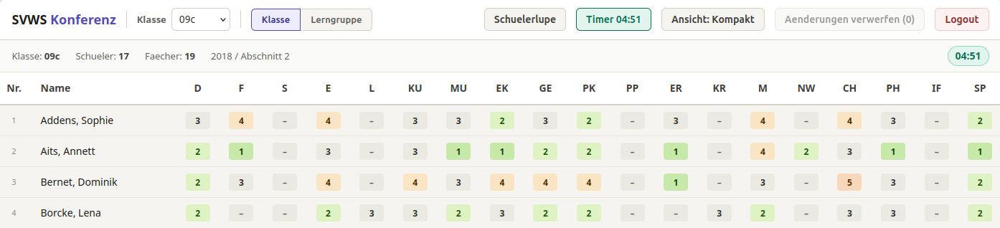

# Die SVWS-Konferenzübersicht

Die **SVWS-Konferenübersicht** dient dazu, alle Leistungsdaten einer Schülergruppe übersichtlich während einer Zeugniskonferenz zu präsentieren und auch zu ändern. 

::: danger Release "Bald"
Die SVWS-Konferenzübersicht ist derzeit noch nicht als Release verfügbar, dieser ist jedoch kurzfristig zu erwarten.
:::

Sie können sich in einer Netzwerkumgebung direkt mit dem SVWS-Server verbinden oder die Datei `enm.json.gz` manuell laden, die über den SVWS-Webclient exportiert wurde, so dass das SVWS-Konferenzmodul auch vollständig offline genutzt werden kann.

Die SVWS-Konferenzübersicht läuft im direkt in einem Browser, ohne dass ein weiterer Server zur Verfügung gestellt werden muss. Die Anwendung ist so gestaltet, dass alle Daten im Browser verarbeitet werden. 

Im **Offline-Modus** werden keine Schülerdaten oder Noten an Dritte weitergeleitet: Die Daten werden lediglich über die Dateien `enm.json.gz` eingelesen und aus der SVWS-Konferenzübersicht wieder exportiert.

Im **Online-Modus** bei Verbindung mit dem SVWS-Server wird mit diesem kommuniziert.

Dieses Handbuch richtet sich an:

- Lehrkräfte, die Konferenzdaten sichten und bewerten
- Eine Administration, die den technischen Zugriff vorbereiten
- Schulleitungen und Organisationsteams, die den Konferenzablauf strukturieren

## Starten der SVWS-Konferenzübersicht

Achten Sie darauf, dass die App vollständig in einem Ordner abgelegt wurde (Sie haben die Index.html und im Unterordner /assets/ die Dateien app.js und app.css). Wenn Sie die Konferenzübersicht herunterladen und entpacken, ist alles direkt so, wie es sein soll.

Starten Sie nach dem Download und Entpacken einfach die `index.html`.

## Was ist zu beachten?

::: tip Datenschutz und IT-Sicherheit
Beachten Sie die Datenschutzrichtlinien Ihrer Schule und des geltenden Rechtsrahmens, wenn Sie mit personenbezogenen Daten arbeiten. Sichern Sie Exportdateien und Berichte nur auf geschützten Schulservern oder verschlüsselten Speichermedien. Fragen Sie Ihre IT-Abteilung bei Unklarheiten zu Netzwerk, CORS oder Serverzertifikaten.
:::

* Nutzen Sie einen aktuellen Browser, aktuelle Versionen von Firefox, Chrome, Edge oder Safari sind geeignet. Bei älteren Browsern kann die Verarbeitung großer Datenmengen problematisch sein.

* Alle Änderungen werden nur lokal im Browser gehalten. Verwenden Sie die Exportfunktion, um Ihre Ergebnisse als Datei zu sichern, bevor Sie die Seite schließen. Nicht gespeicherte/exportierte Daten gehen beim Schließen des Browsers verloren.

* Die App selbst kann als statische Dateien auf einem zentralen Laufwerk oder einem Schulserver bereitgestellt werden. Jeder Nutzer, der die `index.html` gestartet hat, lädt dann die Seite im lokalen Browser des verwendeten Clients und damit eigene Konferenzdaten.

* Die Anwendung verarbeitet den SVWS-Export durch den **SVWS-Webclient** als `enm.json.gz`. Andere Dateitypen - oder aus anderen Programmen exportierte Daten - werden nicht unterstützt.

