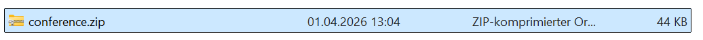
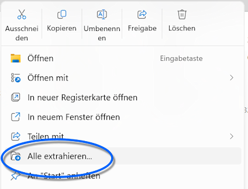
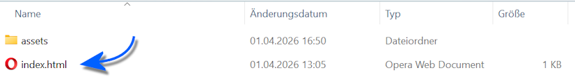

# Bereitstellung der SVWS-Konferenzübersicht

## Browser des zugreifenden Clients

- Ein aktueller Browser: Firefox, Chrome (Chromium-basiert), Edge oder Safari.
- JavaScript muss aktiviert sein.
- Desktop-Browser werden empfohlen; die Oberfläche ist für große Bildschirme optimiert.

## Installation der App auf einem Rechner oder im Netzwerk

Die Konferenzübersicht läuft in einem Browser und setzt daher kein bestimmtes Betriebssystem voraus!



Laden Sie die SVWS-Konferenzübersicht herunter. Die Datei ist eine gepackte .zip und muss entpackt werden.



Mit einem `rechten Mausklick` öffnet sich in MS Windows das Kontextmenü, wählen Sie hier `Alle extrahieren...` und wählen Sie dann einen geeigneten Speicherort.



Nach dem Entpacken liegen nun die `index.html` und der Unterordner `/assets/` in Ihrem Konferenzverzeichnis. Dieses Verzeichnis können Sie frei irgendwohin kopieren.

Blendet Ihr Betriebssystem Dateiendungen aus, sehen Sie die Datei nur als `index`.

Das Icon der Datei variiert je nach installiertem Internetbrowser.

::: tip Betrieb über einen Webserver
Hinweis für die IT: Ein einfacher statischer Webserver reicht aus, um die App im Schulnetz bereitzustellen.
Alternativ stellen Sie die App einfach über eine Dateifreigabe im Netzwerk zur Verfügung.
:::

Starten Sie einen solchen beispeilsweise über

```bash
python -m http.server 8000
```

## Lokale Nutzung (offline)

Alle Daten bleiben im Browser und werden nicht im Netzwerk oder an Dritte übertragen.

- Die Anwendung kann per Doppelklick auf `index.html` geöffnet werden.
- Offline-Modus ist besonders geeignet, wenn kein direkter Zugriff auf den SVWS-Server möglich ist.
- Alle Verarbeitung findet lokal im Browser statt. Achten Sie darauf, dass nur berechtigte Personen Zugriff auf die Arbeitsrechner haben.

### Dateien, Zugriffsschutz und Problembehandlung

- Die App verarbeitet den ENM-Export des SVWS als gzip-komprimierte JSON-Datei (`enm.json.gz`).
- Stellen Sie sicher, dass die Datei vollständig heruntergeladen und nicht umbenannt wurde; beachten Sie hierbei, dass MS Windows per Standard Dateiendungen im Windows-Explorer ausblendet und diese daher nicht sichtbar und kontrollierbar sind.
- Sensible Dateien, also die `enm.json.gz` mit Ihren personalisierten Leistungsdaten, sind sicher zu übertragen und zu sepichern. Nutzen Sie zum Beispiel per verschlüsseltem Dateitransfer oder die Ablage auf einem gesicherten Netzlaufwerk.

- Große ENM-Exporte im Bereich von "Dutzenden MB" benötigen mehr Arbeitsspeicher und CPU beim Entpacken und Einlesen. Bei Problemen empfehlen sich:
  - kleinere Dateien mit Schüler-Teilmengen verwenden, etwa nur die Schüler des Jahrgangs der aktuellen Konferenz
  - die Datei auf einen Schulserver legen und dort filtern (IT-Unterstützung)

## Online-Abruf (optional)

- Für den Online-Abruf werden die **SVWS-Server-URL**, das Schema (also den **Namen Ihrer "Datenbank"**) sowie **Ein normaler Datenbank-Benutzername** und **Passwort** benötigt (Basic Auth). Hierbei ist zu beachten, dass der Datenbank-Benutzer die üblichen Rechte hat, also gegebenfalls nicht alle Klassen sehen/ändern kann. 
- Bei Verbindungsproblemen prüfen Sie bitte:
  - den Netzwerkzugang zum SVWS-Server
  - Gültigkeit des Service-Zertifikats - selbstsignierte Zertifikate müssen vom System/Browser *vertraut* werden, klicken Sie hierzu *Zertifikat vertrauen* an.
  - Die für sichere Kommunikation im Netzwerk verantwortliche CORS-Konfiguration, falls die App aus dem Browser eines Client-Rechners auf einen Server zugreift.


