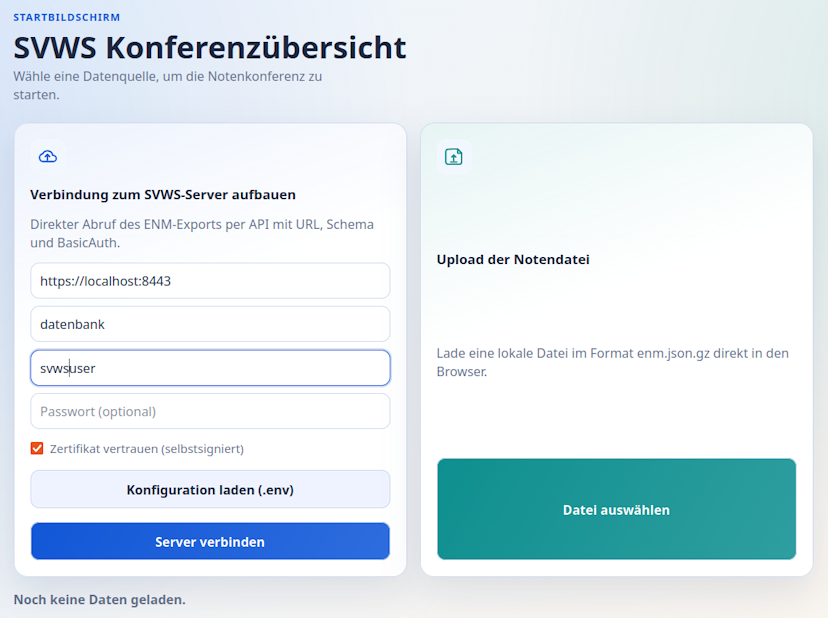
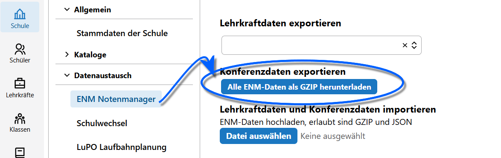

# Login - online oder per Datei

## Online-Abruf vom SVWS-Server

Wenn Sie die Anwendung online mit einem SVWS-Server nutzen, geben Sie Benutzername und Passwort in der Server-Kachel ein und klicken auf `Server verbinden`.

Im linken Bereich sind nun die Login-Daten anzugeben:

- SVWS-Server-URL beziehungsweise die Server-IP-Adresse im lokalen Netzwerk, tragen Sie hier das Präfix `https://` mit ein. Verbinden Sie sich also beispielsweise mit `https://name-des-svws-servers` oder `https://127.0.0.1`. Haben Sie den Server auf einem bestimmten Port liegen, tragen Sie diesen ebenfalls ein, für den Port *8443* zum Beispiel wäre dies `https://mein-verwaltungsserver:8443`. Fragen Sie im Zweifel Ihre IT für die konkreten Daten.
- Den Schema-Namen auf dem Server, dies ist der **Name Ihrer "Datenbank"**.
- Einen Datenbank-Benutzernamen, mit dem Sie sich etwa normalerweise auch im SWVS-WebClient oder in anderen Programmen anmelden. In der Konferenzübersicht hat dieser die üblichen Rechte zum Ansehen und Ändern von Schüler-Leistungsdaten.
- Das zugehörige Passwort.

Nutzen Sie ein eigenes **Zertifikat**, klicken Sie an, dass dem **Zertifikat vertrauen**.

::: warning Fehler bei der Verbindung
Wenn die Verbindung fehlschlägt, prüfen Sie URL/Adresse, die Zugangsdaten, die Rechte des verwendeten Datenbank-Nutzers und gegebenfalls eventuelle Firewall- oder Proxyserver-Einstellungen. Bei großen Datenmengen kann der Download einige Sekunden dauern.
:::

## Offline per Datei-Upload

Wenn kein direkter Serverzugriff möglich oder gewünscht ist:

1. Exportieren Sie die `enm.json.gz` im SVWS-WebClient über die **App Schule ➜ Datenaustausch ➜ ENM Notenmanager**. Speichern Sie diese Datei an einem sinnvollen Ort. Beachten Sie den Datenschutz.

2. Laden Sie diese Datei nun im SVWS-Konferenzmodul im rechten Bereich hoch, indem Sie `Datei auswählen` anklicken. Achten Sie hier unbedingt darauf, die korrekte Datei zu nutzen und nicht zum Beispiel eine alte aus dem letzten Lernabschnitt.
3. Darstellung der Daten prüfen

::: tip Drag & Drop
Alternativ laden Sie eine Exportdatei `enm.json.gz` per Drag & Drop oder über die Schaltfläche **Datei auswählen** hoch.
:::

Nach dem Upload sehen Sie eine kurze Bestätigung und den Namen der geladenen Datei.

## Eventuelle Startprobleme

Unten links sehen Sie den Status der geladenen Daten beziehungsweise ob und welche Fehler es gibt.

- Anwendung startet nicht: prüfen, ob index.html im richtigen Ordner geöffnet wurde und ob der Unterordner /assets/ mit den Dateien app.js und app.css vorhanden ist.
- Keine Daten sichtbar: Schema, Zugangsdaten oder ENM-Datei kontrollieren
- Verbindungsprobleme online: Netzwerk, https://-Präfix, CORS und Zertifikatssituation prüfen
- Bei Unsicherheit öffnen Sie die Entwicklerkonsole des Browsers (F12) und prüfen die Fehlermeldungen; diese helfen beim Troubleshooting.
