# Die Verwendung Der SVWS-Konferenzübersicht

Dieses Kapitel beschreibt die wichtigsten Bereiche der Benutzeroberfläche und ihre Funktion.

## Klassenübersichtstabelle

Die zentrale Tabellenansicht zeigt pro Klasse die aufbereiteten Datensätze — Schülernamen, Leistungsnoten, Status und gegebenfalls Kommentarspalten.

Nutzen Sie die *Kopfzeilen zum Sortieren*, die Suchleiste für schnelles Filtern und das **Dropdown-Menü** links oben, um zwischen Klassen zu wechseln beziehungsweise nur eine einzige *Klasse oder Lerngruppe* anzuzeigen.

Einzelne Noten können direkt in der Tabellenansicht editiert werden, Klicken Sie dazu in die jeweile Zelle. Nach Änderung bestätigen Sie die Eingabe per Enter oder durch Klicken außerhalb der Zelle.

Sie können die *Noten (eventuell mit Tendenzen)* sowie die anderen gewohnten Werte wie *NB*, *E1* bis *E3* und so weiter eingeben.

Für die *Gynmasiale Oberstufe* kann zwischen **Noten** und **Punkten** bei der Eingabe umgeschaltet werden.

Klicken Sie eine Zeile an, um Details mit der *Schülerlupe* zu öffnen.

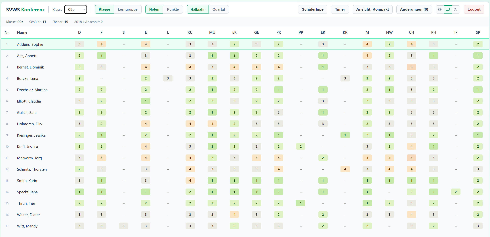

Hier im Beispiel wurde auch ein *Timer* gesetzt - mehr dazu findet sich weiter unten.

## Schülerlupe - eine große Übersicht und weitere Detaildaten

Per Lupe-Icon oder Doppelklick auf einen Schüler öffnen Sie eine kompakte Schnellansicht: Notenübersicht, Fehlstunden und Bemerkungen für die Konferenz.

Ebenso werden über die Schülerlupe weitere Daten zur Ansicht und Einstellung möglich, wenn diese in ihrem *Tabellenmodus* verwendet wird.

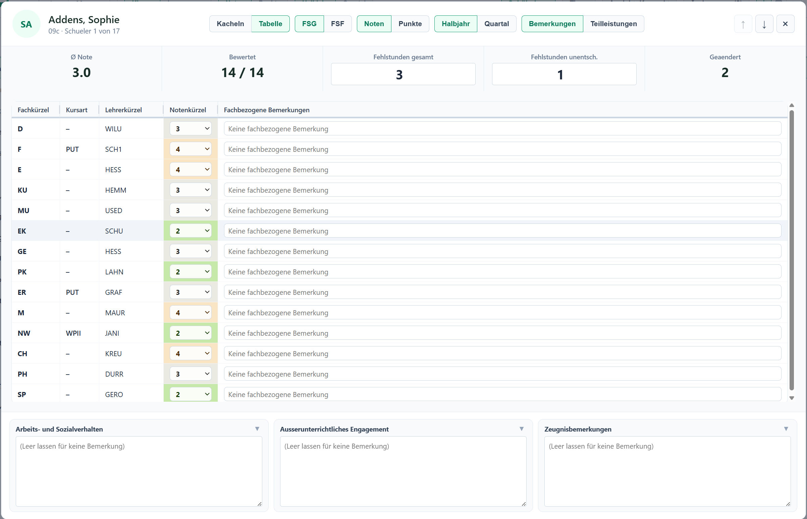

Hier in dieser Ansicht lassen sich auch **Fehlstunden** und im unteren Bereich die **Zeugnisbemerkungen** eintragen. 

Ist vorgesehen, dass nicht in *Noten*, sondern in *Punkten* bwertet wird, lässt sich diese Umstellung ebenfalls in der Kopfzeile vornehmen. 

Diese Ansicht ist dazu geeignet, um vor einer Entscheidung schnell die relevanten Informationen zu prüfen, ohne das Hauptfenster zu verlassen.

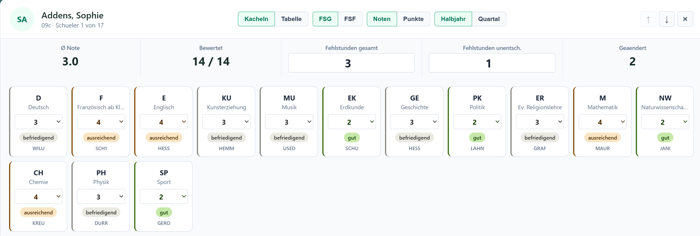

In der Kopfzeile lässt sich die Darstellung in den Modus für *Kacheln* und eine *Tabellenansicht* umstellen.

Ebenso können Sie umstellen, ob *Fehlstunden gesamt (FSG)* oder *Fehlstunden fachweise (FSF)* angezeigt werden und damit auch geändert werden können.

### Fachbezogene Bemerkungen und Teilleistungen

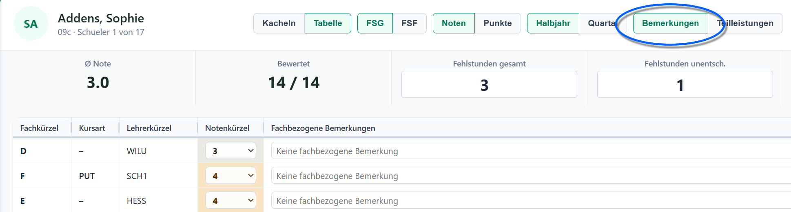

Ist die Ansicht im *Tabellenmodus*, kann in der Kopfzeile ebenfalls zwischen den *Fachbezogenen Bemerkungen* und *Teilleistungen* umgeschaltet werden.

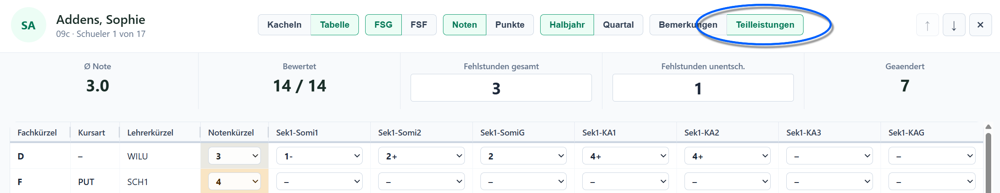

## Timer / Konferenzzeitmesser

Oben rechts finden Sie einen Timer, der die verbleibende oder verstrichene Zeit der Besprechung anzeigt.

Starten, pausieren oder nullen Sie den Timer über die danebenliegenden Tasten. Der Timer dient als Orientierung für die Zeitplanung einzelner Tagesordnungspunkte.

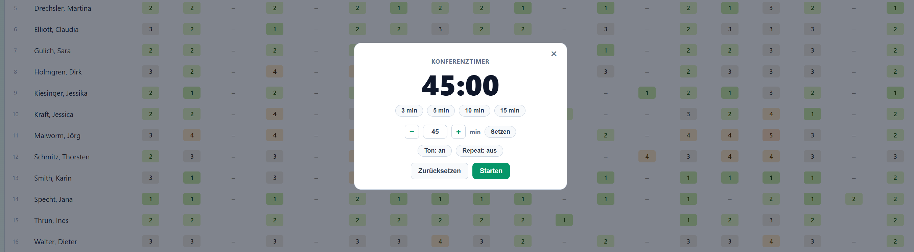

Wird der Timer auf **Repeat: an** gestellt, wird er beim Wechsel auf einen anderen Schülerdatensatz automatisch neu gestartet. In diesem Modus sollten kürzere Zeiten über *Setzen* eingestellt werden.

**Repeat: aus** bietet sich an, wenn für eine komplette Konferenz (Klasse oder Kurs) ein langer Timer gesetzt wird.

Über **Ton: an** kann gesteuert werden, ob der Timer bei Ablauf einen akkustischen Hinweis gibt.

## Ansicht Kompakt/nicht Kompakt

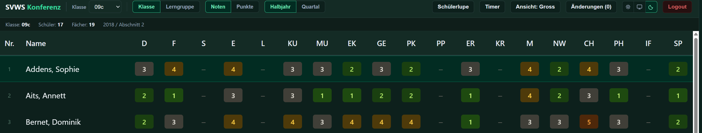

Wechseln Sie zwischen kompakter und großer Tabellenansicht über die Ansichtsschaltfläche oberhalb der Tabelle.

Die kompakte Ansicht zeigt mehr Zeilen, die große Ansicht mehr Detailspalten.

Oben rechts lässt sich die Anzeige zwischen dem hellen oder dunklen Schema wählen. Über den Schalter in der Mitte wird die Systemeinestellung beziehungsweise die Einstellung des Browsers übernommen.

## Änderungen exportieren

.")

Nach der Bearbeitung klicken Sie auf **Änderungen (x)**, um die gemachten Änderungen zu speichern. Das *(x)* gibt hierbei die Zahl der ungespeicherten Änderungen an.

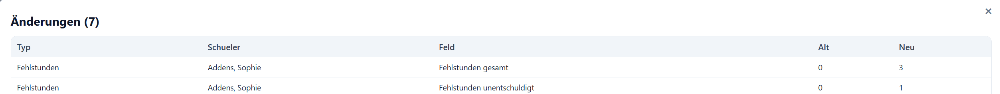

Sie erhalten zuerst eine Übersicht über die gemachten Änderungen.

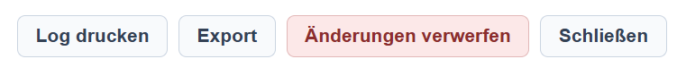

Über **Log drucken** öffnet sich ein Dialog, mit dem Sie einen Speicherort für für ein Logdatei als .pdf mit den Änderungen auswählen. Diese Datei können Sie zur Weitergabe, Archivierung oder als Teil des Konferenzprotokolls verwenden.

Die **Exportfunktion** nutzt den Weg, der bei Zugang zur App gewählt wurde, um die Daten wieder aus der SVWS-Konferenzübersicht herauszuschreiben, also entweder findet eine Online-Synchronisation mit dem SVWS-Server über API statt oder es wird wieder eine Notendatei erstellt, die sich über den SVWS-WebClient einlesen lässt.

Sie können Ihre *Änderungen verwerfen* und damit alle gemachten Änderungen wieder zurücksetzen. Achtung, diese Option ist nicht zu wiederrufen.

Durch einen Klick auf *Schließen* kehren Sie ohne Änderungen zum Konferenzmodul zurück.

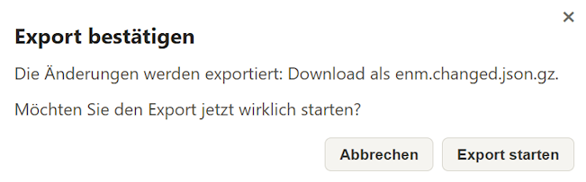

Der Export ist noch einmal zu bestätigen. Da hier im Beispiel mit einer Offline-Notendatei gearbeitet wurde, wird eine veränderte Datei erzeugt, diese heißt `enm.changed.json.gz`, die nun wieder im SVWS-WebClient eingelesen werden kann.

Arbeiten Sie im Online-Modus mit einer direkten Verbindung zum SVWS-Server, sind die Daten nach dem Export synchronisert.

Alternativ können Sie *alle!* **Änderungen verwerfen** und die SVWS-Konferenzübersicht wieder auf den Ausgangszustand zurückstellen.

::: warning Keine automatische Synchronisierung
Es findet keine automatische Synchronisierung statt. Nicht gespeicherte/exportierte Änderungen gehen verloren.

Denken Sie daher an regelmäßige Sicherungen.
:::

## Einlesen der Daten im SVWS-WebClient

Wenn Sie im Online-Modus arbeiten, sind die Daten nach einem Export synchronisert. Arbeiten Sie im Offline-Modus mit den Im- und Exportdateien, müssen Sie im Anschluss an den Export die `enm.changed.json.gz` im SVWS-WebClient noch einmal wieder einlesen.

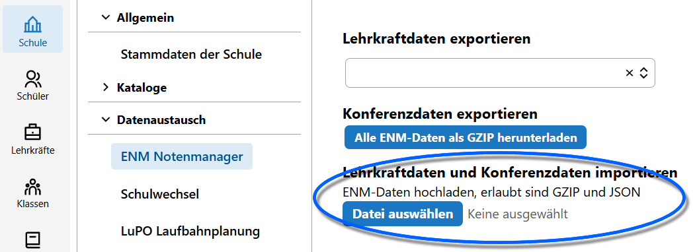

Gehen Sie hierzu in **App Schule ➜ Datenaustausch ➜ ENM-Notenmanager** und klicken Sie unter *Lehrkraftdaten und Konferenzdaten importieren* auf die Schalter `Datei auswählen`.

Achten Sie auch hier darauf, dass die gerade erstellte und damit korrekte Datei ausgewählt wird. Achten Sie hierbei auf Erstellungsdatum/-zeit der Datei.

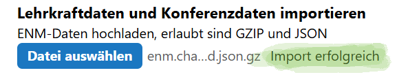

Ganz gleich, ob Sie im Offline- oder Onlinemodus gearbeitet haben: Die Eintragungen der SVWS-Konferenzübersicht sind nun im SVWS-WebClient über die **App Noten** und in den **Leistungsdaten** der **App Schüler** einsehbar.
