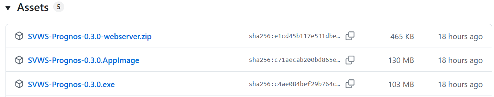

# Installation des SVWS Prognosewerkzeugs

SVWS-Prognos steht in drei Varianten bereit:

* Als Desktop-App für MS Windows ab Windows 10/11 (SVWS-Prognos-x.x.x.exe)
* Als Desktop-App für Linux, z.B. Ubuntu, Fedora u. a. (SVWS-Prognos-x.x.x.AppImage)
* Web-Bundle, startbar in einem (fast) beliebigen Browser (SVWS-Prognos-x.x.x-webserver.zip)

Die jeweils aktuellen Downloads finden Sie auf der Release-Seite des Projekts.

## Installation unter Windows

Voraussetzungen: Windows 10 (64-Bit) oder Windows 11. Es ist keine weitere Software erforderlich, alle Abhängigkeiten sind im installierten Programm enthalten.

* Laden Sie die Datei SVWS-Prognos-x.x.x.exe herunter.
* Starten Sie die Installationsdatei mit einem Doppelklick und folgen Sie dem Installationsassistenten.

SVWS-Prognos wird im Startmenü eingetragen und als Desktop-Icon angelegt und kann direkt geöffnet werden.

>[!TIP]Windows-Sicherheitswarnung
>Da die Anwendung aktuell kein Code-Signing-Zertifikat besitzt, kann Windows beim ersten Start eine SmartScreen-Warnung anzeigen.

Klicken Sie auf "Weitere Informationen" und anschließend auf "Trotzdem ausführen".

## Installation unter Linux

Voraussetzungen
64-Bit-Linux-Distribution (Ubuntu 20.04+, Fedora 38+, Debian 11+) und das Recht zum Ausführen der *AppImage-Datei*.

* Laden Sie die Datei SVWS-Prognos-x.x.x.AppImage herunter.
* Machen Sie die Datei ausführbar.
    * Nutzen Sie hierfür entweder einen grafischen Dateimanager (Rechtsklick → Eigenschaften → Ausführen erlauben) 
    * `chmod +x SVWS-Prognos-x.x.x.AppImage`
* Starten Sie die App per Doppelklick oder im Terminal: `./SVWS-Prognos-x.x.x.AppImage`

>[!TIP]Hinweis für Wayland-Nutzer
>Sollte die App nicht starten, fügen Sie die Option --ozone-platform=x11 hinzu:
>./SVWS-Prognos-x.x.x.AppImage --ozone-platform=x11

## Betrieb als Web-App (Webserver)

Wenn Sie SVWS-Prognos auf einem Schulserver als Web-Anwendung bereitstellen möchten, nutzen Sie das Web-Bundle.

Voraussetzungen: Ein Webserver (z.B. nginx, Apache), ein HTTPS-Zertifikat ist empfohlen, moderner Browser zum Zugriff (Chrome 90+, Firefox 90+, Edge 90+, Safari 15+).

* Laden Sie SVWS-Prognos-x.x.x-webserver.zip herunter.
* Entpacken Sie das Archiv in das Webverzeichnis Ihres Webservers.
    * Linux: unzip SVWS-Prognos-x.x.x-webserver.zip -d /var/www/html/prognos/
    * Windows: Nutzen Sie das Kontextmenü unter der rechten Maustaste zum Entpacken.

Rufen Sie die App im Browser unter https://ihr-schulserver.de/prognos/ auf.

>[!TIP]CORS-Hinweis
> Im Web-Browser-Betrieb muss der SVWS-Server CORS-Anfragen von Ihrer Domain erlauben (Cross Origin Ressource Sharing zwischen Browsers und Servern). Wenden Sie sich dazu an Ihren SVWS-Administrator.

>[!CAUTION]Impressum
>Sofern Sie SVWS Prognos vom Web aus erreichbar aufsetzen, vergessen Sie bitte nicht, ein Impressum zu setzen, indem Sie Ihre Daten in die Datei *impressum.example.js* eintragen und diese in *impressum.js* umbenennen.
>Wenn SVWS Prognos nur in Ihrem internen Netzwerk läuft, benötigen Sie kein Impressum. 

Nach der Installation [verbinden Sie sich bitte mit dem SVWS-Server](server_verbinden.md).