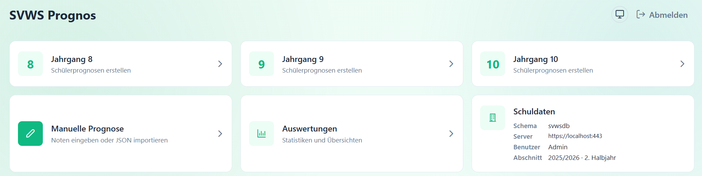
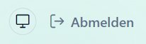
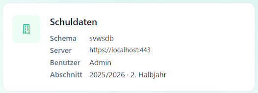
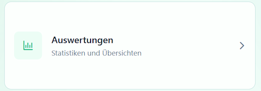
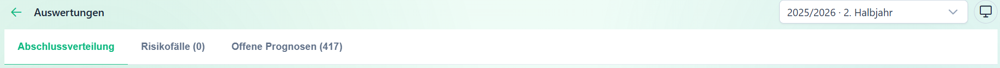

## SVWS Prognos Übersicht

Nach dem Verbinden mit einem SVWS-Schema wird auf der Hauptseite von *SVWS Prognos* eine Übersicht der Funktionen angezeigt.

In der Kopfzeile können Sie einen *hellen* oder *dunklen Modus* wählen oder die Systemeinstellung behalten.

Ebenso können Sie sich **Abmelden** und damit Prognos verlassen. Es werden keine Daten gespeichert.

>[!TIP]Noten Speichern
>Veränderte Daten, zum Beispiel Noten, können aus den Detailübersichten der Schüler in den SVWS-Server zurück gespeichert werden.

Unter der Hauptseite sehen Sie die Kacheln mit den Funktionen von SVWS-Prognos.

Unten rechts sehen Sie eine Zusammenfassung der Datenbank, mit der Sie gerade verbunden sind.

## Abschluss-Auswertungen

Direkt daneben wird eine statistische Zusammenfassung, in der Sie eine *Abschlussverteilung* aufrufen könen, ebenso werden Grenz- und *Risikofälle* angezeigt, ebenso haben Sie Zugriff auf noch *offenen Prognosen*.

Über die Kopfzeile können Sie den gewünschten **Lernabschnitt** wählen. Anschließend haben Sie Zugriff auf *Abschluss-Zusammenfassungen*, *Risikofälle* und noch *Offene Prognosen*.

Ein Klick auf die Jahrgangs-Kacheln öffnet die Schülerübersicht für diesen Jahrgang. Hier sind 

Manuelle Prognose
Die Kachel „Manuelle Prognose” öffnet ein Eingabeformular, in das Sie Noten ohne Verbindung zu einem bestimmten Schüler eingeben können. Dies ist nützlich für:

Schnelle „Was-wäre-wenn”-Szenarien bei Beratungsgesprächen
Überprüfung von Notenkombinationen
Import von JSON-Testfällen
→ Mehr dazu: Manuelle Prognose

Auswertungen
Die Kachel „Auswertungen” bietet Statistiken und Übersichten über Prognosen im Jahrgang. Diese Funktion befindet sich in Entwicklung.

Schuldaten-Kachel (Info)
Die Kachel „Schuldaten” ist keine Navigation, sondern zeigt Ihnen die aktuell verbundene Instanz:

Feld	Beschreibung
Schema	Der Datenbank-Mandant (Schulname)
Server	Die URL des verbundenen SVWS-Servers
Benutzer	Ihr angemeldeter Benutzername
Abschnitt	Der aktuell gewählte Schuljahresabschnitt (z. B. „2024/25 · 2. Halbjahr”)
Hell- und Dunkelmodus
Oben rechts im Dashboard befindet sich der Theme-Umschalter. Er wechselt zwischen drei Modi:

System — übernimmt die Einstellung des Betriebssystems
Hell — heller Hintergrund
Dunkel — dunkler Hintergrund
Die Einstellung wird gespeichert und beim nächsten Start der App wiederhergestellt.

Abmelden
Über den Button „Abmelden” oben rechts trennen Sie die Verbindung zum SVWS-Server und kehren zum Verbindungsformular zurück. Alle Daten und Zugangsdaten werden aus dem Speicher gelöscht.