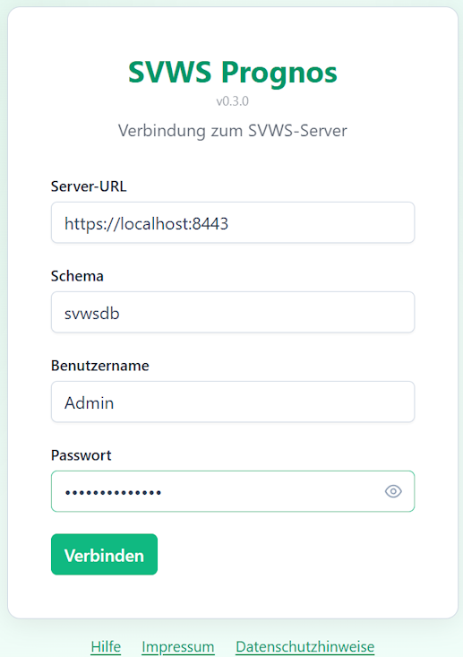

# Verbindung zum SVWS-Server

## Login

Beim ersten Start öffnet sich automatisch der Verbindungsdialog. Dieser fragt vier Angaben ab, die Sie von Ihrer Schulverwaltung oder Ihrem IT-Betreuer erhalten:

* **Server-URL**, gegebenfalls inklusive des Ports (z.B. https://MEINSERVER:8443) alternativ können Sie hier auch eine IP-Adresse (z.B. https://256.0.1.1:8443) eintragen.

Die URL beginnt immer mit `https://`. Eine unverschlüsselte  http://-Verbindung wird nicht unterstützt.

* Das **Schema** entspricht dem Datenbank-Mandanten Ihrer Schule auf dem SVWS-Server. Jede Schule hat ein eigenes Schema. Der Name wird in der SVWS-Administration festgelegt. Ein Beispiel wäre `ge_musterstadt` oder `svwsdb`, wenn das Beispiel aus den SVWS-Server-Installationsanleitungen verwendet wurde. Wenden Sie sich bei Unklarheiten an Ihre SVWS-Administration.
* Benutzername und Passwort: Geben Sie Ihre persönlichen **SVWS-Zugangsdaten** ein. Es werden dieselben Daten verwendet, die Sie auch für den *SVWS-Client* oder andere Clienten für den Zugriff nutzen.

>[!TIP]Sicherheitshinweis
> SVWS-Prognos speichert Ihr Passwort ausschließlich im Arbeitsspeicher für die aktuelle Verwendung. Die Daten werden nicht in einer Datei abgelegt. Nach dem Beenden der App sind damit alle Zugangsdaten gelöscht.

## Verbindung herstellen

Klicken Sie nach dem Ausfüllen auf `Verbinden`.

SVWS Prognos wird nun 
* Erreichbarkeit des SVWS-Servers prüfen
* Ihre Benutzerdaten authentifizieren
* Die verfügbaren Schuljahresabschnitte laden
* Sie zur Benutzeroberfläche weiterleiten
* Verbindung beenden

Über den Button `Abmelden` auf dem Dashboard können Sie aktuelle SVWS Prognos-Sitzung beenden. Sie werden zum Verbindungsformular zurückgeleitet. Alle Daten im Speicher werden gelöscht.

## Fehlermeldungen beim Verbinden

* *"Verbindung fehlgeschlagen" der Server ist nicht erreichbar*. Prüfen Sie, ob die URL/Serveradresse korrekt ist oder prüfen Sie die Netzwerkverbindung des Rechners
* *"Verbindung fehlgeschlagen" Falsches Schema*. Prüfen Sie, ob der Schema-Name korrekt ist beziehungsweeise erfragen Sie diesen bei der Administration
* *"Vernindung fehlgeschlagen" Falsches Passwort*. Prüfen Sie Ihre Zugangsdaten (Benutzername/Passwort).
* *Seite lädt nicht* die Firewall oder Proxy blockiert, Sie müssen Ihre IT-Abteilung kontaktieren.
* *SSL-Zertifikatsfehler*. Etwas funktioniert mit dem selbstsigniertes Zertifikat auf dem Server nicht, nutzen Sie die Hilfe auf der Anmeldeseite.

Nutzen Sie nun [SVWS Prognos](./prognos.md).
