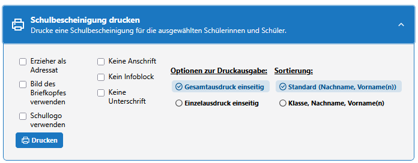

# Drucken einer Schulbescheinigung über die App Schüler

## Voraussetzungen

- Für den Druck einer Schulbescheinigung müssen Sie die Berechtigung dazu haben. Sollte die Schaltfläche nicht sichtbar sein, wenden Sie sich bitte an Ihre SchILD-Administration.
- Die notwendigen Daten der betreffenden Schülerinnen und Schüler (wie Adresse, Geburtsdatum usw.)  müssen eingetragen sein.

## Schritte

1. **Login durchführen**\
   Melden Sie sich mit Ihren Zugangsdaten beim Webclient an.
2. **App Schüler öffnen**\
   Navigieren Sie auf der linken Seite des Webclients zur App Schüler.
3. a) **Schulbescheinigung für einen einzelnen Schüler erstellen**
   - Wählen Sie im Schülercontainer den Schüler oder die Schülerin aus, für die oder den die Schulbescheinigung erstellt werden soll.
   - Der Name wird in der Liste hervorgehoben, im rechten Fensterteil erscheinen die Daten dieser Person.
   - Drücken Sie oben rechts auf die Schaltfläche "Schulbescheinigung drucken".
   ::tipp Beim Druck einer einzelnen Schulbescheinignung werden normalerweise keine Optionen angeboten. Möchten Sie die Ausgabe der Schulbescheinigung anpassen, nutzen Sie den Gruppenprozess, indem Sie vor dem einen Namen das Kästchen durch Anklicken aktivieren. Sie Können dann einen Gruppenprozess für nur eine Person verwenden.::\

    b) **Schulbescheinigung für mehrere Schüler erstellen**
   - Wählen Sie im Schülercontainer die Schüler und Schülerinnen aus, für die eine Schulbescheinigung erstellt werden soll. Markieren Sie dazu vor jedem gewünschten Namen das Kästchen durch Aufklicken.
   - Im rechten Fensterteil werden dann alle verfügbaren Gruppenprozesse angezeigt.
   - Klicken Sie auf "Schulbescheinigung drucken".
   - Es klappt ein Fenster auf, in dem Sie verschiedene Optionen auswählen können.\
   
   - Um die Erstellung der Schulbescheinigungen zu starten, klicken Sie auf die Schaltfläche "Drucken".

4. **Schulbescheinigung ansehen**
   - Je nach verwendetem Internet-Browser wird die Schulbescheinigung in einem neuen Tab oder einem neuen Fenster automatisch geöffnet.
   - Es wird immer eine PDF-Datei erzeugt, die alle erstellten Schulbescheinigungen enthält. Diese Datei können Sie im Browser scrollen und durchsuchen.

5. **Schulbescheiniung drucken oder speichern**
   - Wie die Schulbescheinigung gedruckt oder gespeichert wird, hängt von Ihrem Internet-Browser ab.
   - In der Regel können Sie die Schulbescheinigung mit der Tastenkombination Strg + P oder über den Menüpunkt "Drucken" ausdrucken.
   - Alternativ können Sie die Schulbescheinigung auch als PDF-Datei speichern. Nutzen Sie dafür die Tastenkombination Strg + S oder den entsprechenden Menüpunkt, der z. B. "Seite speichern unter" heißen kann.
   - Diese PDF-Datei können Sie dann mit einem PDF-Viewer Ihrer Wahl öffnen und weiterverarbeiten.
