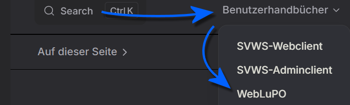

# Anleitungen zur Gymnasialen Oberstufe

In diesem Bereich finden sich Anleitungen zur Gynmasialen Oberstufe, die nicht einem konkreten Tab zuzuordnen sind.

Die Grundlagen zur Konfigurationen der Abiturjahrgänge mit den 
* Fächern,
* der Vorlagen für die Beratungsbögen,
* der Laufbahnplanung,
* der Übersicht von erfolgten und eingesammelten Fachwahlen
* und dann die Blockung im Zuge der Kursplanung und
* anschließend die Klausurplanung

in der **App Oberstufe** beschrieben werden.

## Laufbahnwahlen mit WebLuPO

Bezüglich der Laufbahnwahlen mit WebLuPO finden Sie in diesem Bereich unter **Oberstufe ➜ WebLuPO** die Anleitung, wie WebLuPO durch die Abteilungsleitung GOSt/GOSt-Koordination oder durch Beratungslehrkräfte WebLuPO für einen konkreten Abiturjahrgang aufzusetzen ist.

Im **Benutzerhandbuch WebLuPO**, das in der Kopfzeile dieser Webseite verlinkt ist, finden Sie die Anleitung für Nutzer beziehungsweise die Installationsanleitung.

