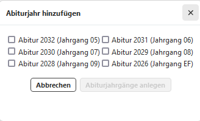

# Einrichtung der Jahrgänge
Unter  **Allgemein/Vorlage** kann eine Vorlage erzeugt werden, auf der neu erzeugte Jahrgänge basieren.


Erzeugen Sie für an der Schule schon eingerichtete Jahgänge einen kommdenen Abiturjahrgang, indem Sie auf das ````+```` klicken.



Nach dem Anlegen kann ein Jahrgang aus der Liste unter der App **Oberstufe** ausgewählt werden.

Es können im Anschluss die **allgemeine Vorlagen** oder individuell **ein konkreter Abiturjahrgang** bearbeitet werden hinsichtlich der folgenden Punkte:
1. Fächereigenschaften
2. Ausschlussregeln
3. Weitere Kombinationsbedingungen
4. Beratungslehrkräfte
5. ...

Nach Anklicken eines angelegten Jahrganges erweitert sich die Auwahl im rechten Fenster des Jahrganges:


Konfigurieren Sie nun den Jahrgang über die Einstellungen in den Reitern.