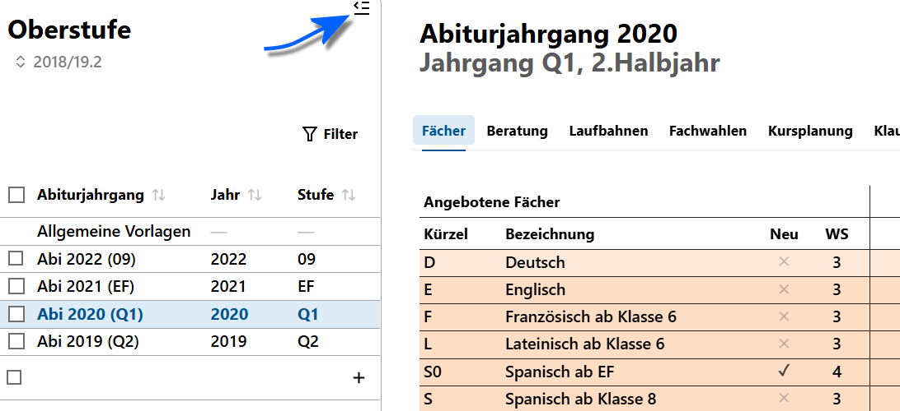
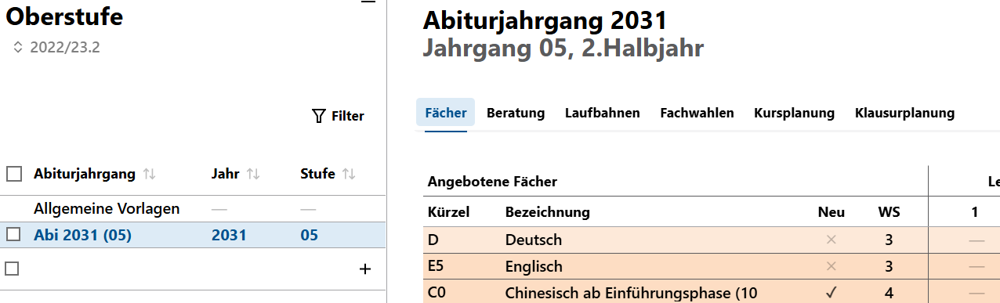

# Gymnasiale Oberstufe

In diesem Bereich wird die **App Oberstufe** erläutert und führt von den Kurswahlen vor dem Beginn der Einführungsphase mit WebLuPO über das Erstellen der Blockung bis zum Abitur.

Viele der Grundlagen wie das Zuweisen von Fächern/Kursen wird hier stark erweitert, so dass aus den Kurswahlen der Schülerinnen und Schüler die konkrete Kursverteilung, die Blockung, für einen Abiturjahrgang berechnet werden kann.

Diese Blockung lässt sich dann den Lernenden eines Jahrgangs zuweisen und hierbei werden automatisch die geplanten Kurse angelegt.

Weiterhin unterstützt der SVWS-WebClient auch eine Klausurplanung basierend auf den Kurswahlen.

Die Themen decken Vorbereitungen zu Laufbahnplanungen der neuen EF über die Wahlen bis hin zu Kurswahlen und zum Abitur ab. Nehmen Sie hier auch das Benutzerhandbuch zu WebLuPO zur Kenntnis, das in der Kopfzeile verlinkt ist.

::: tip Tipp: Arbeiten Sie mit dem Linksymbol und dem Zurück-Button
Bei den Prozessen, in denen individuelle Laufbahnwahlen korrigiert, geblockt und schließlich zugewiesen werden, findet sich vor Personen an vielen Stelle das **Linksymbol 🔗**. Es empfiehlt sich, viel mit diesem Symbol und dem **Zurück-Button** des Browsers zu arbeiten.
:::

## Abiturjahrgang

Für alle Tabs in der App Oberstufe stehen links in der Auswahlliste die **Abiturjahrgänge** zur Auswahl.

Unter der **Allgemeinen Vorlage** lässt sich die Vorlage für alle Abiturjahrgänge konfigurieren. Per Standard ist zuerst der **Tab Fächer** geöffnet. Die Einstellungen für den Abiturjahrgang werden im Artikel zu den Fächern beschrieben.

Legen Sie mit dem **Plus +** einen neuen Abiturjahrgang an oder löschen Sie einen existierenden Jahrgang.

Die **Stufe** wird basierend auf dem aktuell eingestellten Abschnitt, direkt oben sicht- und einstellbar unterhalb der App-Bezeichnung, angezeigt. Der Abiturjahrgang "EF" würde also im nächsten Schuljahr als "Q1" angezeigt.

Sie können die Auswahlliste mit dem kleinen Symbol oben rechts, markiert durch den blauen Pfeil im Screenshot, minimieren.

## Orientierende Übersicht zur Planung in der App Oberstufe

Grundsätzlich folgt die Planung eines Abiturjahrgangs den Tabs in der App Oberstufe von links nach rechts:

1. Legen Sie die **Fächer** der Oberstufe zuerst als **Allgemeine Vorlage** und dann als konkrete **Vorlage für einen Abiturjahrgang** an. Hieraus folgt, welche Fächer in welchem Halbjahr der Oberstufe als was für eine Kursart (GKS, GKM, LK, ...) wählbar ist und in welche Fachkombinationen eventuell gefordert oder gegenseitig ausgeschlossen sind.
2. Als nächstes sind die **Beratung**svorlagen wieder allgemein und für einen konkreten Abiturjahrgang festzulegen. Dies ist faktisch eine Vor-Ausfüllung für den WebLuPO-Wahlbogen mit sinnvollen Standardwerten, zum Beispiel belegen erst einmal alle Deutsch und Mathe schriftlich.
3. Anschließend an die Wahl mit *WebLuPO* finden sich die **Laufbahnen** im folgenden Tab. Die Wahlen werden nun mit der Abteilungsleitung/Koordination/Beratungslehrkräften kontrolliert, korrigiert und finalisiert. Springen Sie über das **Linksymbol 🔗** direkt zu den individuellen Laufbahnwahlen.
4. Unter **Fachwahlen** ist eine statistische Zusammenfassung einzusehen. Schauen Sie, ob Sie den Abiturjahrgang so von der EF bis zum Abitur führen können und wollen. Hat zum Beispiel nur noch eine Person Musik in der Q2 oder nur vier Leute wollen den Geschichts-LK belegen, müsste überlegt werden, ob hierfür ein extra Kurs eingerichtet werden soll.
5. Führen Sie die konkrete Planung der Kurse für den Abiturjahrgang über die **Kursplanung** aus. Weisen Sie anschließend die Kurse den Schülerinnen zu.
6. Nutzen Sie im laufenden Schuljahr die **Klausurplanung**.
