# Beispiele, weitere Informationen und Praxistipps

## Weiterblocken mit veränderten Regeln

Nach einer Berechnung können die Regeln nicht mehr geändert werden.

Zum Ändern/Ergänzen von Regeln muss die **Blockung abgeleitet** werden oder alle **Blockungsergebnisse bis auf eines gelöscht** werden.

Im folgenden Beispiel werden **zunächst die Leistungskurse** und **anschließend die Grundkurse** geblockt.  
 

## LK-Blockung

Es sind einige erkennbare und nicht erkennbare Regeln und Fixierungen enthalten:  

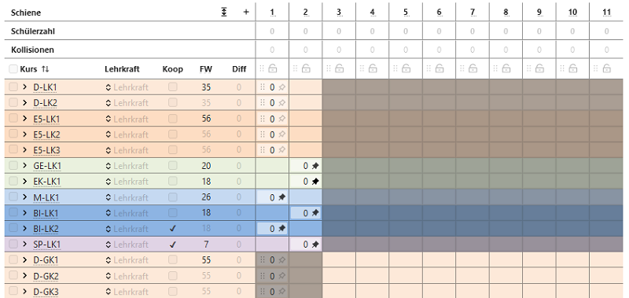  

+ Einige **LKs** wurden in Schienen **fixiert** (schwarze Pinnnadeln).  

+ Die Schienen 3 bis 11 wurden für **Leistunskurse gesperrt** (graue Felder bei LKs).  

+ Die Schienen 1 und 2 wurden für **GKs und ZKs gesperrt** (graue Felder bei GKs, i.d.R. redundant durch LK-Setzung in Schienen 1 und 2).   

+ Die Kurse SP-LK1 und BI-LK2 sind **Koop-Kurse** (Unterricht an anderer Schule, Haken bei Koop gesetzt).  

+ Der Kurs BI-LK2 wurde auf **maximal zwei Schüler** begrenzt. Diese zwei Schüler belegen gleichzeitig M-LK1, daher sollen **nur diese beiden** in BI-LK2 (Diese Regel ist nur unter **Regeln Detailansicht** sichtbar).  

+ Die LKs D und E haben zunächst keine Vorgaben.  

Einmaliges schnelles Blocken liefert eventuell noch Kollisionen, eine weitere Blockungsberechnung liefert in diesem Beispiel aber neben weiteren dieses Ergebnis:

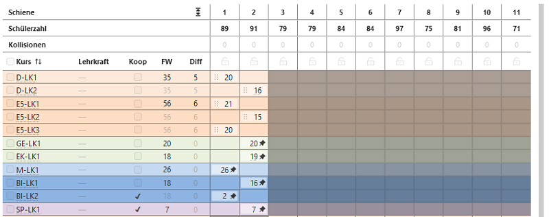 

Hier kann jetzt ein Ergebnis ausgewählt werden:

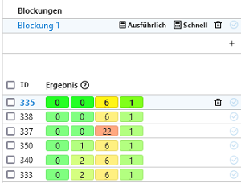

Ebenso können definitiv unbrauchbare Ergbnisse gelöscht werden. Wird der Haken direkt bei **ID** gesetzt, werden alle Ergebnisse markiert.

Der Haken der Wunschergebnisses (und eventuell die Startvorlage) kann entfernt werden. Dann können alle anderen Ergbnisse auf einmal gelöscht werden.

:::info Regeln verändern nach einer Berechnung
Änderungen der Regeln sind nicht mehr möglich, solange mehrere Ergebnisse vorliegen. Es können jetzt nur Kurse-Schienen- oder Kurs-Schüler-Zuordnungen geändert werden.

Zum **Ändern von Regeln** für neue Berechnungen darf entweder **nur ein Ergebnis stehen bleiben** oder die **Blockung muss abgeleitet werden**. Letzteres hat den Vorteil, dass auf die bisherigen Ergbnisse immer wieder zurückgegriffen werden kann.
:::

## GK-Blockung

Um nur noch die GKs zu blocken werden erst alle **LKs in ihren Lagen fixiert**, dann alle **Schüler in den LKs fixiert**. 

(Anmerkung: Eventuell kommt in späteren Versionen die Option hinzu, bestimmte Kurse beim Blocken gar nicht erst zu berücksichtigen.)  

### Zusatzbeispiel: Spezialfall Sportprofile

Es kann (nicht nur in Sport) vorkommen, dass bereits vor dem Blocken ein Kurs eines Faches eine bestimmte Schülergruppe enthalten muss.  

Hier kann die Funktion **Kurse: Schülerzuordnung** eingesetzt werden.  

1. **Leeren des Fußball-Kurses** SP-GK1-FB  
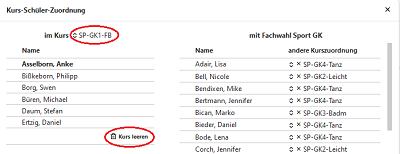

2. **Zuweisung** Schüler in SP-GK1-FB  
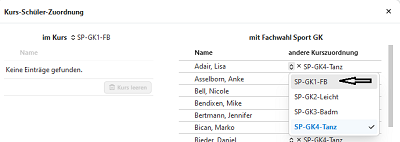  

Ergänzend können die hier schon **Schüler in Ziel-Kursen fixiert** werden. 

3. **Vorgang** für die anderen drei Sportkurse entsprechend **wiederholen**.  

4. Sport-GKs auswählen (Haken setzen) und **Schülermenge fixieren**. 

5. Falls alle oder einige dieser Kurse z.B. nachmittags stattfinden, können zusätzlich diese **Kurse noch in bestimmten Schienen fixiert** werden.

### Zusatzbeispiel Kerngruppen/Parallelkurse

Hier wird dargestellt, wie zum Beispiel in einer **EF feste Gruppen für D, M und E-Kurse** gebildet werden. Das heißt, die Schülergruppe hat die Fächer D, M und E immer gemeinsam, gegebenfalls kann auch Sport ergänzt werden.  

Über **Kurse: Schülerzuordnung** kann eine feste Schülergruppe mehreren Kursen zugewiesen (und dort fixiert) werden.

Dazu werden die Schüler erst einem Kurs (hier D-GK1) zugeordnet, dann werden weitere Kurse ausgewählt.  

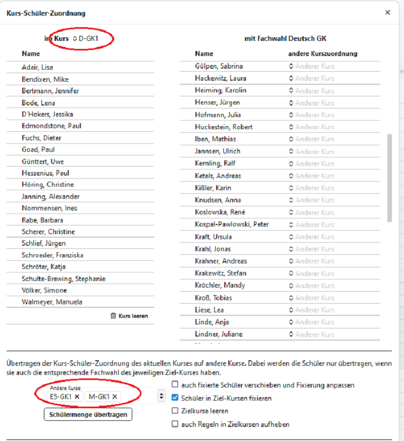  

## Kurse über mehrere Schienen planen

Grundsätzlich können sogeannten **Mehrfachkurse** angelegt werden, die über mehrere Schienen gehen.

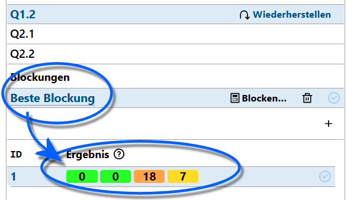

Die Voraussetzung, um einen Mehrfachkurs anzulegen ist, dass es in der gew#hlten **Blockung** nur ein einziges **Ergebnis** gibt.

Ist das der Fall, lässt sich der Kurs **>** aufklappen und anschließend kann der Kurs hinten rechts bei **Schienen** mit dem Plus **+** auf mehrere Schienen erweitert werden. Ebenso lässt sich das Minus **-** nutzen, um wieder Schienen zu entfernen.

Nachdem ein weiterer Kurs generiert wurde, können die Kurse per Drag & Drop wie andere Kurse auch in andere Schienen gezogen werden.

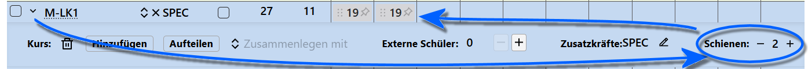

Auf diese Weise lässt sich ein Kurs über zwei oder auch mehr Schienen verteilen.

::: danger Mehrfachkurse können extrem rechenintensiv sein!
Für **jeden** Multikurs verläuft die Blockung **exponentiell langsamer**, da die Berechnung sehr ineffektiv wird (das Problem wird NP-vollständig).

Um diese Verlangsamung zu verhindern sind Multikurse zuerst in der Schiene zu fixieren. Gleichzeitig sind auch die Schüler fest zuzuordnen und über die Pinnadel zu fixieren. Es gilt also: Was der Algorithmus gar nicht erst behandeln muss, kann die Verteilung nicht ineffizent machen.  
:::

In den folgenden beiden Screenshots sind erst die Kurse in ihren Schienen fixiert, anschließend werden auch die Schülerinnen im Kurs selbst fixiert. Dies ist an den schwarzen Pinnadeln erkennbar.

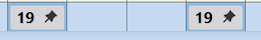

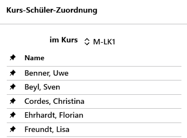

## Schüler individuell bearbeiten

### Kurs: Schülerzuordnung

*in Bearbeitung, ab Dezember 2024*  

### Blockungsmatrix

*in Bearbeitung*

## Blockung exportieren (etwa nach Untis)

::: warning Blockung exportieren und Stundenpläne importieren
Nehmen Sie zum Export einer Blockung und dann zum Import von Stundenplänen bitte die Artikel in der **App Schule** zum **Datenaustausch** mit **Untis** zur Kenntnis.

Der Datenaustausch findet im Format der Untis-Schnittstellendateien statt. Konsultieren Sie bitte zu diesen das Handbuch von Untis.
:::

## Änderungen NACH Übertrag der Kursplanung in Leistungsdaten

### Umwahl GKS-GKM

Aufruf **Schüler -> Lernabschnitte**, dann im aktuellen Abschnitt die Kursart des entsprechenden Kurses ändern.  
In **Laufbahnplanung** kontrollieren, dort wird jetzt die neue Kursart im aktuellen Abschnitt angezeigt.  
In **Oberstufe -> Kursplanung** (ist auch direkt über den Link aus der Laufbahnplanung erreichbar) wird die neue Kursart ebenfalls im entspechenden Kurs für den betroffenen Schüler angezeigt.

### Abwahl eines Faches (auch LK-GK-ZK-Wechsel)

Aufruf **Schüler -> Lernabschnitte**, dann im aktuellen Abschnitt das entsprechende Fach auswählen und mit dem Papierkorb-Symbol löschen.  
In **Laufbahnplanung** ist das abgewählte Fach im betroffenen Abschnitt mit einem roten Kreuz gekennzeichnet. Es kann durch Klick auf das rote Kreuz abgewählt werden.  

In den weiteren Abschnitten kann das Fach wie gewohnt entfernt werden.

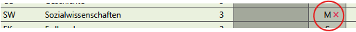  
In **Oberstufe -> Kursplanung** erscheint die Abwahl des Faches als roter Hinweis unter unter **Ungültige Kurszuordnungen**.  
Bei gesetztem Haken und OK kann die jetzt nicht mehr gültige Kurszuordnung aufgehoben werden.  

  
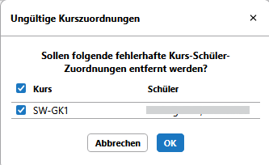

### Neuwahl eines Faches (auch LK-GK-ZK-Wechsel)

Aufruf **Schüler -> Lernabschnitte**, dann im aktuellen Abschnitt ein **Fach über '+' ergänzen**.  

::: tip Hinweis 
Es wird in der Regel das erste Fach Ihrer Fächertabelle als Anfangswert eingetragen. Nach Änderung auf die gewünschte Fachbezeichnung sortiert sich der Facheintrag entsprechend ein und steht nicht mehr in der ersten Zeile.  
:::

Jetzt muss zwingend noch **ein Kurs eingetragen werden**, das muss bei Mehrfachauswahl nicht der richtige sein. (Der passende Kurs wird in der Kursblockung festgelegt.)

Eine **Kursart** muss hier gewählt werden.   

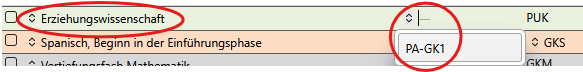

In **Laufbahnplanung** ist jetzt das Fach mit der entprechend gewählten Kursart eingetragen. Die weiteren Abschnitte können hier ergänzt werden. 

In **Oberstufe -> Kursplanung** erscheint das neue Fach beim Schüler in der Fachauflistung und kann **händisch gesetzt** werden oder über **"Verteilen" automatisch gesetzt** werden.  
Dabei werden ggf. andere - nicht fixierte - Zuordnungen geändert.  

Da es jetzt zu möglicherweise neuen Zuordnungen in anderen Kursen gekommen sein kann, sollte die **Kursblockung jetzt synchronisiert** werden.

### Änderungen bei Wiederholern  

Grundsätzlich ist es derzeit **nicht möglich**, Wiederholer vor der Versetzung der Datenbank ins neue Schuljahr in deren neuen Abiturjahrgängen zu verwalten.  

Diese Funktion ist aber **zukünftig geplant**.

#### Fall 1: Keine Versetzung, keine Nachprüfung:

Nach dem Übertrag der Datenbank ins neue Schuljahr stehen Wiederholer in der Kursplanung dem neuen Abiturjahrgang zur Verfügung.  
Die zu wiederholenden Abschnitte sind als **nicht gewertet** markiert, dadurch können wie gewohnt in deren Laufbahnplanung Änderungen vorgenommen werden, auch wenn der aktuelle Abschnitt grau hinterlegt sein sollte.  
Wichtig dafür ist, dass noch keine  Hochschreibung stattgefunden hat.  
Änderungen nach einer Hochschreibung erfolgen wie oben beschrieben.  

::: tip Klären Sie Umwahlen von Wiederholern vor Erstellen der neuen Blockung
Es empfiehlt sich, mögliche Umwahlen von feststehenden Wiederholern noch vor dem Schuljahreswechsel abzufragen, um die Umwahl auch in der neuen Blockung sicher zu stellen und die Laufbahnen schon beim Blocken sauber zu verarbeiten.
:::

#### Fall 2: Keine Versetzung, aber Nachprüfung:

Hier findet die Hochschreibung oft schon vor den Nachprüfungen statt.  
Damit sind die Laufbahndaten grundsätzlich fixiert.  
Unabhängig vom Abiturjahrgang - je nach Ausgang der Nachprüfung - müssen jetzt ggf. Kurszuordnungen erfolgen.  
Diese werden in der Kursplanung **händisch** oder durch **"Verteilen" automatisch gesetzt**.  

::: caution **WICHTIG:**
Vor einer Synchronisation müssen jetzt bei den betroffenen Schülern die **Facheinträge in den Leistungsdaten manuell eingetragen** werden (Fächer ergänzen).
:::

Dieses kann aus Gründen der derzeit noch einfacheren Bedienung **auch in Schild erfolgen**.  
Es genügt, wenn **nur die Facheinträge** ergänzt werden, die Kurszuweisungen inklusive der individuellen Kursarten erfolgen durch die Synchronisation der Kursblocklung.  

Jetzt noch erforderlich mögliche Umwahlen erfolgen wie oben beschrieben.