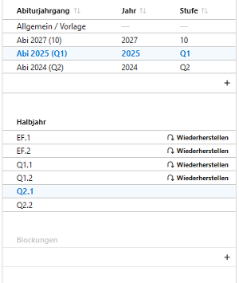
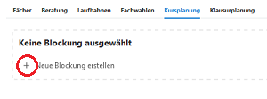
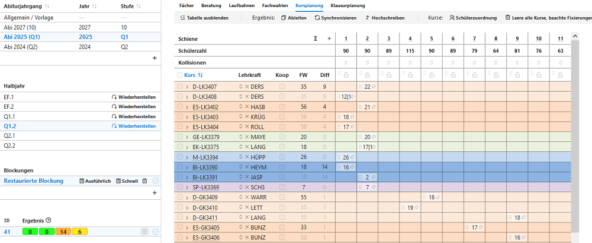
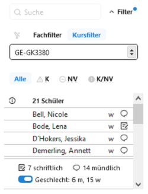
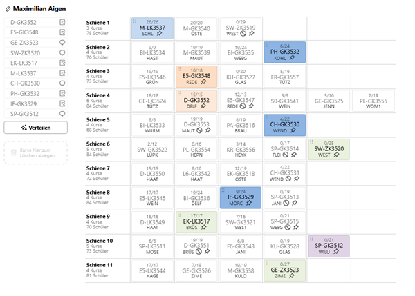
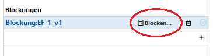
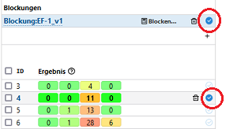
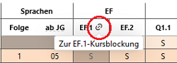
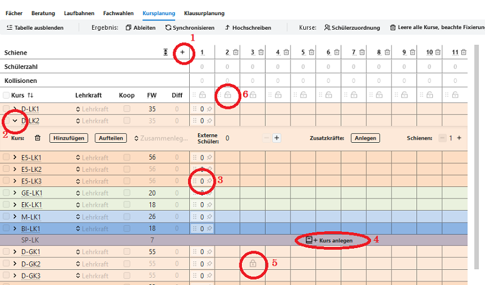

# Kursplanung

## Symbole
Diese Symbole finden sich in vielen der Menüs. Hinweise zu ihrer Bedeutung:

**Linksymbol 🔗**: Springen Sie direkt zu dieser Person. In der Kursplanung sind dies je nach Kontext die Kurswahlen oder die inviduellen Leistungsdaten.

: für diesen Schüler liegt bei der Kursplanung eine Fixierung vor.

: Die Schülerin ist im angezeigten Kurs fixiert.

: Der Kurs ist an seiner Position fixiert.

**🛇**: Der Kurs ist für die Zuweisung von Schülern verboten.

## Blockungsübersicht

Zu einem Abiturjahrgang können in jedem Lernabschnitt eine oder mehrere Blockungen angelegt oder aus bestehenden Daten wiederhergestellt (restauriert) werden.

Eine *Wiederherstellung* erfolgt, wenn die vorliegende Datenbank bereits eingetragene Leistungsdaten enthält und sich Kurszuordnungen daraus ermitteln lassen.

### Fall Wiederherstellung und Weiterbearbeitung

Eine Wiederherstellung ist nur möglich, wenn in der Datenbank bereits Blockungsdaten vorliegen, zum Beispiel nach einer Migration einer SchILD-NRW-2-Datenbank oder vergleichbarer Datenbestände.

Nach Auswahl von Abiturjahrgang und Abschnitt **Wiederherstellen** aktivieren. Die Blockung wird dann als **Restaurierte** Blockung angezeigt.

Es wird eine Übersicht über eingerichtete Kurse angezeigt, in welchen Schienen sie liegen und so weiter.

### Fall Neue Kursblockung

Über das **+**-Symbol wird eine neue Blockung erstellt.

Hierbei sollten für den gewählten Abschnitt  **vollständige Fachwahlen** vorliegen.

Zum Ablauf der Einrichtung/Erstellung einer **neuen Blockung** lesen Sie den Abschnitt [Erstellen einer neuen Blockung](#erstellen-einer-neuen-blockung).

## Übersichten, Filter, Belegungsmatrix

Die Blockungsübersicht zeigt die Lage der Kurse in den Schienen an, ebenso die Belegungszahl einer Schiene und die jeweilige Kursgröße.

Im Falle einer **neu angelegten Blockung liegt noch keine Verteilung** vor.

Durch Anklicken eines Kursnamens kann dieser in seiner Bezeichnung ergänzt, jedoch nicht vollständig umbenannt werden. So kann *BI-LK2* zu *BI-LK2-Koop* ergänzt werden.

::: info Angabe der Kursgrößen
Sollte eine Kursgröße im Format "14|3" angegeben sein, dann befinden sich in diesem Kurs 14 Schüler der eigenen Schule und 3 einer Koopschule (Status Extern).
:::

**Weitere Funktionen** in dieser Übersicht werden unten erläutert.

### Schülerlisten (nach Filter)
Rechts neben der Kursübersicht befinden sich **Schülerlisten**, deren Inhalt **gefiltert** werden kann:

- **kein Filter**
- **Fachfilter**: Schüler mit einem bestimmten gewählten Fach und Kursart filtern. Beispiel: Alle mit **Fachwahl Deutsch LK**
- **Kursfilter**: Schüler eines gewählten Kurses filtern. Beispiel: Alle, die dem **Kurs D-LK1** zugewiesen sind.

Weiterhin kann auf diese Eigenschaften gefiltert werden:
- **K** **K**ollision: Schüler, die in der aktuellen Blockung eine Kurskollision haben, also zwei Kurse in einer Schiene.
- **NV** **N**icht **V**erteilt: Schüler, für die mindestens eine Fachwahl keinem Kurs zugewiesen ist.
- **K/NV**: Schüler mit Kollision und einer nicht verteilten Fachwahl.

Die **Symbole** hinter den Namen stehen für das **Geschlecht** und die Eigenschaft **mündlich** oder **schriftlich** belegt.

## Umwahldialog
Weiter rechts (gegebenfalls müssen Sie nach rechts scrollen oder den Container einklappen) befindet sich die Belegungsmatrix des ausgewählten Schülers.

Hier können
+ Kursbelegungen per **Drag & Drop** geändert werden
+ Kurse durch **Verschieben** in die linke Fachwahlübersicht abgewählt werden
+ Schüler in Kursen **fixiert** werden (Setzen der Pinnadel)

Die **Kursart** (GKS, GKM, LK1, LK2, AB3, AB4 usw.) kann hier - im Gegensatz zu Kurs42 - **nicht geändert werden**. Um die Kursarten zu ändern, muss durch den Link links am Schülernamen in dessen Laufbahnplanung gewechselt werden.

Nach Umwahl der Kursart kann vom Laufbahndialog mittels des Linksymbols wieder direkt in die Kursplanung gewechselt werden.
[Laufbahnplanung](../../schueler/laufbahnplanung/index.md)

::: info Aktive Blockung
Achten Sie darauf, dass Sie die Blockung beziehungsweise das Ergebnis in einer Blockung, mit dem Sie arbeiten, auf "aktiv" gestellt ist.
:::

## Blockung berechnen
Um eine Blockung berechnen zu lassen, müssen zuvor
- Kurse eingerichtet werden

und können zusätzlich
- Fixierungen und Sperrungen von Kursen für bestimmte Schienen festgelegt werden
- mögliche Schülerfixierungen in Kurse gesetzt werden
- weitere Regeln (siehe unten) gesetzt werden

Siehe dazu hier: [Erstellen einer neuen Blockung](#erstellen-einer-neuen-blockung)

### Berechnungen durchführen

### Bewertungskriterien

Im Berechnungsszenario werden die Ergebnisse mit vier Bewertungskriterien angegeben. Durch Bewegung des Mauszeigers auf die Werte werden weitere Erklärungen dazu sichtbar (Tool-Tips).
- Regelverletzungen (sollten 0 sein)
- Fachwahlkonflikte (sollten 0 sein)
- Kursdifferenzen (hängt von individuellen Bedingungen ab)
- Häufigkeit der Kursdifferenzen größer 0 (im Tool-Tip werden die betroffenen Kurse angezeigt.)

### Ableiten einer Blockung

Um ein vorliegendes Ergebnis einer Berechnung oder den Grundzustand der Blockungseinrichtung bestehen zu lassen und immer wieder darauf zurückgreifen zu können, kann durch **"Ableiten"** die Blockung dupliziert werden. Es können dann neue Regeln ergänzt oder bestehende gelöscht werden, um dann wieder neu zu berechnen. Sie können auch wieder Schienen und Kurse hinzufügen oder entfernen.

## Blockung aktivieren

Durch Setzen des Hakens hinter eines der Blockungsergebnisse werden die weiteren Prozesse auf die jetzt aktivierte Blockung bezogen.

Dazu gehören:
* Abgleich mit den Fachwahlen
* Anzeigen der Kursbelegung der Schüler
* Kursbelegungslisten
* Rückführender Link aus der Schüler-Laufbahnplanung zurück in die aktivierte Blockung:

## Erstellen einer neuen Blockung

### Grundeinstellungen der Blockung

**1**: **Hinzufügen** weiterer **Schienen**. Nicht benötigte Schienen können mit dem Papierkorb hinter der Schienennummer **gelöscht** werden.

**2**: Untermenü für einen eingerichteten Kurs
+ **Papierkorb**: Löschen des Kurses
+ **Hinzufügen**: Kurs des Faches und der Kursart wird hinzugefügt
+ **Aufteilen**: Zunächst wie Hinzufügen. Befinden sich Schüler in dem Kurs, so wird ein weiterer Kurs mit identischem Fach und Kursart hinzugefügt und die Schüler des gewählten Kurses hälftig in beide Kurse verteilt.
+ **Zusammenlegen**: Es kann ein Kurs mit identischem Fach und Kursart gewählt werden, dessen Schüler werden dann in den ausgewählten Kurs übernommen, der dann leere Kurs wird unmittelbar gelöscht.
+ **Externe Schüler**: Durch **+** kann bereits die Zahl der zu erwartenden externen Schüler ergänzt werden. Dieser Wert wird dann bei den Kursdifferenzen berücksichtigt.
+ **Zusatzkräfte**  können gegebenfalls eingetragen werden.
+ **Schienen**: Der Kurs kann auf weitere Schienen verteilt werden (zum Beispiel bei "Huckepackkursen" oder besonderen Stundenplankonstellationen).

**3**: Der Kurs kann per Drag & Drop in eine andere Schiene **verschoben** werden. Mit der Pinnnadel kann der Kurs in der Schiene **fixiert** werden. Die Nadel ist dann schwarz gefärbt.

**4**: Der Kurs wird entgegen des Vorschlages doch **angelegt**.

**5**: Durch Klicken in ein Feld wird diese Lage **für den einen Kurs gesperrt**.

**6**: Die gesamte Schiene kann für **eine oder mehrere Kursarten gesperrt** werden.

::: info Fixieren, Sperren oder Regeln?
Es ist häufig eine Frage des planerischen Geschickes (Übersicht, Reduktion von Rechenkapazität, ...), ob Kurse eher in bestimmten Lagen fixiert, oder andersherum für bestimmte Lagen gesperrt werden. Alternativ können Kurse auch gegenseitig über Regeln gekoppelt oder gegenseitig ausgeschlossen werden.

Welche Option besser ist, hängt vom konkreten Kontext der Blockung ab.
:::

### Kursauswahl

Durch Klicken auf die Teilnehmerzahl eines Kurses in der Schienenmatrix wird im Fach/Kursfilter neben der Schienenmatrix die Kursliste angezeigt. Für jeden Schüler wird daneben (je nach Bildschirmgröße nach rechts scrollen) der jeweilige Umwahldialog angezeigt. Es kann den jeweiligen Symbolen (siehe Startseite Oberstufe) Eigenschaften der Schüler entnommen werden, wie:

+ Belegung schriftlich oder mündlich (Heft oder Sprechblase hinter Schülernamen)
+ Schüler im markierten Kurs fixiert (schwarze Pinnnadel vor Schülernamen)
+ Schüler in anderen Kursen fixiert (graue Pinnnadel vor Schülernamen)

### Fixierungen

Sowohl vor wie auch nach Berechnungen können Kurse in bestimmten Schienen fixiert werden. Ebenso können Schüler in bestimmten Kursen fixiert werden. Bei weiteren Berechnungen der Blockung bleiben diese Fixierungen dann erhalten.

Fixierungen können durch Anklicken der jeweiligen Pinnnadeln in der Schienenmatrix, der Kursliste im Fach/Kursfilter oder im Umwahldialog des einzelnen Schülers vorgenommen werden.

Darüber hinaus stehen unter **Fixiere alle Kurse** weitere Möglichkeiten zur Verfügung, bestimmte Schüler-Fixierungen zu setzen.

So können im Falle einer neu anzulegenden Q2-Blockung in Grundkursen alle Schüler mit Fachwahl "3. Abiturfach" in ihrem bisherigen Kurs fixiert werden, um Lehrerwechsel zu vermeiden.

Ebenso könnten nach einer Berechnung alle LKs in ihren Schienen fixiert werden, dann alle Schüler in den LKs fixiert werden. Danach können dann GK-Berechnungen durchgeführt werden, ohne, dass die Leistungskurse dabei noch berücksichtigt werden.

Werden einzelne **Kurse** zuvor durch einen Haken **ausgewählt**, so beschränken sich viele Fixierungsregeln nur auf diese Auswahl. Zu erkennen ist dies an der jetzt auftretenden Formulierung **"Kursauswahl"** vor diesen Regeln.

### Regeln

Unter **Regeln: Detailansicht** können neben den grafisch zu setzenden Bedingungen weitere Regeln für die Blockung erstellt werden. Hier sind zahlreiche Einstellungen möglich, wie zum Beispiel:
+ Kurse auf eine bestimmte Größe zu begrenzen
+ Kurse mit anderen Kursen bedingen oder ausschließen
+ Bestimmte Schüler in bestimmten Kursen bedingen oder ausschließen
uvm.

Der Regelkatalog wird immer wieder an Nutzerwünsche angepasst, die Formulierungen der Regeln sind in der Regel selbsterklärend.

Wurden alle Einstellungen gesetzt, kann die Blockung berechnet werden.

Siehe [Berechnungen durchführen](#berechnungen-durchführen)

## **Übertragung** in Leistungsdaten

### Übertragen

Der Übertrag der Kurse und Kursbelegungen ist nur im aktiven Abschnitt, nicht für vergangene Abschnitte möglich. Ausgelöst wird der Übertrag durch **Übertragen**.

Es werden dadurch:
+ alle eingerichteten Kurse im Kurskatalog neu angelegt
+ die Kurszuweisungen in die Leistungsdaten der Schüler eingetragen

### Änderungen durch **Synchronisieren** (nach einem Übertrag)

Nach dem Übertrag ändert sich der Button **Übertrag** in **Synchronisieren**

**Synchronisieren** öffnet ein Hinweisfenster, dessen Text unbedingt gelesen werden sollte.

Die Synchronisation überträgt:
+ Änderungen der Kurszugehörigkeit eines Schülers in dessen Leistungsdaten
+ Kursartänderung eines vorhandenen Kurses
+ Lehrerwechsel eines Kurses
+ Schienenwechsel eines Kurses
+ neu eingerichteten Kurs in die Kurstabelle

Die Synchronisation überträgt **nicht**
+ für einen Schüler **neu gewählte Fächer**
+ die **Abwahl eines Faches**
+ das **Löschen eines Kurses** (auch leere Kurse werden nicht gelöscht)

Diese Eintragungen müssen eigenständig in der Kurstabelle oder den Schülerleistungsdaten vorgenommen werden.

::: warning Nach Dateneintrag kann nicht mehr synchronisert werden
Sobald in den Leistungsdaten der Schüler Einträge vorgenommen werden, steht die Funktion "Synchronisieren" nicht mehr zur Verfügung. Es genügt dabei ein einziger Eintrag bei einem einzigen Schüler. Leistungsdaten sind dabei:
+ Quartalsnoten, Zeugnisnoten
+ Bemerkungen aller Art
+ Noten für Teilleistungen
+ Fehlstunden (FSG, FSU)
:::
