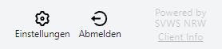

# Apps


Die großen Programmteile im SVWS-Webclient heißen **Apps**.

Je nach Bildschirmbreite können die Apps als Menü oben oder links im Browser angezeigt werden.

Die App-Leiste beginnt immer zuerst mit dem akuell angemeldeten Benutzer, hier im Screenshot *AD* für den "Admin", dann folgen die weiteren Apps.

Je nach Schulform werden bei Ihnen eventuell Apps ausgeblendet oder weitere Apps werden eingeblendet. 



Die Knöpfe für die Einstellungen und das Abmelden finden sich am Ende der App-Leiste.

Ganz am Ende lässt sich über ````Client Info```` die installierte Version des Clients abrufen.

Über die Client-Info erreichen Sie ebenfalls das **Impressum** und die **Hinweise zum Datenschutz**.