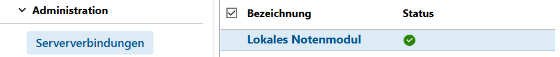
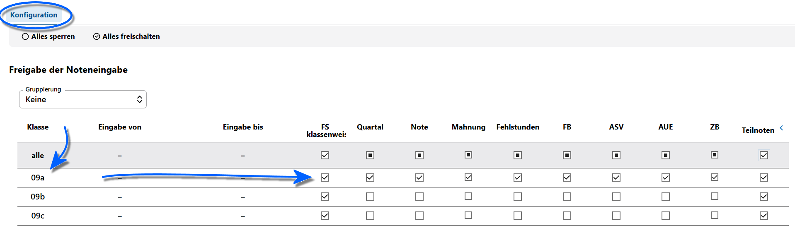
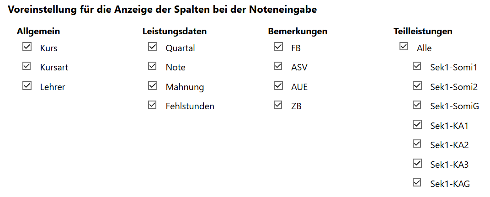

# Noten Administration

Über den Bereich **Administration** können die verbundenen WeNoM-Server sowie des **Lokale Notenmodul des SVWS-Webclients** konfiguriert werden.

::: tip WeNoM Benutzerhandbuch
Dies ist eine Kurzübersicht zur Orientierung in der App Noten.

Um **WeNoM-Serververbindungen** zu konfigurieren und für eine ausführliche Anleitung zur **Noteneingabe**, konsultieren Sie bitte das [Benutzerhandbuch WeNoM](../../../../wenom/index.md).

Um im aktuellen Theme weiterzulesen, wechseln Sie im Benutzerhandbuch in den Bereich zum [**Tab Konfiguration**](../../../../wenom/benutzerhandbuch/schulische_administration.md#konfiguration).
:::

Im lokalen Notenmodul ist nur der **Tab Konfiguration** sichtbar, über den sich klassen- und jahrgangsweise einstellen lässt, welche Noten und anderen Daten sich unter über den Bereich **Noteneingabe** eingeben werden können.

Wählen Sie hier das **Lokale Notenmodul** des SVWS-Webclients aus. Wurden WeNoM-Server konfiguriert, finden Sie diese hier ebenfalls und diese lassen sich in gleicher Weise für die Eingabe von Noten und anderer Daten einstellen.

Hier im Screenshot ist zu sehen, dass nur der **Tab Konfiguration** im Lokalen Notenmodul zur Verfügung steht. Über diesen wird eingestellt, welche Daten für welche Lerngruppen aufgenommen werden sollen.

Darunter lassen sich Spalten vollständig ausblenden und es kann konfiguriert werden. Sollen zum Beispiel keine *Zeugnisbemerkungen* für Quartalsnoten erfasst werden, wird diese Spalte somit gar nicht erst angezeigt.

Sollen *Teilleistungen* erfasst werden, können die zur Verfügung stehenden Teilleistungen an dieser Stelle angehakt werden.

:::tip Wollen Sie mehr wissen?
Konsultieren Sie das WeNoM-Benutzerhandbuch für eine ausführliche Anleitung. Ebenso wird dort auch der Bereich **Administration ➜ Zugangsdaten** erläutert.
:::