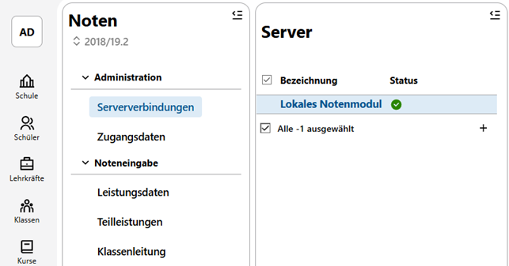

# Noten

Über die **App Noten** lassen sich im Bereich **Administration** schon laufende Server des WebNotenManagers WeNoM für die Schule verfügbar machen und für das Einsammeln von Noten konfigurieren.

Über den Bereich **Noteneingabe** steht eine lokale Möglichkeit bereit, direkt im SVWS-Webclient Noten zu erfassen.

Es können auch *Quartalsnoten*, *Fehlstunden*, die unterschiedlichen Arten von *Zeugnisbemerkungen* und *Teilleistungen* erfasst werden.

In diesee Bereich wird die **App Noten** mit ihren Tabs knapp besprochen. Konsultieren Sie für eine detaillierte Ausführung und für Installationsanleitungen das [Benutzerhandbuch WeNoM](../../../wenom/index.md).