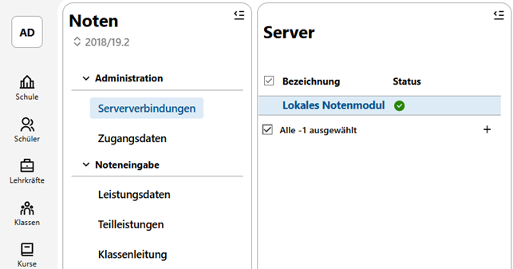

# Noten

Über die **App Noten** lassen sich im Bereich **Administration** schon konfigurierte Server des WebNotenManagers WeNoM für die Schule verfügbar machen und für das Einsammeln von Noten konfigurieren.

Über den Bereich **Noteneingabe** steht eine lokale Möglichkeit bereit, direkt im SVWS-WebClient Noten zu erfassen.

Es können auch *Quartalsnoten*, *Fehlstunden*, die unterschiedlichen Arten von *Zeugnisbemerkungen* und *Teilleistungen* erfasst werden.

::: tip Benutzerhandbuch des WebNotenManagers
In diesem Bereich wird die **App Noten** mit ihren Tabs besprochen. Konsultieren Sie für die detaillierte Erläuterung und für Installationsanleitungen das [Benutzerhandbuch WeNoM](../../../wenom/index.md).
:::
