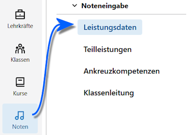
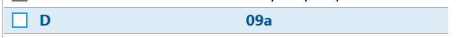
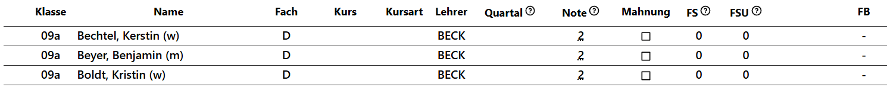
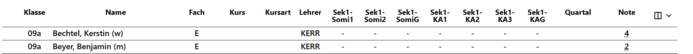
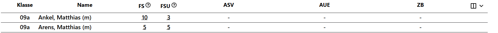
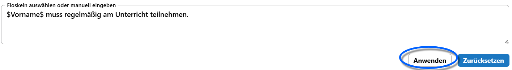

# Noteneingabe

:::tip WeNoM-Benutzerhandbuch
Bei dieser Anleitung handelt es sich um eine Übersicht zur Orientierung. 

Für eine ausführliche Anleitung zur **Noteneingabe** konsultieren Sie bitte das [Benutzerhandbuch WeNoM](../../../../wenom/index.md).
:::

## Schnellanleitung

Um Noten im Notenmodul des SVWS-Webclients einzugeben, navigieren Sie über die **App Noten** zur Bereich **Noteneingabe ➜ Leistungsdaten**.

Nutzen Sie die **Filter** über der *Auswahlliste*, um die gewünschte Lerngruppe zu finden.

Nachdem Sie auf Lerngruppen gefiltert haben, hier im Beispiel auf welche der Klasse `09a`, können Sie diese auswählen:

Klicken Sie auf die gewünschte Gruppe, hier das Fach `Deutsch`.

Nun können Sie die Noten und Daten für jeden Schülerinnendatensatz eingeben. Welche Spalten angezeigt werden und welche Daten eingegeben werden können, hängt davon ab, was in der Administration für diese Lerngruppe konfiguriert wurde.

## Weitere Bereiche unter "Noteneingabe"

Sollen Teilleistungen, Ankreuzkompetenzen oder Daten durch Klassenleitungen erfasst werden, finden Sie diese Bereiche ebenfalls unter *Noteneingabe*. Die weiteren Punkte sind ebenfalls im ersten Screenshot auf dieser Seite zu sehen.

Hier im Beispiel wurde auf die 09a gefiltert und nun werden die im Fach Englisch vorgesehenen Teilleistungen angezeigt. Durch das `-` wird angezeigt, dass keine Teilleistung als zu Setzen in der Administration konfiguriert wurde.

Ebenso funktioniert die Eingabe von **Ankreuzkompetenzen*.

Im Bereich **Klassenleitung** können klassenweise erfasste *Fehlstunden* und *Unentschuldigte Fehlstunden* sowie die unterschiedlichen Zeugnisbemerkungen eingegeben werden.

Durch Anklicken der Bereiche bei **ASV**, **AUE** und **ZB** öffnet sich der Floskeleditor und die für die Schule definierten Floskeln können durch deren Anwahl verwendet werden.

Alternativ kann ein Text manuell eingeben werden.

Hierbei werden Platzhalter wie *$Vorname$* automatisch durch das System ausgefüllt.

Übernehmen Sie Ihre Floskeln durch einen Klick auf `Anwenden` oder verwerfen Sie Änderungen mit einem Klick auf `zurücksetzen`.

:::tip Wollen Sie mehr wissen?
Konsultieren Sie für eine detaillierte Anleitung das [Benutzerhandbuch WeNoM](../../../../wenom/index.md).

Für die Noteneingabe springen Sie in die [Anleitung für Lehrkräfte](../../../../wenom/benutzerhandbuch/anleitung_lehrkraefte.md). Die Anleitung dort beginnt mit der **Anmeldung an einem WeNoM-Server**. Sofern Sie direkt mit dem *Lokalen Notenmodul des SVWS-Webclients* arbeiten, entfällt der Bereich mit der Anmeldung und Sie gehen über die **App Noten**.
:::